# B-tree 2부

## 개요 & 리뷰
지난 시간에는 B-tree의 구성과 데이터 삽입 순서를 배워보았고 이진 탐색 트리를 `일반화`한 트리라고 배웠다. 노드 내의 key들은 오름차순으로 저장되며 leaf노드들은 모두 같은 레벨에 있는 특징을 발견하게 되었다. 이번 글에서는 B-tree에서 데이터를 삭제하는 로직을 살펴볼 예정이다.

## 데이터 삭제
B-tree에서 데이터를 삭제할 때는 삽입과 동일하게 leaf 노드에서 발생하게 되며 삭제 후 최소 key보다 적어졌다면 트리를 재조정한다. 이런 특징을 가지고 있다. 
 
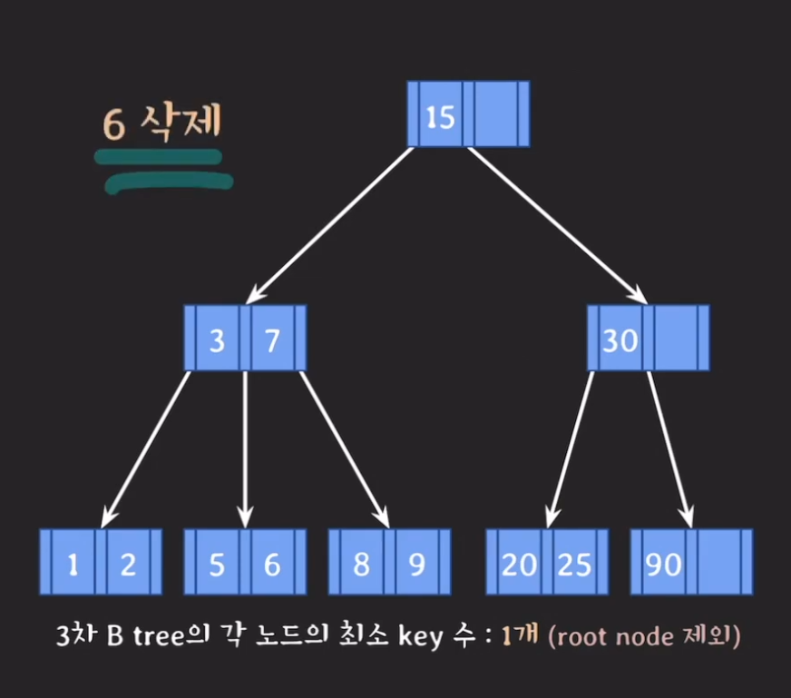 

여기서 6을 삭제하게 되면 쭉 트리를 타고 내려가 6을 삭제하고 3차 B-tree의 최소 key수는 1이기 때문에 문제가 없다.
 
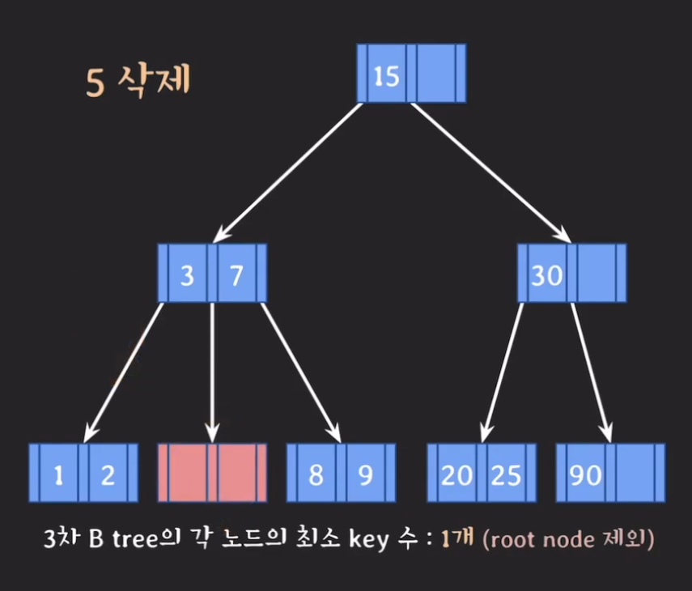

그런데 5를 삭제한다고 하면 어떻게 될까? 이때 데이터 삭제 법칙에 따라 `재조정`단계가 필요하게 되는데 재조정의 방법은 3가지가 존재한다.
1. key수가 여유있는 형제의 지원을 받는다.
2. 1번이 불가능하면 부모의 지원을 받고 형제와 합친다.
3. 2번 후 부모에 문제가 있다면 거기거 다시 재조정한다.

1번의 방법을 사용하게 되면 결과는 다음과 같다.
 
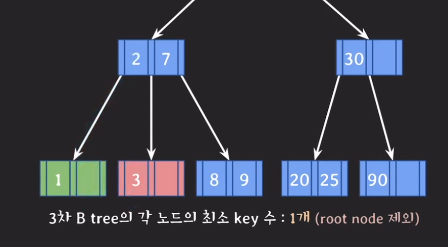

다만 1번 방법을 사용할때는 왼쪽 형제 노드부터 확인을 해야한다. 왼쪽 형제 노드에 마땅한 값이 없을때 오른쪽 형제 노드의 값을 채워야한다는 것이다. 이번엔 3을 삭제해보자.
 
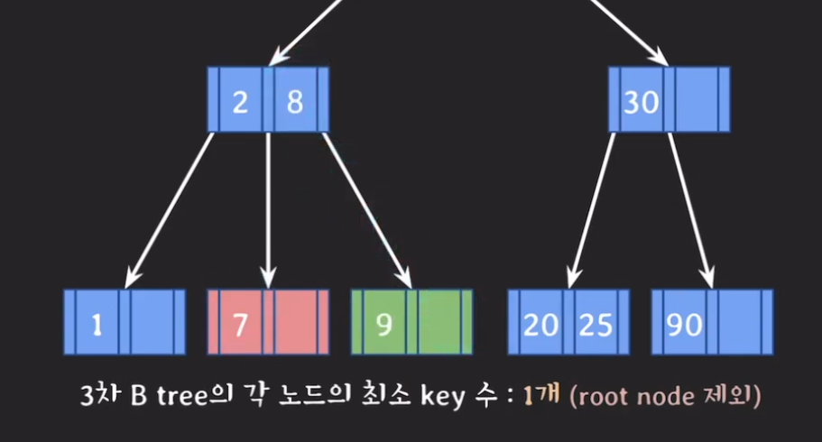

왼쪽 형제 노드는 이제 더이상 키를 뺏길 수 없기 때문에 이번엔 오른쪽 형제 노드의 값을 가져와야한다. 이때 정렬 순서를 지켜야하기 때문에 부모 노드에 있던 7을 가져오고 오른쪽 형제 노드의 8을 부모 노드의 키로 추가한다. 이번엔 7번을 삭제해보자.
 
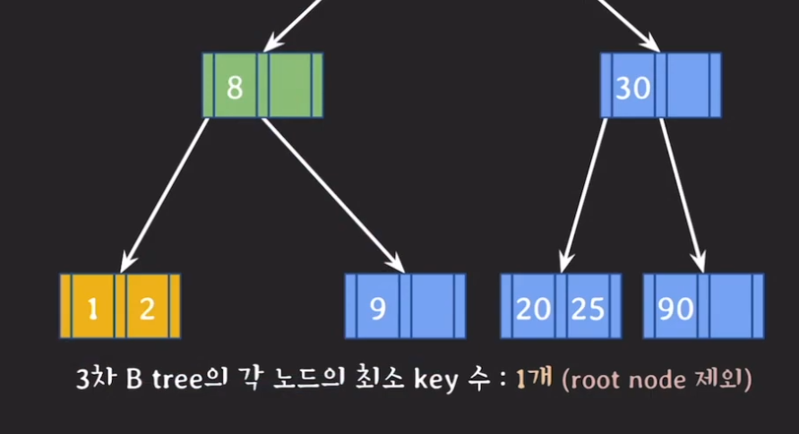

7을 삭제했더니 최소 key수를 더이상 형제들을 통해 채울 수가 없게 되어 이제는 2번 방법인 부모 노드의 도움을 받아야할 순서가 되었다. 그래서 비어있는 노드는 왼쪽 형제 노드와 합친다고 하고 부모 노드의 2를 지원 받고 기존의 노드를 삭제한다. 이후 8번 노드를 첫번째 자리로 옮기고 가리키고 있던 포인터도 맞게 수정해준다.(9의 주소) 이제 2를 삭제해보자. 2를 삭제한 경우 최소 key를 유지할 수 있기 때문에 아무런 재조정 없이 삭제할 수 있다. 그리고 1번을 삭제해보자.
 
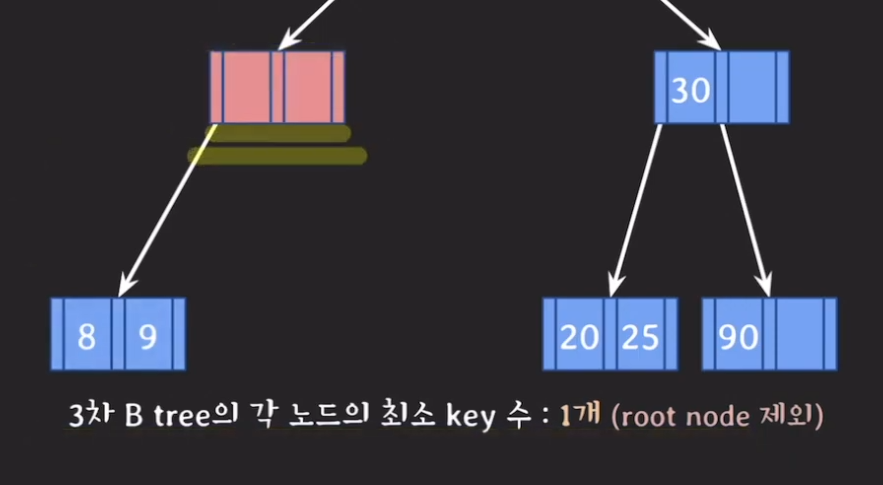

이제 1번 방식으로는 삭제할 수 없기 때문에 2번 방법을 사용했더니 이렇게 정리가 되었다. 그런데 이제 부모 노드에 문제가 생겼다. 이제 3번 방식으로 넘어갈 순서이다.
> 합칠 때는 무조건 왼쪽 먼저  

 
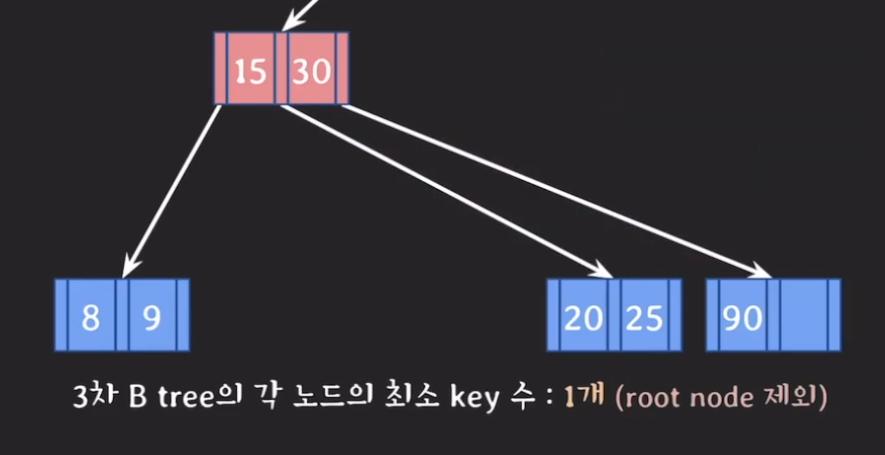

부모노드는 형제가 있었지만 key가 하나이기 때문에 부모의 지원을 받고 형제의 값인 30도 합치게 된다. 더불어 30이 가지고 있던 자식 노드도 넘어오게 된다. 그리고 남아있던 부모 노드 즉, 루트 노드에는 아무런 데이터가 없기 때문에 직전에 합쳐진 노드를 루트 노드로 변경해주고 기존의 루트 노드를 삭제해주면 작업이 끝나게 된다. 규칙에 루트 노드는 제외이기 때문에 가능한 것이다.

## Internal 노드 데이터 삭제
B-tree에서 데이터를 삭제할 때 규칙이 leaf 노드에서 삭제가 이루어져야 한다는 규칙이 있었는데 그러면 internal 노드를 삭제하는 방법은 어떻게 될까. 가장 쉬운 방법은 leaf 노드에 있는 데이터와 위치를 바꾼 후 삭제하고 tree를 재조정하면 된다. 바꿀 데이터를 뽑는 기준은 선임자(predocessor)나 후임자(successor)와 위치를 바꿔야한다. 이들은 모두 leaf 노드에 존재하게 된다. 

> 선임자(predocessor) : 나보다 작은 데이터들 중 가장 큰 데이터  
> 후임자(successor) : 나보다 큰 데이터들 중 가장 작은 데이터

 
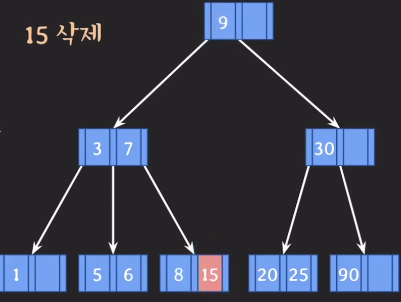

위는 선임자를 골라서 자리를 바꾼 상태이다. 이렇게 삭제를 진행하면 B-tree의 규칙에도 위배되지 않으며 데이터가 삭제되게 된다.

## 5차 B-tree 데이터 삭제
 
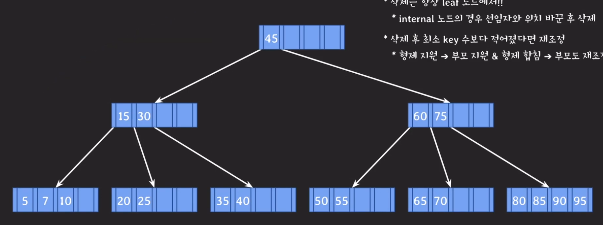
 
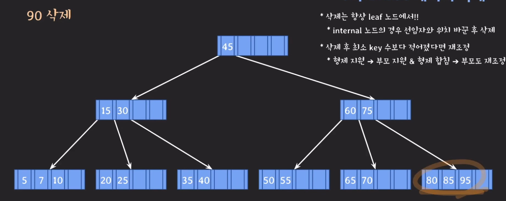
 
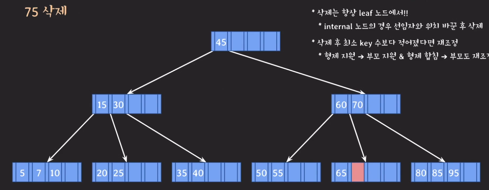
 
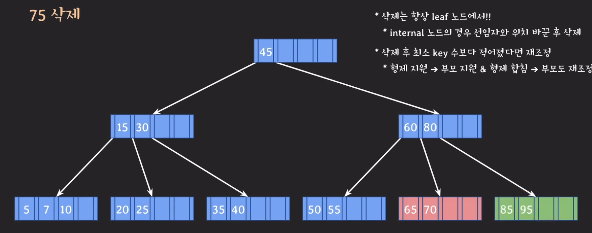
 
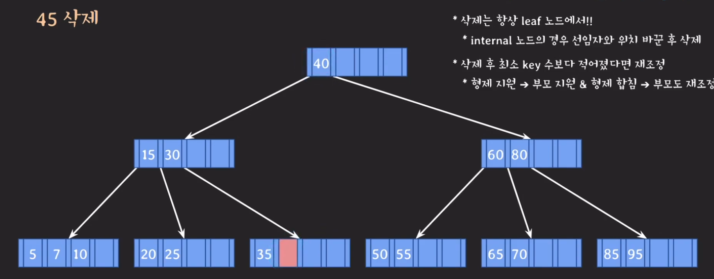
 
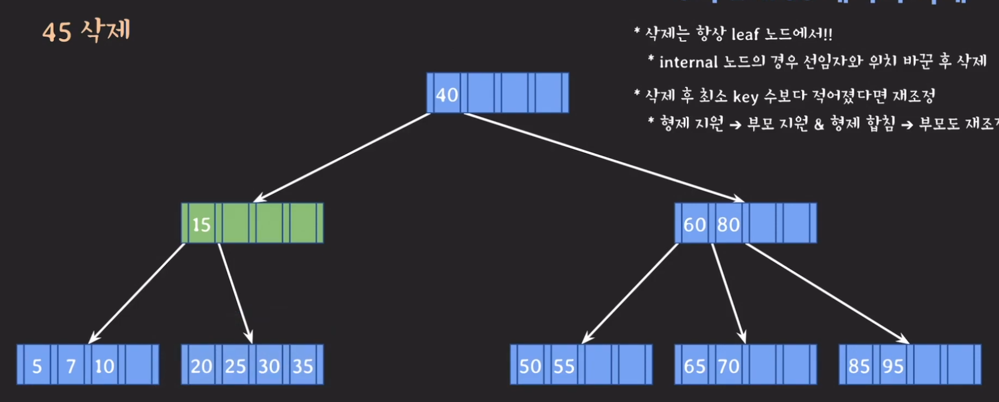
 
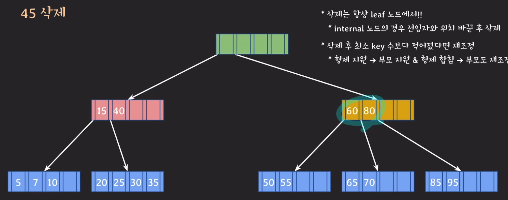
 
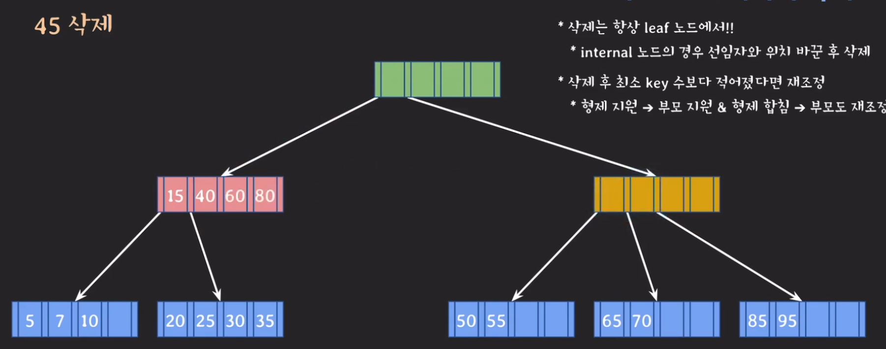
 
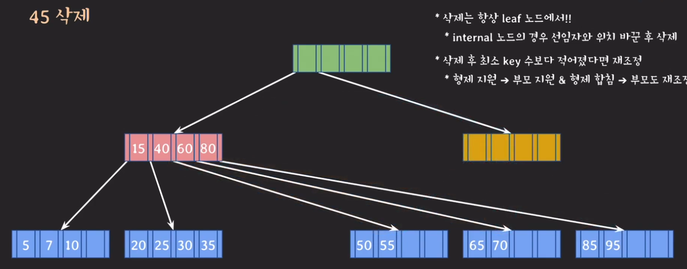
 
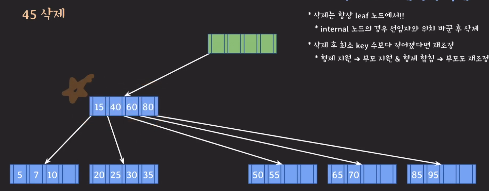
 
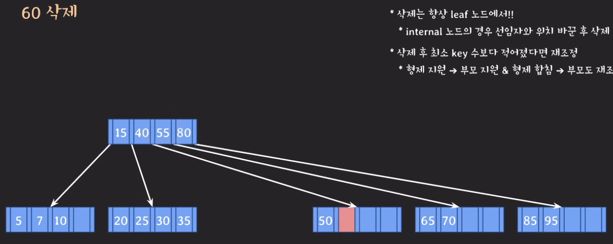
 
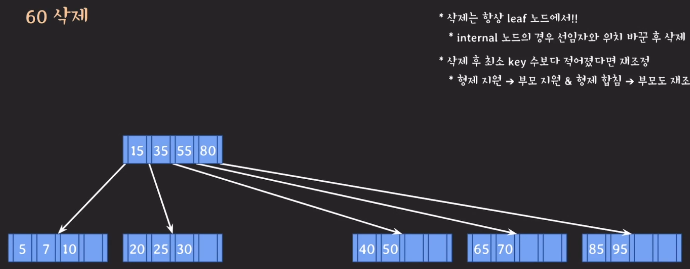

## 마무리
삭제하는 로직은 저번 시간에 배웠던 삽입하는 로직의 반대같았다. b-tree가 무엇인지는 이제 알게 됐는데 이게 인덱스와 무슨 관련이 있는지는 아직 잘 상상이 안간다. 정확히는 B+tree라고 하는데 빠르게 데이터를 찾고 수정하고 하는 것 때문에 쓰이는 건지 궁금해진다. 