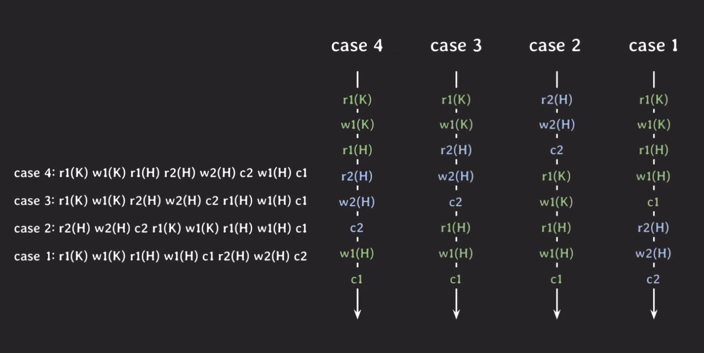
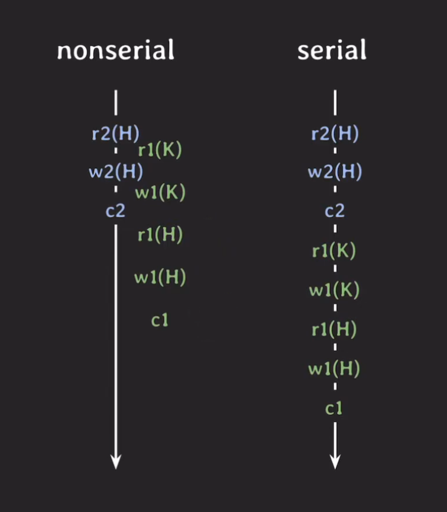
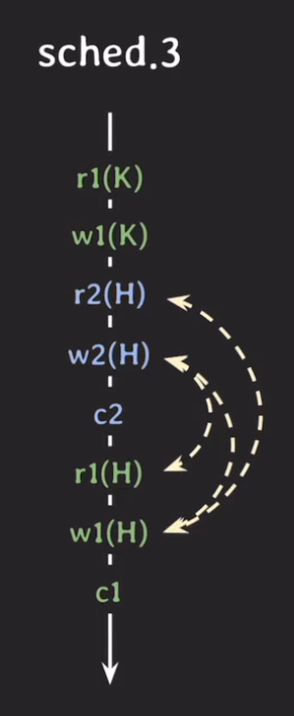
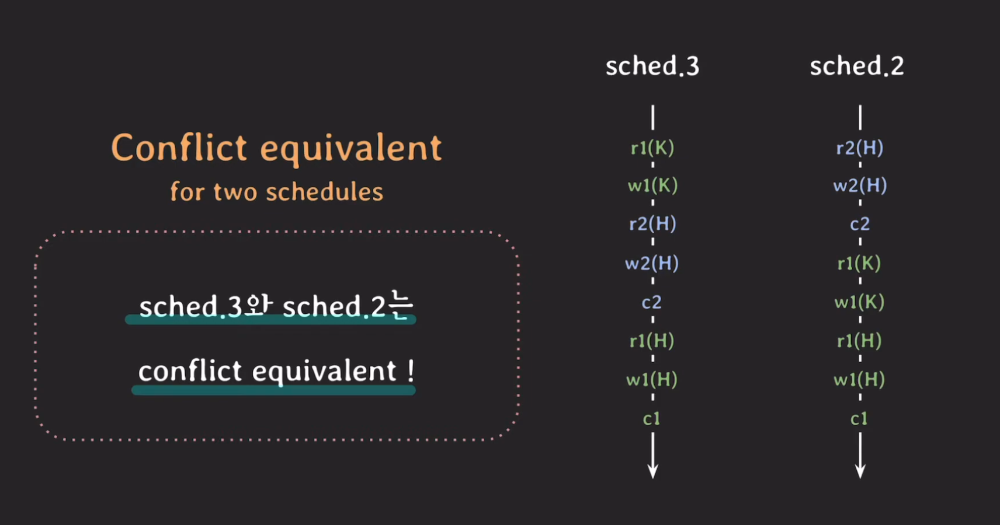
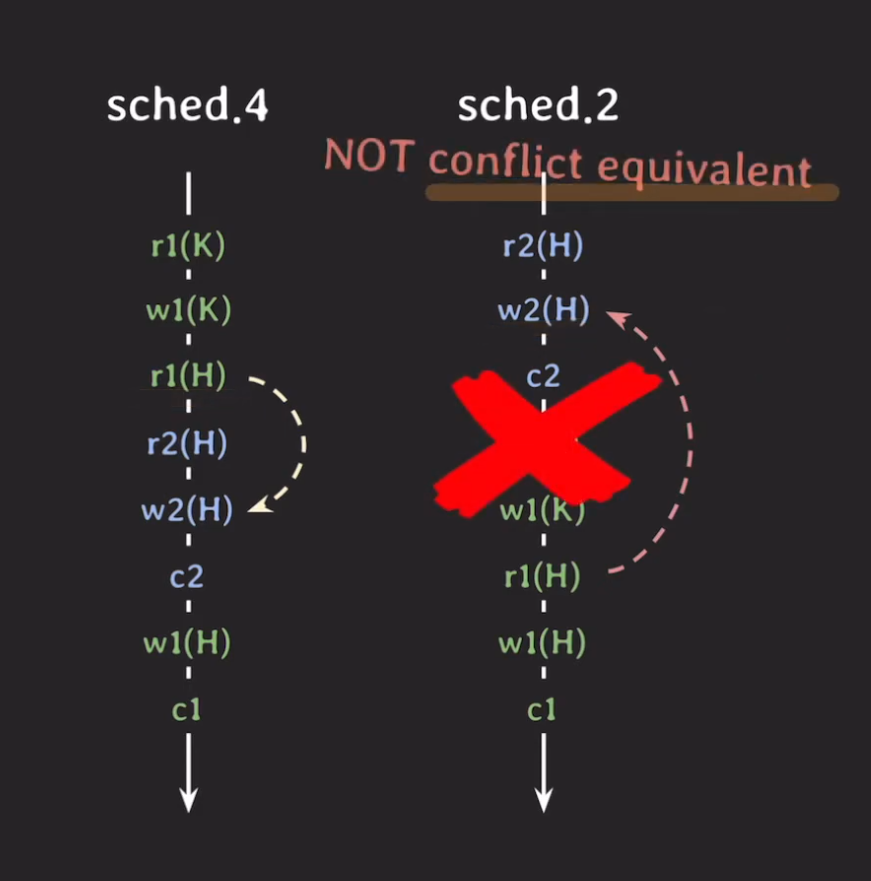
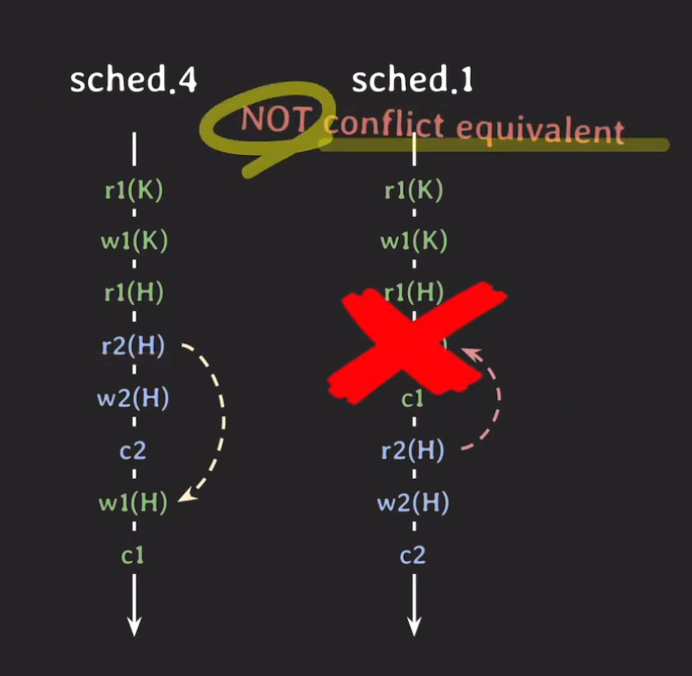

# Schedule & Serializability

## Transaction의 실행 예시
 
  

여기서 r,w 그리고 c는 각각 read, write 그리고 commit을 의미한다. 뒤에 오는 숫자는 어떤 트랜잭션에 속해있는지 나타내는 숫자이다. 괄호에 있는 것은 각 오퍼레이션이 어떤 대상으로 이루어지는 지에 대한 줄임말이며 이러한 operation들의 실행 순서를 `Schedule`이라 부른다. 

> <b>Schedule이란?</b>  
> 여러 transaction들이 동시에 실행될 때 각 transaction에 속한 operation들의 실행 순서  
> 각 transaction내의 operation들의 순서는 바뀌지 않는다

### Serial & Nonserial schedule
 
  

#### Serial schedule
serial schedule은 트랜잭션이 겹치지 않고 transaction이 진행되는 스케쥴을 말하며 한번에 하나의 transaction만 실행되기 때문에 좋은 성능을 낼 수 없고 현실적으로는 사용할 수 없는 방식이다.

#### Nonserial schedule
반대로 nonserial schedule은 트랜잭션들이 겹쳐서 실행되는 스케쥴을 의미하며 transaction들이 겹쳐서 실행되기 때문에 동시성이 높아져서 같은 시간 동안 더 많은 transaction들을 처리할 수 있다. 그러나 nonserial schedule 단점이 존재하는데 transaction들이 어떤 형태로 겹쳐서 실행되는지에 따라 이상한 결과가 나올 수 있다는 단점이 있다. 예를들면 트랜잭션 1과 2가 읽고 쓰는 대상이 같다면 타이밍에 따라 잘못된 정보로 작업이 진행될 수 있다는 뜻이다. 그래서 개발자들은 이 단점을 타파하기위해 연구를 시작했고. serial schedule과 동일한 `nonserial schedule을 실행`하면 되겠다라는 생각을 하게 된다. 하지만 그 이전에 `schedule이 동일하다?`라는 것에 대한 정의가 먼저 필요하다. 

## 동일한 schedule?
### Conflict
conflict는 두 개의 operations일때 해당이 되는데 정의는 세가지 조건을 모두 만족하면 conflict라고 볼 수 있다.
- 서로 다른 transaction 소속
- 같은 데이터에 접근
- 최소 하나는 weite operation  
- 종류에는 read-write conflict, write-write conflict가 있다
- conflict operation은 순서가 뒤바뀌면 결과도 바뀌게 된다

  

일 때 두 개의 operations이 모두 같은 조건을 갖고 있다면 이 operations을 conflict라고 볼 수 있다는 것이다.

### Conflict equivalent
두 개의 schedule이 아래의 조건을 만족하면 Conflict equivalent라고 말할 수 있다.
- 두 schedule은 같은 transaction들을 가진다. 
- 어떤(any) conflicting operations의 순서도 양쪽 schedule 모두 동일하다.

#### Schedule 3, 2
  

그런데 자세히 보면 schedule 2번은 serial schedule이고 3번은 nonserial schedule인데 3번의 입장에서는 serial schedule과 equivalent한 상태이다. 이때 schedule 3번을 `Conflict serializable`이라고 부르게 된다. 그러니까 결과적으로 schedule 3번은 불안정한 nonserial schedule이었음에도 불구하고 정상적인 결과를 도출해낼 수 있는 schedule이 되는 것이다.

#### Schedule 4, 2, 1
  

반면 schedule 4번은 schedule 2번과는 Conflict equivalent하지 않다. 오퍼레이션의 순서가 다르기 때문이다. 그러나 schedule 1번과 Conflict equivalent하게 된다면 4번 또한 Conflict serializable한 schedule이라고 볼 수 있게 된다.  

  

결과적으로 위 그림과 같이 schedule 4번은 어느 serial schedule과도 Conflict equivalent하지 않았으므로 `Not Conflict serializable`이다.

## 요약
이렇게 연구를 했던 것은 schedule 처리 능력을 향상시키기 위해서 이상한 결과가 나오지 않는 nonserial schedule을 사용하고 싶었고 이에 따라 Conflict serializable한 nonserial schedule을 사용하면 되겠다 라는 결과를 갖게 되었다. 이제 구현을 해서 사용하면 될 것 같은데 간단하게 생각해보면 여러 transaction이 실행 될 때 마다 해당 schedule이 Conflict serializable인지 확인하면 될 것 같은데 매 transaction마다 이 연산을 하는 것은 비용이 많이 들기 때문에 사실상 실사용은 불가능 하다. (추측) 그래서 여러 tansaction을 동시에 실행해도 schedule이 Conflict serializable하도록 보장하는 `프로토콜`이 개발되었다.

#### serializable
하나의 schedule이 있고 이 schedule이 다른 serial schedule과 equivalent하다면 해당 schedule은 serializable하다.(혹은 serializability)

#### Conflict serializable
하나의 schedule이 다른 serial schedule과 conflict equivalent하다면 해당 schedule은 Conflict serializable하다.(혹은 conflict serializability)

#### 혹은 view serializable
하나의 schedule이 있고 이 schedule이 다른 serial schedule과 view equivalent하다면 해당 schedule은 view serializable하다.(혹은 view serializability)

## Isolation
어떤 스케줄도 serializable하게 만드는 것을 concurrency control이라고 부르는데 이것과 밀접하게 괸련있는 transaction 속성이 `Isolation`이다. (ACID의 속성 중 하나가 여기서 설명이 된다.) 그러나 Isolation을 너무 엄격하게 하면 성능은 줄어들고 동시성이 떨어지게 되어 개발자들이 유연하게 선택할 수 있는 개념이 나오게 되었고 이를 `Isolation Level`이라고 부른다.

## 마무리
오늘 배운 내용은 사실 어려운 내용 중에 하나가 될 것 같다. 이론은 단순하지만 처음듣는 개념과 단어가 많아서 그렇게 느껴지는 것 같다. 단순하게 생각하면 어떻게 수많은 transaction을 (최대한 많은 양을) 동시에 실행시키면서 안정적으로 운영을 할까에 대한 고민 중에 하나였던 것 같다. 지금 배우는 내용이 굉장히 중요할 것 같다.