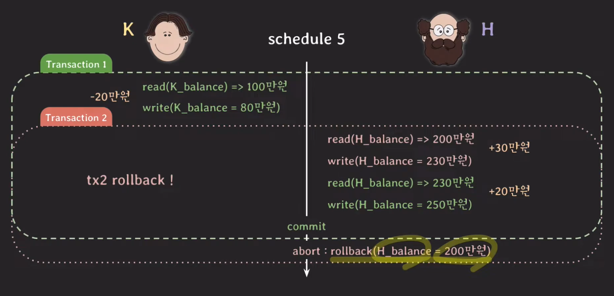
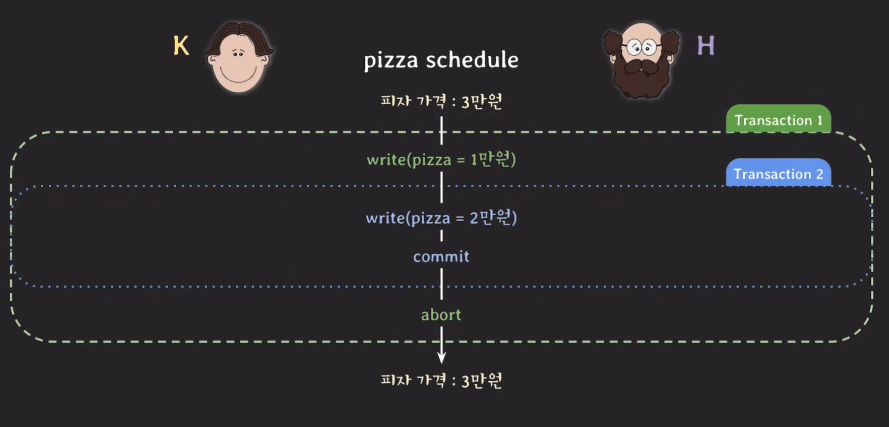
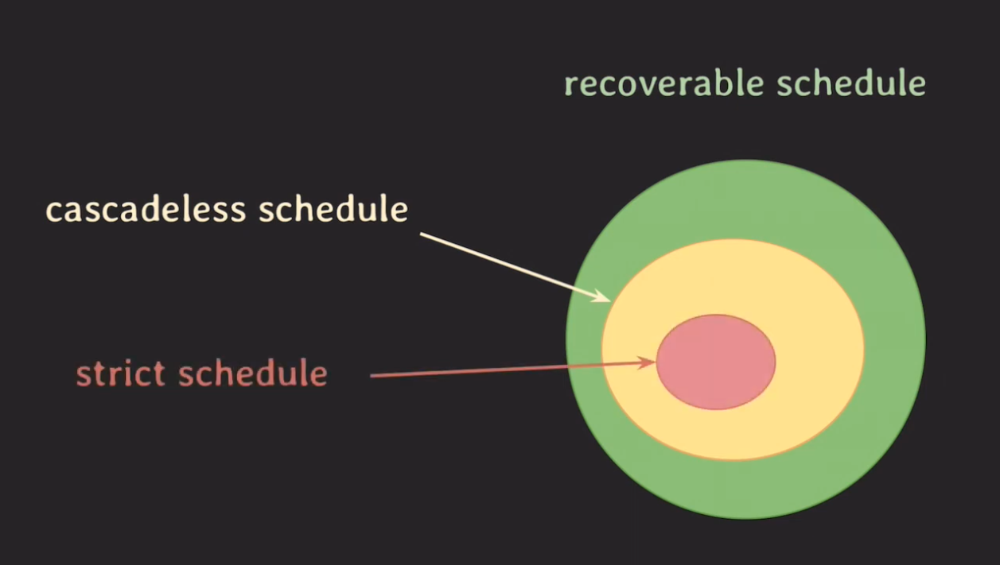

# Recoverability

## Unrecoverable schedule
 
  

schedule 내에서 commit된 transaction이 rollback된 transaction이  write했었던 데이터를 읽은 경우 unrecoverable schedule라고 한다. 이 schedule은 rollback을 해도 `이전 상태로 회복 불가능할 수 있기 때문에(Durability 속성에 의하여 commit된 transaction은 DB에 적용된 상태이다.)` 이런 schedule은 `DBMS가 허용하면 안된다.` 그렇다면 어떤 schedule이 recoverable한걸까?

## Recoverable schedule
기본적인 컨셉은 tx1, tx2가 있을 때 tx1이 tx2에 의존하는 경우 tx1은 tx2가 commit이든 rollback이든 할 때까지 기다렸다가 나머지 operaions을 진행하는 컨셉이다. 그러니가 schedule내에서 그 어떤 transaction도 자신이 읽은 데이터를 write한 transaction이 먼저 commit/rollback하기 전까지는 commit하지 않는 상태를 Recoverable schedule라고 한다. 따라서 위의 Unrecoverable schedule과는 다르게 DBMS는 이런 schedule만 허용하면 된다.

### cascading rollback
Recoverable schedule의 컨셉처럼 하나의 transaction이 rollback을 하게 되었을 때 이 transantion에 의존하고 있는 다른 transaction도 rollback을 해야하는데 이와 같은 rollback을 cascading rollback이라 한다. 그런데 만약 엮여있는 transaction이 100개라고 하면 처리 비용이 많이 드는 단점이 생기게 되는데 이를 해결하는 또 다른 schedule이 등장하게 된다.

## Cascadeless schedule
바로 cascadeless schedule이다. 이 방식은 데이터를 write한 transaction이 commit/rollback 한 뒤에 데이터를 읽는 schedule만 허용하는 방식이다. schedule내에서 어떤 transaction도 commit되지 않은 상태의 transaction들이 write한 데이터는 읽지 않겠다는 것이다. 다른 말로 avoid cascading rollback이라고도 불린다. 그렇지만 해당 schedule도 다른 상황에서는 문제가 생길 수 있다.

## Strict schedule
 
  

위와 같은 상황은 cascadeless schedule에는 부합한 schedule이다 그러나 tx1번이 rollback이 되면서 tx2의 commit내용이 결론적으로는 없던 일로 되는데 이는 사용자가 사용하는데에 문제가 생길 수 있다. 그래서 조금 더 규칙을 엄격하게 하는 schedule이 생겼는데 cascadeless schedule는 자기가 의존하고 있는 transaction가 commit되지 않은 상태라면 그 transaction과 관련있는 데이터는 읽지 않겠다는 규칙이었는데 strict schedule은 `쓰지도 않겠다.`라는 규칙을 더하여 더 엄격하게 관리하는 schedule이다. 그래서 이 schedule은 이전 상태로 rollback하는 것이 쉽다. 

## 정리
 
  

어떤 schedule이 어떤 transaction이 write한 데이터를 또 다른 transaction이 read를 했다면 write한 transaction이 commit/rollback하기 전까지는 read한 transaction도 commit/rollback하지 않을 때 그런 schedule을 `recoverable하다고 하고 또는 그 schedule은 recoverability를` 가지고 있다고 말한다.

그래서 최종적으로 `concurrency control이라고 하는 것은 지난 시간에 배웠던 serializability와 recoverability를 제공`하는 것을 말한다. 그리고 이와 관련된 DBMS의 속성이 바로 `isolation`이다.