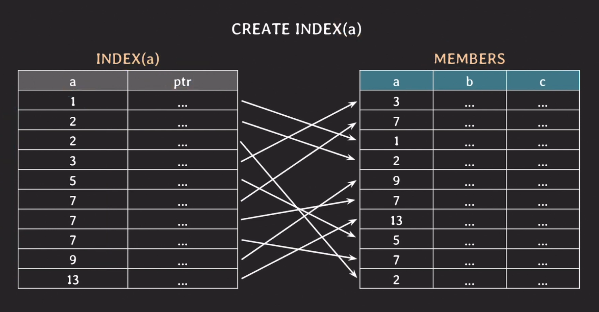
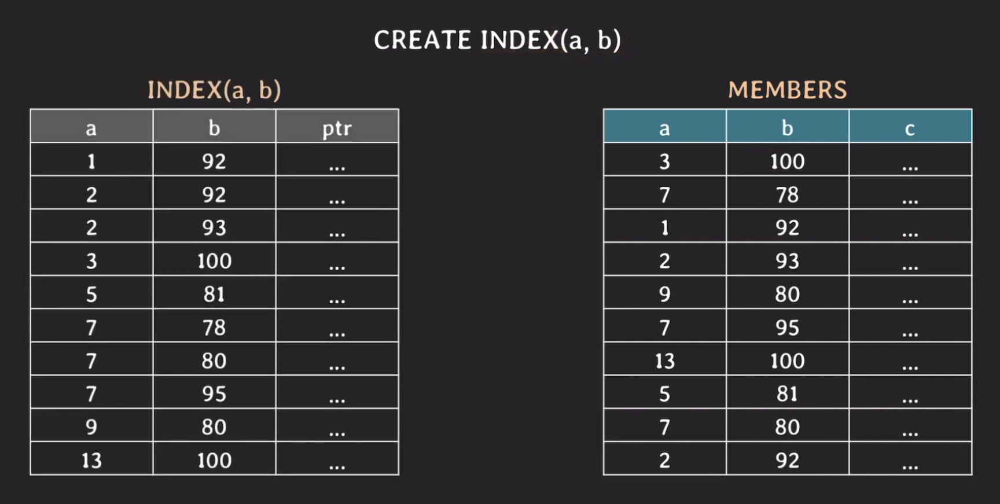
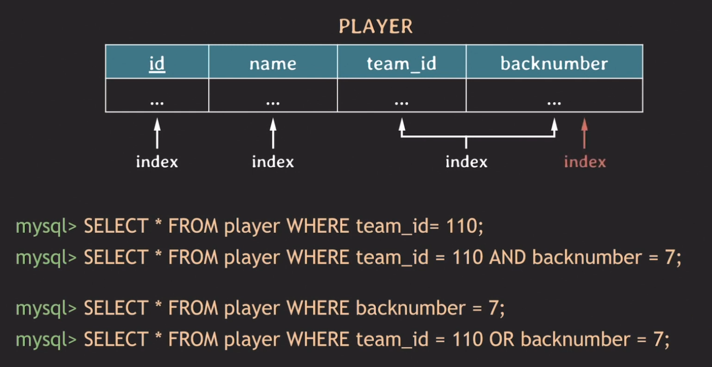
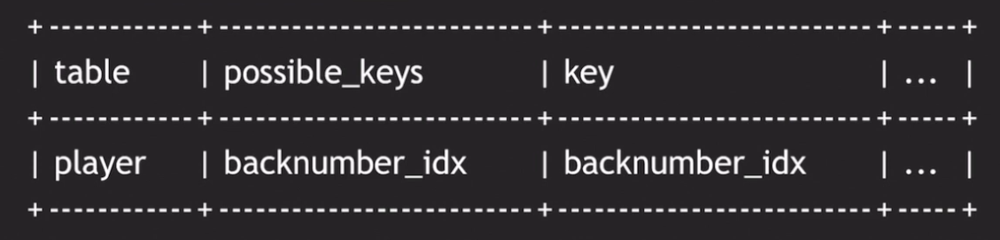

# Index 인덱스

## 개요 
이번 글에서는 index가 중요한 이유와 index를 거는 방법 그리고 동작방식 마지막으로 사용 시 참고 사항을 공부해보겠다.

## Index란?
```SQL
SELECT *
FROM customer
WHERE first_name = 'Minsoo';
```
위와 같은 쿼리가 있을 때 first_name에 인덱스가 결려있지 않고 데이터가 100만개라면 full scan(혹은 table scan)으로 정보를 찾게 되는데 시간 복잡도는 O(N)이 된다. 그러나 인덱스가 걸려있게 된다면 O(logN)(B-tree based index)로 정보를 찾게된다. 이는 당연히 full scan보다 훨씬 빠른 속도이다. 그래서 DB에서 index를 쓰는 이유는 조건을 만족하는 튜플을 빠르게 조회하기 위해서 사용하는 것이다.(또는 빠르게 정렬(order by) 혹은 그룹핑(group by)하기 위해) 조회 속도는 비용 그 이상으로 의미가 있기 때문이다.

## Index 생성 및 조회
### 데이터가 있는 경우
```SQL
SELECT * FROM PLAYER WHERE name = 'Sonny';
SELECT * FROM PLAYER WHERE team_id = 105 and backnumber = 7;

CREATE INDEX player_name_idx ON player(name);
CREATE INDEX team_id_backnumber_idx ON player(team_id, backnumber);
```

MySQL기준으로 테이블에 데이터가 존재할 때 컬럼에 인덱스를 걸어줄 수 있는 방법이다. 인덱스는 컬럼 하나 혹은 여러개를 걸 수 있는데 조회조건으로 사용되는 범위안에서 걸어주어야한다. 

### 초기 테이블 생성 시
```SQL
CREATE TABLE player (
    id INT PRIMARY KEY,
    name VARCHAR(20) NOT NULL,
    team_id INT,
    backnumber INT,
    INDEX player_name_idx(name),
    UNIQUE INDEX team_id_backnumber_idx(team_id, backnumber)
);
```

이때 생성할 때 인덱스 명을 생략해도 알아서 해당 컬럼에 맞게 인덱스 명을 생성해준다. (player_name_idx, team_id_backnumber_idx 생략 가능) 그리고 team_id_backnumber_idx처럼 여러개의 컬럼을 사용한 인덱스를 `multicolumn index` 또는 `composite index`라고 부른다. 그리고 대부분의 RDBMS에서는 primary key는 자동으로 인덱스가 생성이 된다.

### Index 조회
```shell
SHOW INDEX FROM player;
```

## 동작방식
### B-tree 기반의 index가 동작하는 방식
<br>
 

Members 테이블의 a에 대해서 인덱스를 생성하게 되면 왼쪽과 같은 인덱스 테이블이 생성된다. 이때 a는 정렬된 상태로 존재하고 두번째 컬럼인 포인터 컬럼은 실제 members테이블의 a의 위치를 가리키는 정보를 담고 있다. 그런데 이때 `WHERE a = 9;`과 같이 쿼리를 실행하게 되면 인덱스 테이블에서 Binary-search를 통해 9를 찾고 그 포인터 값을 통해 members테이블의 tuple을 선택하게 된다. 그리고 나서 9라는 값이 또 존재하는지 체크하게 되는데 이때는 9 다음에 13이라 마지막 선택 단계에서 마무리 짓게 된다.

그런데 `WHERE a = 7 AND b = 95;`라는 쿼리가 들어오게 되면 어떻게 데이터를 찾을까? 7을 찾는 과정은 동일하게 Binary-search로 찾으면 되지만 b는 인덱싱이 안되어있기 때문에 결국 b를 찾는 과정은 full-scan을 하게 되는 것이다. 예제에서는 7이 3건이었지만 실제 서비스에서도 이러하다면 서비스 품질에 영향을 미치게 될 것이다.

<br>
 

그래서 이제는 a와 b를 multicolumn index로 설정해줘보자. 이렇게 인덱스를 걸게되면 인덱스 테이블 내에서의 정렬 우선 순위는 인덱스를 등록할 때 왼쪽이 우선시가 된다. 그래서 현재 a만 정렬된 상태이고 b는 정렬이 되어있지 않다. 자 그러면 아까처럼 `WHERE a = 7 AND b = 95;`쿼리가 하달되면 어떻게 동작하게 될까? 이전에는 b값을 찾을 때 full-scan으로 값을 찾았지만 이제는 인덱스 테이블에서 b값과 그 위치를 알고 있기 때문에 훨씬 빠르게 값을 찾을 수 있다. 그런데 만약 `WHERE b = 95;`라는 쿼리가 들어오게 되면 어떻게 될까. 이때는 인덱스 테이블에 b가 있어도 정렬이 되어있지 않은 상태이기 때문에 사실상 full-scan과 다를게 없어진다. 그래서 조회를 따로 할 것 같으면 인덱스를 b로만 해서 따로 만들어줘야한다. 

### 추가사항
실제로 DB에서는 Binary-search의 확장된 방법으로 검색한다. 두 부분으로 나누는 것이 아니라 더 많은 부분으로 나누고 재귀적으로 탐색하게되는 형태이다.(서브트리)

## 예제
<br>
 

위의 테이블에는 현재 총 3개의 인덱스가 걸려있다. 다른 쿼리들은 인덱스 서치가 가능해서 빠르게 조회할 수 있지만 마지막 쿼리는 이야기가 다르다. AND가 아니라 OR절로 묶인 이 조건문은 team_id에 대해서는 인덱스가 있기때문에 빠르게 검색이 가능하지만 backnumber에 대해서는 인덱스 테이블에 정렬도 안되어있기 때문에 결국 full-scan을 하게 될 것이다. 만약 이렇게 조회를 해야한다고 하면 backnumber도 따로 인덱스를 생성해주어야 빠른 조회가 가능하다. 그래서 결론은 사용하는 쿼리에 따라서 적절하게 인덱스를 걸어주는 것이 필요하다는 것을 확인할 수 있다.

## Index 추가사항
### 쿼리가 어떤 인덱스를 사용하고 있을까?
바로 실행계획을 확인해보면 된다. 
```shell
EXPLAIN SELECT * FROM player WHERE backnumber = 7;
```
 

그리고 어떤 인덱스를 사용할지는 DBMS의 optimizer가 알아서 적절하게 index를 선택하게 되어있으나 가끔 이상한 인덱스를 선택할 때가 있는데 직접 인덱스를 설정하는 방법이 존재한다. MySQL에서는 다음과 같이 실행하면 된다.
```SQL
SELECT * FROM player USE INDEX(backnumber_idx) WHERE backnumber = 7;
-- USE : 가급적 "이 index로 써주새요." 라고 optimizer에게 요구할 떄 사용한다.

SELECT * FROM player FORCE INDEX(backnumber_idx) WHERE backnumber = 7;
-- FORCE : 이 인덱스를 쓰지만 optimizer가 성능이 안나온다고 판단하면 full scan을 하게 된다.

SELECT * FROM player IGNORE INDEX(backnumber_idx) WHERE backnumber = 7;
-- IGNORE : 특정 인덱스는 제외하고 사용할 때 쓴다.
```

### 그러면 Index를 많이 만들어도 되는 걸까?
과유불급이라는 말이 여기에 잘 맞는데 인덱스를 생성한다는 것은 table에 insert를 할 때마다 index에도 변경이 필요하다는 말이다. 수시로 업데이트되고 삭제되면 그만큼 인덱스 테이블도 취하는 액션이 많아진다는 뜻이다. 또 인덱스 테이블 또한 원천 테이블 만큼은 아니지만 일종의 저장공간을 사용하기 때문에 인덱스를 많이 만들게 되면 저장 공간도 고려해야한다. 

### Covering index
개념은 간단하다, 만약 내가 찾으려는 컬럼이 team_id와 backnumber인데 해당 컬럼을 관리하고 있는 인덱스가 있는 경우 이때 원천테이블까지 매핑하며 조회하지 않고 인덱스 테이블 내에서 조회결과를 반환하는 시스템을 `covering index`라고 한다. 당연히 조회 성능이 더 빠르다.
```SQL
SELECT team_id, backnumber FROM player WHERE team_id = 5;
```

### Hash Index
지금까지 B-tree index에 대해서 살펴보았지만 Hash방식 으로 구현한 index도 존재한다. 특징은 다음과 같다.
- hash table을 사용하여 index를 구현
- 시간 복잡도 O(1)의 성능
- rehasing에 대한 부담
- equality 비교만 가능, range 비교 불가능 (ex. <, >, <=, >=....)
- multicolumn index의 경우 전체 attrubutes에 대한 조회만 가능

### Full scan이 더 좋은 경우
- table에 데이터가 조금 있을 때 (몇 십, 몇 백건 정도)
- 조회하려는 데이터가 테이블의 상당 부분을 차지할 때
    - 이때 인덱스가 있어도 optimizer가 알아서 판단한다.

### 그 외
- order by나 group by에도 index가 사용될 수 있다.
- foreign key에는 index가 자동으로 생성되지 않을 수 있다.(join 관련)
- 이미 데이터가 몇 백만 건 이상 있는 테이블에 인덱스를 생성하는 경우 몇 분 이상 시간이 걸릴 수 있고 이때 DB 성능에 안좋은 영향을 줄 수 있다.

## 마무리
그냥 검색 빠르게 해주는 용도로만 알고있었던 인덱스를 조금 더 자세하게 배물 수 있어서 좋았다. 특히 실무에서 바로 고민해볼 수 있는 지점들이 많았고 covering index라는 개념은 모르고 있었는데 이후에 인덱스를 내가 직접 셋팅할 때 큰 도움이 될 지식인 것 같다.