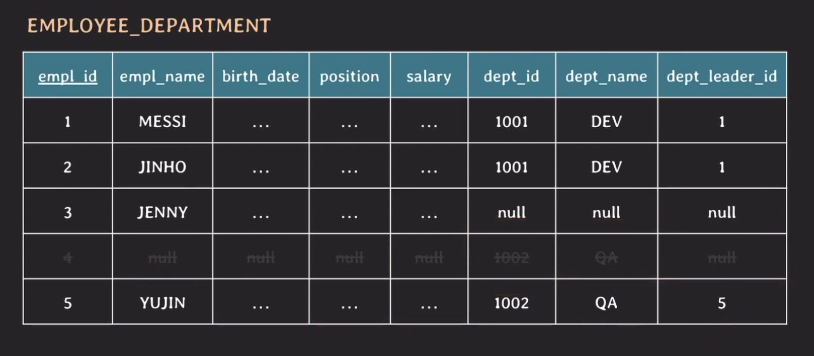
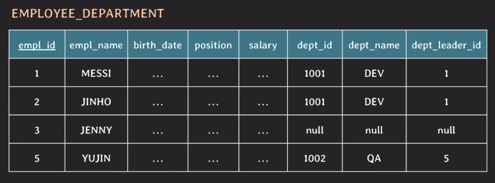
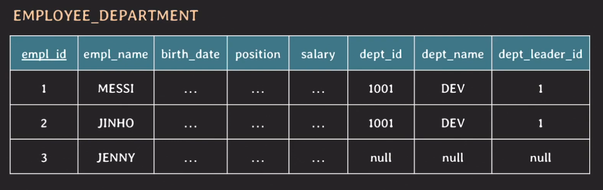
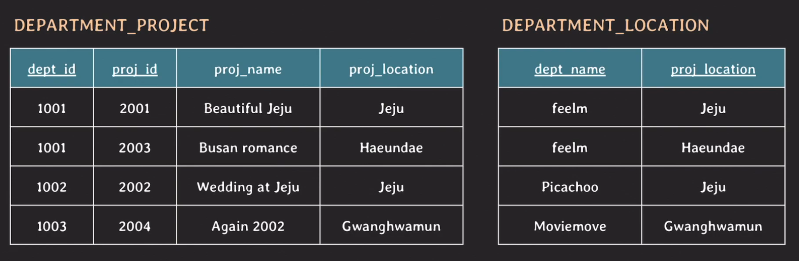
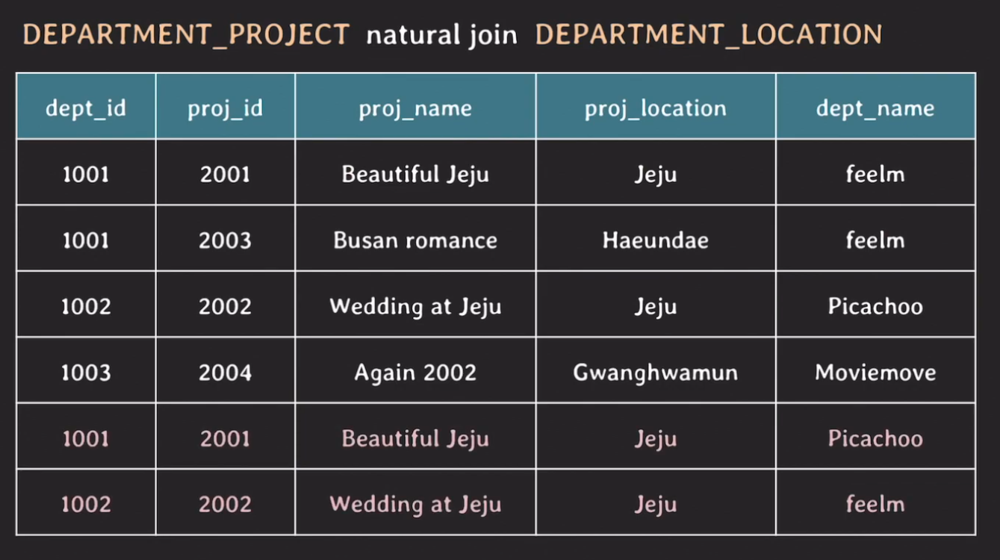

# DB 설계

## 개요
DB를 잘못 설계 했을 때의 문제점을 알아보자.
 
## 중복 데이터 문제
### Insertion anomalies
 
  

위의 그림은 대표적으로 잘못된 설계된 테이블이다. 문제점을 살펴보면 다음과 같다.
1. 중복된 데이터가 존재한다.
    - 부서가 동일한 직원의 경우 부서와 관련된 값은 동일하다.
2. 부서가 없는 경우 부서 관련 값은 null로 채워줘야한다.
3. 부서만 추가하고 싶은 경우 직원이 없음에도 불구하고 empl_id를 추가하여 사용해야한다.
    - 직원의 정보 또한 null로 채워야한다.
4. 이후 'yujin'이라는 직원이 QA팀에 들어오게 되었을 때 3번에서 만들었던 불필요한 row를 삭제해야한다.
5. 결과적으로 해당 테이블은 두 개의 관심사를 가지고 있다. (직원 / 부서)

### Deletion anmalies
 
  

여기서 'yujin'을 지우게 된다면 어떻게 될까? 이제 우리는 QA부서에 대한 정보를 잃어버리게 된다. 그러면 삭제하지 않고 직원의 정보만 null로 바꿔주면 되지 않느냐 라고 할 수 있는데 이는 논리적으로 매끄럽지 않다는 것을 알 수 있다. 그래서 서로 다른 관심사를 가지는 직원과 부서를 각 테이블로 분리해야하는 이유가 생기는 것이다.

### Update anomalies
 
  

만약에 여기서 'DEV'라고 하는 부서가 'DEV1'로 변경을 하려고 하는데 어떤 이유에서인지 JINHO만 DEV1로 업데이트가 진행되었다. 이런 경우엔 보이는 것처럼 데이터 불일치가 일어나는 일이 발생할 수 있다. 마찬가지로 각 관심사별로 테이블을 분리하면 쉽게 해결될 문제이다.

## Spurious Tuples(가짜 데이터)
사진 촬영 회사의 데이터베이스를 구축하는데 다음과 같이 테이블을 만들었다고 가정해보자.
 
 

> 각 dept_id는 location테이블과 논리적으로 연결되어있다고 생각해보자. 1001의 부서명은 feelm처럼 말이다.  

이렇게 데이터만 봐도 이미 설계가 이상하다는 것을 알 수 있다. dept_name이 dept_id와 붙어있어야만 할 것 같기 때문이다. 만약에 이 두 테이블을 natural join을 하게 되면 똑같은 이름을 가진 속성 값끼리 매칭이 되는데 이 테이블에서는 location이 연결 될 것 같다. 흘깃보며 눈으로 조인하면 4줄이 나올거라고 생각할 수도 있지만 결과는 다르다.
 
 

이것처럼 6줄이 나오게 된다. 그 이유는 하나의 row가 Jeju라는 location으로 매칭될 때 각 2건과 매칭되기 때문이다. 그래서 dept_id가 같은데 dept_name이 다른 tuple이 나오게 되는데 이 5,6번의 데이터를 `Spurious Tuples`라고 부른다. 이때는 부서 테이블, 프로젝트 테이블, 부서별 프로젝트 테이블 (중간테이블)로 설계를 해주면 해결된다.

## Null값이 많아짐으로 인한 문제점들
1. null값이 있는 컬럼과 join을 하는 경우 상황에 따라 예상과 다른 결과를 발생시킬 수 있다.
    - 예전에 Is Not Null같은 쿼리를 사용하지 않고 조회를 했을 때 문제가 있었던 것을 공부한적이 있다.(SQL 문법)
2. null값이 있는 컬럼에 aggregate function을 사용했을 때도 주의가 필요함.
    - null값이 있는 경우 count를 할 때 조건에 따라 count를 안하는 경우가 있음
3. 불필요한 storage 낭비
    - 요즘은 저장공간에 대한 부담이 훨씬 적기 때문에 그다지 큰 문제는 아님.
    - 그러나 이 부분을 놓치게 되면 시간이 흘렀을 때 처리하기는 더 힘들다.

## 정리
1. 의미적으로 관련있는 속성들끼리 테이블을 구성
2. 중복 데이터를 최대한 허용하지 않도록 설계
3. join 수행 시 가짜 데이터가 생기지 않도록 설계
4. 되도록이면 null 값을 줄일 수 있는 방향으로 설계
5. 때로는 성능 향상을 위해 일부러 테이블을 나누지 않는 경우도 있다.

## 마무리
이번 내용은 이미 다 알고 있던 부분이어서 쉽게 들을 수 있었다. 예전에 어떤 일을 하면서 한 테이블의 row가 너무 많아져버려서 더이상 insert가 안되는 지경까지 이르렀던 일이 있었는데 그때가 문득 떠올랐다. 설계가 잘못된 것은 아니었지만 결국엔 문제가 발생한 것이었는데 설계를 잘해도 어느정도 미래까지 내다보며 해야겠다는 생각이 들었다.
