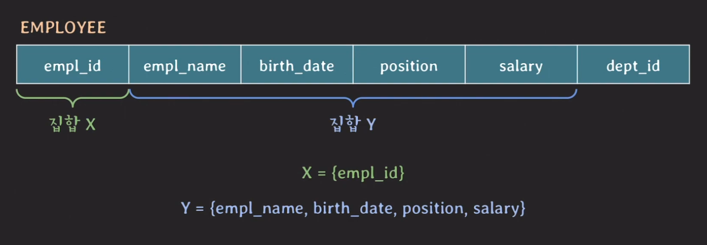
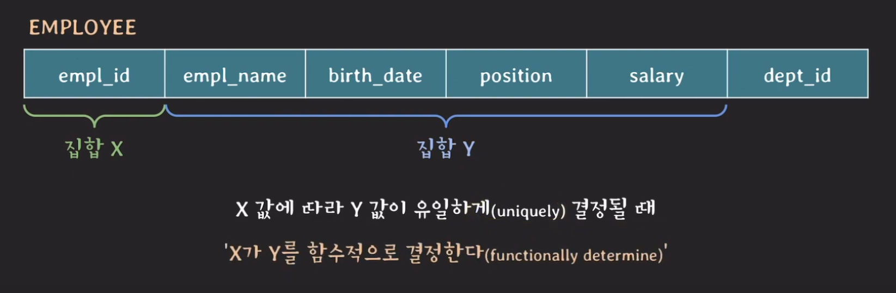
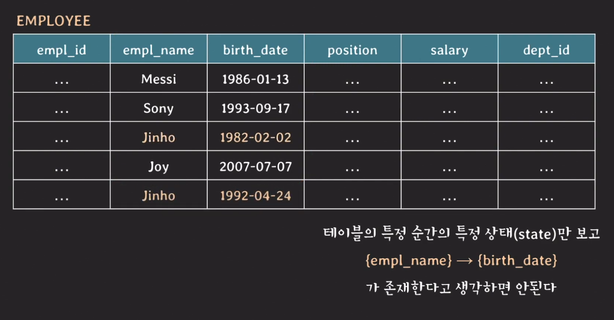
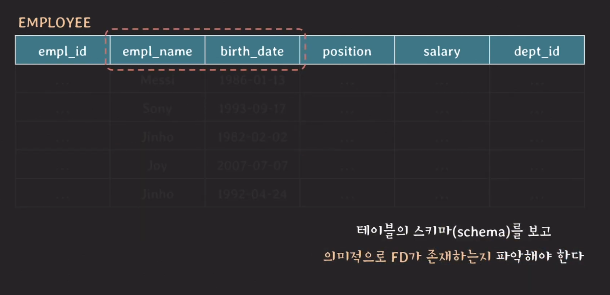
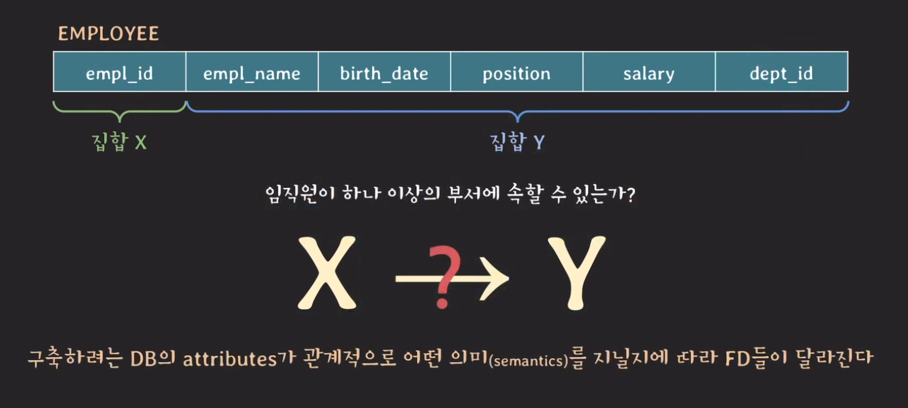
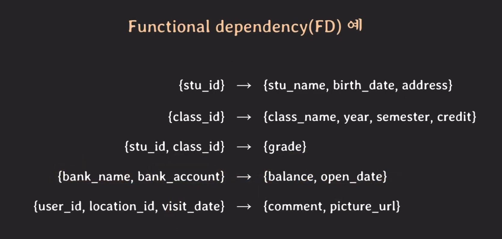
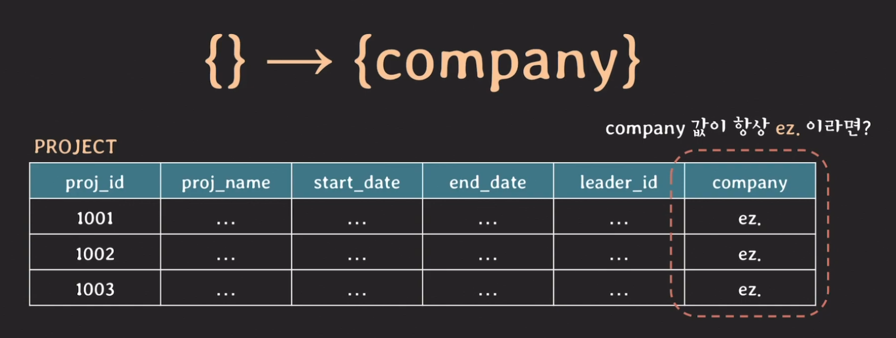
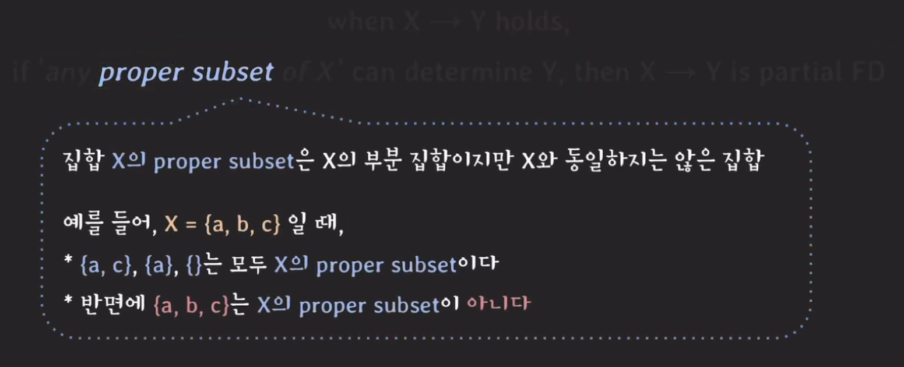

# Functional Dependency(함수 종속)

## 개요
Functional Dependency의 의미는 한 테이블에 있는 두 개의 attribute(s) 집합(set)사이의 제약(a constraint)를 말한다.
<br>
  

이러한 테이블이 있을 때 특징은 두 개 tuple의 X값이 같다면 Y값도 같다는 특징이 있다. 이유는 empl_id를 통해 유니크하게 주어진 ID이기 때문이다.
<br>
  

이때 X 값에 따라 Y값이 유일하게 결정될 때 이를 `X가 Y를 함수적으로 결정한다`라고 하며 `Y가 X에 함수적으로 의존한다`라고도 말할 수 있다. 두 집합 사이의 이러한 제약 관계를 `functional dependency(FD)`라고 부른다. 기호로는 `X(left hand side) -> Y(right hand side)`로 표현한다. 집합 X가 Y를 결정한다라는 뜻이다.

## Functional dependency 파악하기
테이블의 스키마를 보고 `의미적으로` 파악해야한다. 즉, 테이블의 state를 보고 FD를 파악해서는 안된다.
<br>
 

예를들면 5번째 라인의 진호라는 사람이 입사하기 전에 이름과 생년월일을 살펴보았더니 이름이 마치 생일을 결정하는 것처럼 보여 "아 이름이 생일을 결정하는 구나." 라고 생각할 수 있는데 (`{empl_name} -> {birth_date}`) 5번째의 진호가 들어오는 순간 바로 성립되지 않아버리기 때문이다. 그래서 FD는 테이블의 특정 순간의 특정 상태를 보고 판단하면 안된다.
<br>
 


### 또 다른 예시
만약 집합 Y가 dept_id까지 포함한다면 FD는 어떻게 될까. 이때는 정말 의미적으로 생각해봐야한다. 예를 들면 이 회사가 한 직원이 여러 부서에 속해 있을 수 있는지 아닌지에 따라 달라지게 되는 것이다. 여러 부서에 속할 수 있다면 FD가 성립되지 않을 것이기 때문이다. 
<br>
 

<br>
 

### X -> Y not means Y -> X
X가 Y를 결정짓는다고 해서 Y가 X를 결정 지을 수는 없으며 반드시 결정하지 못한다는 법이 없다.

### {} -> Y
해당 의미는 Y값은 언제나 하나의 값만을 가진다는 의미를 가지고 있다.
<br>
  
이런 경우에 위와 같이 표현한다.


## FD의 종류
### Trivial functional dependency
when X -> Y holds, if Y is subset of X, then X -> Y is trivial FD 
X가 Y를 결정할 때 만약 Y가 X의 부분 집합이라면 이때 X -> Y를 trivial FD라고 하는 것이다.  
`{a, b, c} -> { c } is trivial FD`  
`{a, b, c} -> { a, c } is trivial FD`  
`{a, b, c} -> { a, b, c } is trivial FD`  

### Non-trivial functional dependency
when X -> Y holds, if Y is NOT subset of X, then X -> Y is non-trivial FD
X가 Y를 결정할 때 만약 Y가 X의 부분집합이 아니라면 이때 X -> Y를 non-trivial FD라 한다.  
`{a, b, d} -> { b, c, d } is non-trivial FD`  
`{a, b, d} -> { d, e } is non-trivial FD & completely non-trivial FD`  

### Partial functional dependency
when X -> Y holds, if 'any proper subset of X' can determine Y, then X -> Y is partial FD 
X가 Y를 결정할 때 X의 proper 부분집합이 Y를 결정 지을 수 있다면 이때 X -> Y를 partial FD라 한다.  
<br>
  

```TEXT
when {empl_id, empl_name} -> {birth_date} holds,  
becuase {empl_id} can determine {birth_date},  
then this FD is partial FD
```

### Full functional dependency
when X -> Y holds,
if 'every proper subset of X' can NOT determine Y, then X -> Y is full FD  
```TEXT
when {stu_id, class_id} -> {grade} holds,
because {stu_id}, {class_id}, {} can NOT determine {grade},
then this FD is full FD
```

## 마무리
해당 개념들은 정규화를 위해서 알고 가야할 개념들이다. 정규화에 대해서 두 번정도 공부했던 것 같은데 아마 이번에는 조금 다른 방식으로 배울 수 있지 않을까 생각이 된다. 내개 남아있는 정규화의 개념은 `정규화의 방식(공식)은 총 5개로 이루어져있다.`라는 것 밖엔 남아있지 않다.