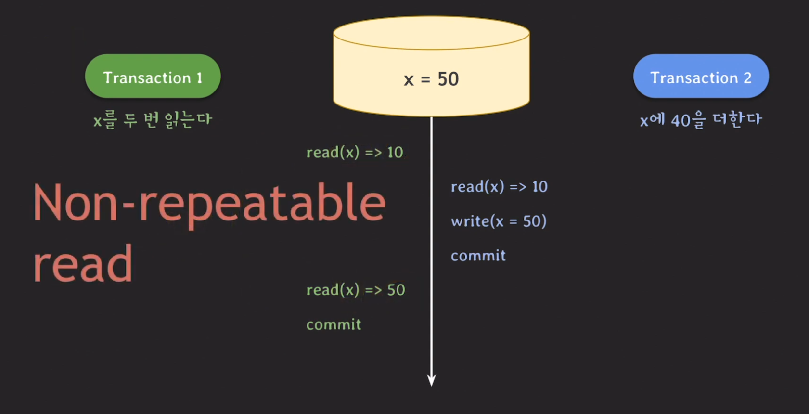

# Isolation level

## 예시
### Dirty read
 
  

각 값의 초기값은 x = 10, y = 20이었을때 아래와 같이 operation들이 진행된다고 가정하였을때 tx1이 읽은 y의 값은 결과적으로 문제가 있을 수 있는 값이 되어버리기 때문에 이를 `Dirty read`라고 한다.

### Non-repeatable read
 
  

위와 같이 같은 값을 읽는 tx인데 각각 다른 값을 읽게되는 상황을 `Non-repeatable read`라고 하며 다른 말로 fuzzy read라고도 부른다. 이는 isolation관점에서 볼 때 하나의 트랜잭션은 마치 혼자 동작하는 것처럼 동작해야하는데 이 때 x의 값을 보면 그렇지 않기 때문에 문제가 있다고 볼 수 있는 부분이된다.

### Phantom read
 
 

이는 같은 값을 읽었는대도 v2라는 새로운 값이 생긴 경우를 말한다. 즉, 없던 데이터가 갑자기 생기는 이 현상을 `Phantom read`라고 부른다. 이 또한 isolation관점에서 볼 때 문제가 있어보이는 연산인 것이다.

## Isolation Level
위 처럼 `Dirty read`, `Non-repeatable read`, `Phantom read`와 같은 현상들이 모두 발생하지 않게 만들 수 있지만 그렇게 한다면 제약사항이 많아져서 동시 처리 가능한 트랜잭션 수가 줄어들어 결국 DB의 전체 처리량이 하락하게 되는 문제가 발생한다. 그래서 일부 이상한 현상들을 허용하는 몇가지 level을 분류하여 사용자가 필요에 따라서 적절하게 선택할 수 있도록 하겠다는 것이 `isolation level`이며 4가지 level로 구분 된다.

 

추가로 serializable level은 위의 3가지 이상 현상을 제외하고도 어떤 이상현상도 일어나지 않게 하는 레벨이다.

### 비판
위에 정의된 `Isolation level`은 92년도 ANSI/ISO standard SQL 92에서 정의되었는데 95년도에 이 level 시스템을 비판하는 논문이 나오게 된다, 해당 논문의 내용은 다음과 같다.
1. 세 가지 이상 현상의 정의가 모호하다.
2. 이상 현상은 세 가지 외에도 더 있다.
3. 상업적인 DBMS에서 사용하는 방법을 반영해서 isolation level을 구분하지 않았다.

추가로 해당 논문에서 언급된 이상 현상을 알아보자.

#### Dirty write
 
  

rollback 시 정상적인 recovery는 매우 중요하기 때문에 모든 isolation level에서 dirty write를 허용하면 안된다고 주장함.

#### Lost update
 
  

해당 이상 현상은 굉장히 치명적인 이상현상이 될 수 있다. 특히 돈처럼 값이 중요한 연산일 경우 더 그렇다.

#### Dirty read expand
 
  

맨 처음 살펴본 dirty read는 abort가 되어야만 이상현상이라고 말했지만 사실 commit되지 않은 값을 읽기 시작하게 되는 순간 이미 데이터의 정합성은 깨지기 때문에 이 또한 문제라고 말하고 있다. abort가 발생하지 않아도 dirty read 상태라는 것이다.(x와 y를 더한 값은 언제나 100이어야 했다.)

#### Read skew
 
  

위 현상은 값을 읽어오는 데에 문제가 생기는 경우다. 이 또한 x와 y의 합이 100이어야하는데 tx2가 뒤늦게 tx을 끝마쳤을 때 합이 140이 되게 된다.

#### Write skew
 
  

위 현상은 간단하다 결국에 둘다 commit은 됐지만 결과적으로 제약사항을 어긴 tx들이 되어버리기 때문에 이또한 이상현상이다라고 주장할 수 있는 것이다.

#### Phantom read expend
 
 

위 현상은 앞서 배운 Phantom read의 확장된 이상 현상이다. 아까처럼 같은 값을 조회하는 tx이 아니라 관련이 있는 데이터들을 조회할 때에도 이상현상이 생길 수 있다는 이야기이다. tx1은 사실 cnt = 0을 기대해야하는데 그렇지 않고 제약 사항도 위반된 상태라는 것을 확인할 수 있다.

## Snapshot isolation
위에 기존 isolation level을 비판했던 논문에서 추가로 제시한 isolation level이 있는데 이때 추가적으로 이상현상을 주장하면서 소개한 `Snapshot isolation`이란것이 있다. 기존의 isolation은 이상 현상에 기반하여 level을 정의하고 적용했지만 snapshot isolation은 concurreny control이 어떻게 동작할지를 판단하여 구현된 isolaion level이다.

 

컨셉은 간단하다. 모든 tx은 시작하기 전에 DB상태를 snapshot으로 저장을 한다.(접근할 데이터를) 그리고 read건 write건 snapshot의 정보를 가지고 연산한다음 commit을 할 때 그제서야 DB에 반영을 하게 된다. 그런데 만약 그림처럼 tx1이 y의 값을 잘 못 읽고 쓰게되는 경우 tx1을 abort 시켜버리는 방식인 것이다. (tx 시작 전에 `commit된 데이터만` 보이며 `먼저 commit`한 tx이 이기게 되는 그런 방식이다.)이렇게 동작하는 방식은 `MVCC`의 한 종류인데 위의 예시처럼 snapshot의 버전을 기준으로 동작하는 것을 말하고 snapshot isolation이 그 중 하나인 것이다. 

## DBMS별 정리
<b>MySQL</b>  
SQL 표준에 정의된 level을 사용하고 있다.  

<b>Oracle</b>  
`Read uncommitted level`을 지원하지 않으며 serializable level은 snapshot방식으로 동작한다.  

<b>SQL Server</b>  
표준을 따르고 있으며 snapshot도 지원한다.  

<b>PostgreSQL</b>  
표준을 따르고 있으며 `Serialization Anomaly`라는 이상 현상을 추가하여 지원하고 있으며 Repeatable read가 snapshot에 해당된다.

## 마무리
오늘 배운 내용은 내가 어떤 쿼리를 어떤 서비스를 구현하는지와 굉장히 밀접한 관련이 있는 내용이었다. 개발자가 상황에 맞춰서 유연하게 정책을 수립할 수 있는 부분이 흥미로웠다. 왜냐하면 오늘 이 내용을 공부하면서 이상 현상이라는 것을 나는 무의식 적으로 문제점 혹은 에러라고 적고있었는데 중반쯤 와서 문제나 에러가 아니라 `이상 현상`임을 알게 되었고 이러한 방식이 도입된 이유는 이렇게 밖에 할 수 없었기 때문임을 이해할 수 있었다. 