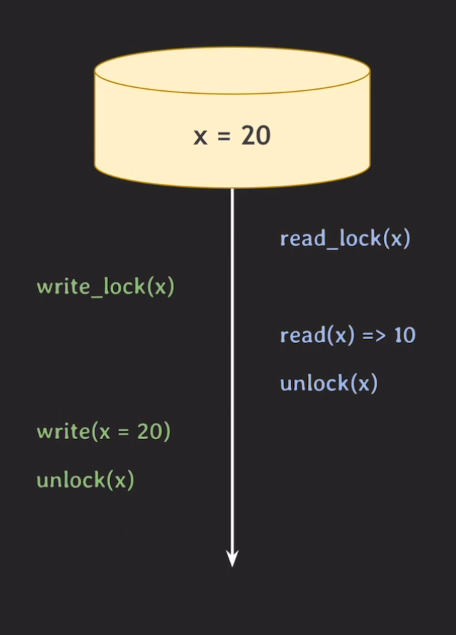
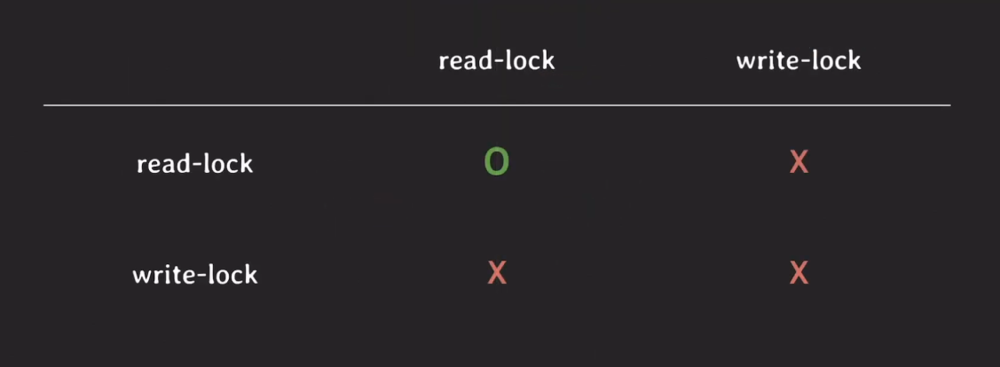
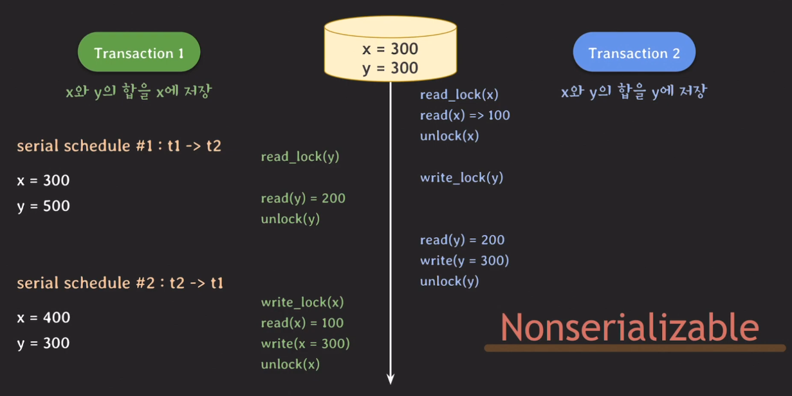
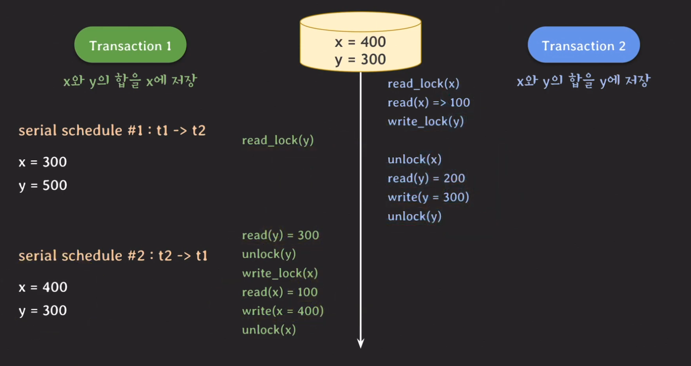
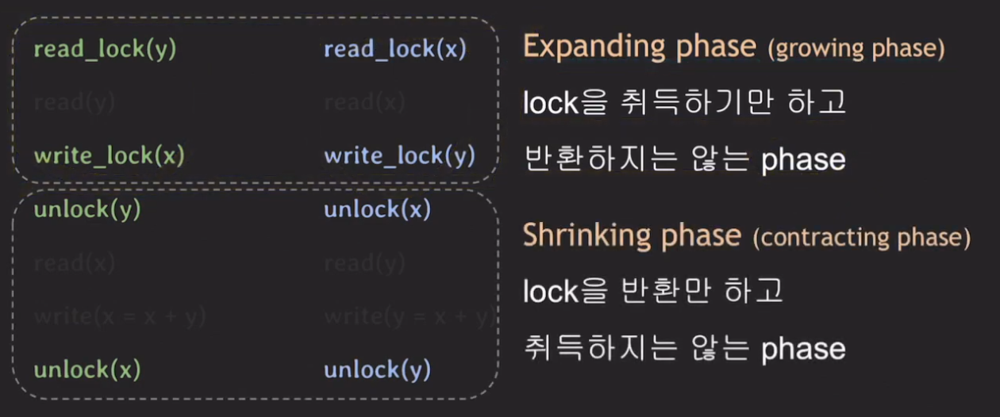
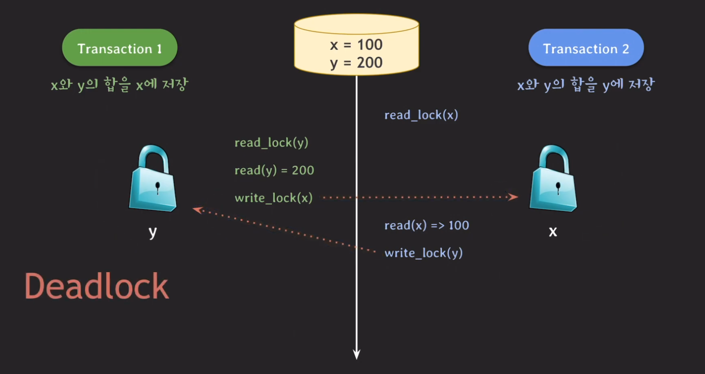
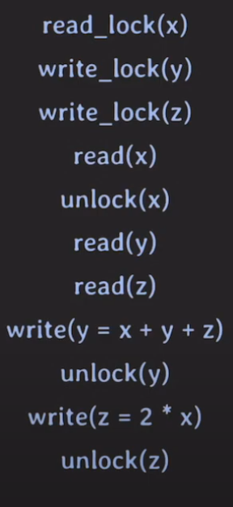
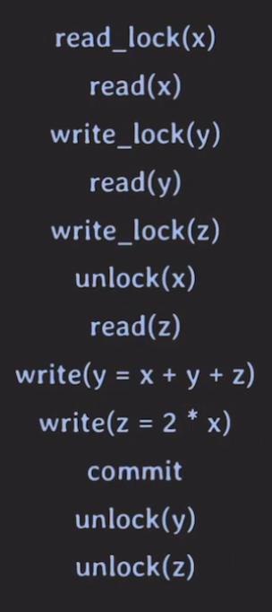
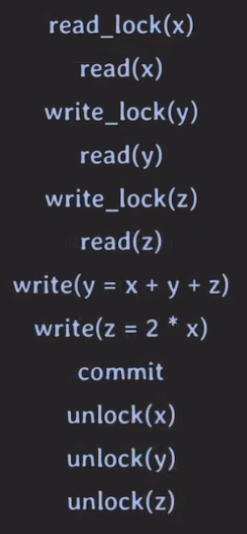

# Lock

## 개요
DB에 write하는 과정은 값을 하나 바꾸는 것보다 더 복잡한 과정이다. (ex. 인덱싱처리) 또 같은 데아터에 또 다른 read/write가 있다면 예상치 못한 동작을 할 수 있다. 그래서 이때 DB는 Lock라는 개념을 사용하게 된다. 이 Lock은 운영체제에서 사용하는 lock과 동일한 개념이다. 만약 데이터 x에 대해 연산을 수행할 tx가 2개가 있을 때 tx1이 먼저 x에 대한 데이터에 접근하기 위해 lock에 대해 권한을 얻었다. 이때 tx2가 x에 접근하려한다면 lock 권한이 없기 때문에 tx1의 연산이 모두 끝나고 해당 lock이 unlock이 될 때까지 기다린 후 tx2의 연산이 진행된다. 

 

## Lock의 종류
### Write-lock(exclusive lock)
- read/write(insert, modify, delete) 할 때 사용한다.
- 다른 tx가 같은 데이터를 read/write하는 것을 허용하지 않는다.
- 이름만 write이지 모든 액션을 취할 수 있다.

### Read-lock(shared lock)
- read 할 때 사용한다
- 다른 tx가 같은 데이터를 read하는 것은 허용하는 특징이 있다.
- 어러개의 tx가 와도 읽는 것이 가능하다.

### Lock의 호환성
 
 

## Concurrency control with lock
 
 

위와 같은상황을 보았을 때 serial schedule의 #1과 #2의 값과 lock을 사용했을때 결과값이 다르다는 것을 알 수 있다. 이는 lock을 사용했을 때 이상한 결과를 받을 수 있다는 것을 의미하고 이 schedule은 non-serializable한 schedule으로 볼 수 있다.

 

이런방법으로 unlock과 write lock의 위치를 바꿔줌으로써 #2와 동일한 결과를 얻게 되었다. 마찬가지도 tx1번이 먼저 시작된다고 가정을 하여도 unlock와 write lock의 위치를 바꿔주면 값은 serial schedule의 값과 동일하게 나온다.

### 2PL protocol (two-phase locking)
위의 해결책을 정리해보자면 tx에서 모든 locking operation이 최초의 unlock operation보다 먼저 수행되도록 한다면 해당 schedule은 serializable하게 동작한다는 것을 찾아낼 수 있고 이를 `2PL protocol`이라 부른다. 

 

이처럼 lock을 취득만하는 phase와 반환만 하고 취득하지않는 phase를 구분한다고 해서 2PL이라고 부르는 것이다. 그리고 이 프로토콜은 serializability를 보장한다. 그런데 어느 상황에서는 문제가 생기는 경우가 있다. 바로 아래와 같은 `Dead-lock`이다. (해결 방법은 운영체재의 방식과 동일하기 때문에 패스)  
[OS-Dead-Lock](https://coding-zzang.tistory.com/39)

 

### Conservative 2PL
- 해당 2PL방식은 모든 lock을 취득한 뒤 tx를 시작하는 방식이다.
- deadlock-free
- 실용적이진 않다. (모든 lock을 취득해야하기 때문에)

 

### Strict 2PL(S2PL)
- strict schedule을 보장하는 2PL
- recoverability를 보장
- write-lock을 commit / rollback 될 때 반환하는 방식

 

### String strict 2PL (SS2PL or rigorous 2PL)
- strict schedule을 보장하는 2PL
- recoverability를 보장
- read-lock / write-lock 모두 commit / rollback 될 때 반환하는 방식
- S2PL보다 구현이 쉽다

 

## 정리
그러나 위와 같은 방식으로 구현을 하게 되면 read-read를 제외하는 경우를 제외하면 한쪽이 block이 되기 때문에 전체 처리량에 영향을 미치게 된다. 그래서 사람들은 read와 write가 서로를 block하는 것이라도 해결해보자라고 생각을 하게 되었다. 그 방법이 바로 `MVCC(multiversion concurrency control)`이다. 오늘날의 많은 RDBMS가 lock과 MVCC를 혼용하여 사용하고 있다.

## 마무리
오늘 내용도 역시 중요한 부분이다. 회사에서 개발할 때 자꾸 Dead lock이 걸리는 경우가 있었는데 update도 안되고 select도 안되는 상황이 있었다. 그땐 그냥 lock 걸렸다는 것으로만 알고 있었는데 이렇게 좋류가 여러가지 있다는 것도 알게되었고 그에 대한 해결법도 배우게되었다. 이후에 이 개념과 MVCC의 개념을 함께 배우게 된다면 DB와 꽤나 가까워 질 것 같아서 기분이 좋아졌다.