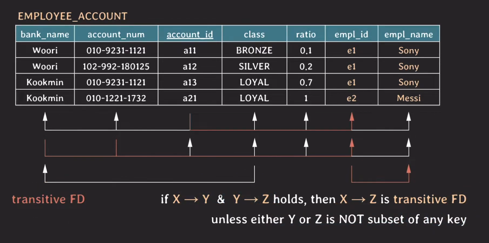
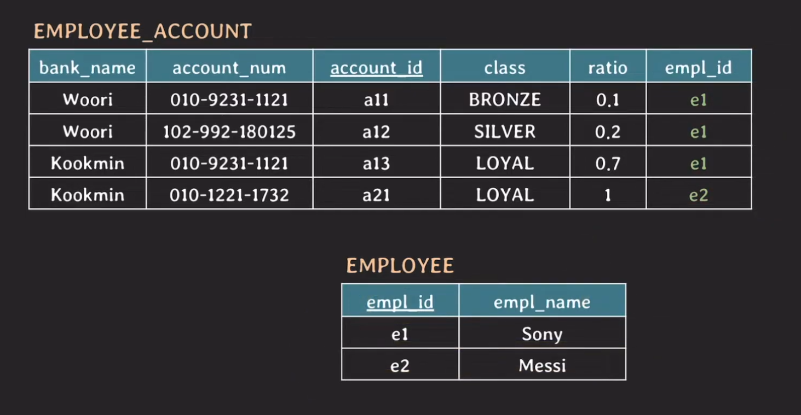
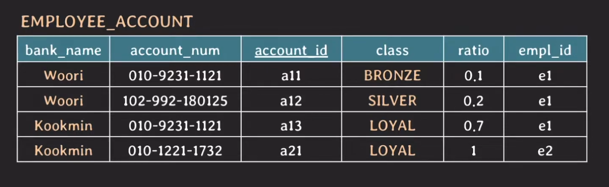
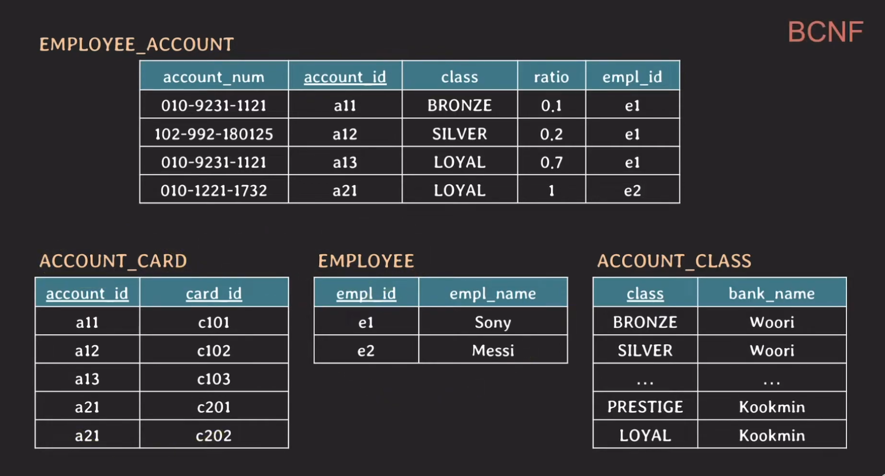
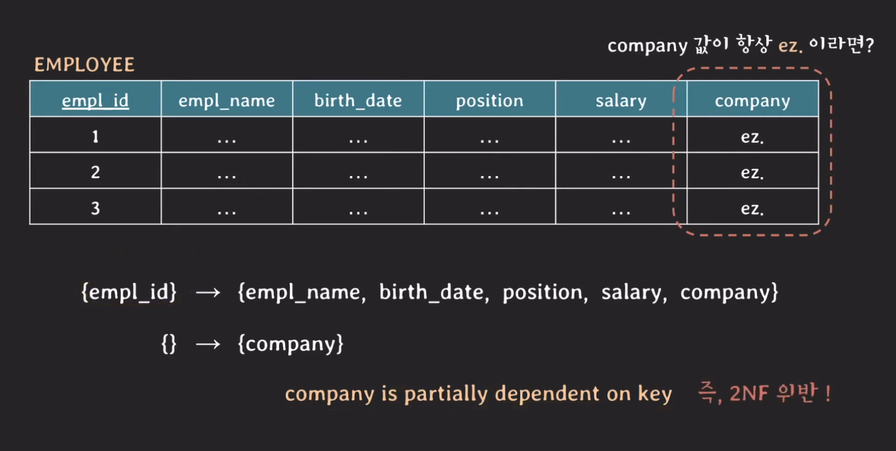
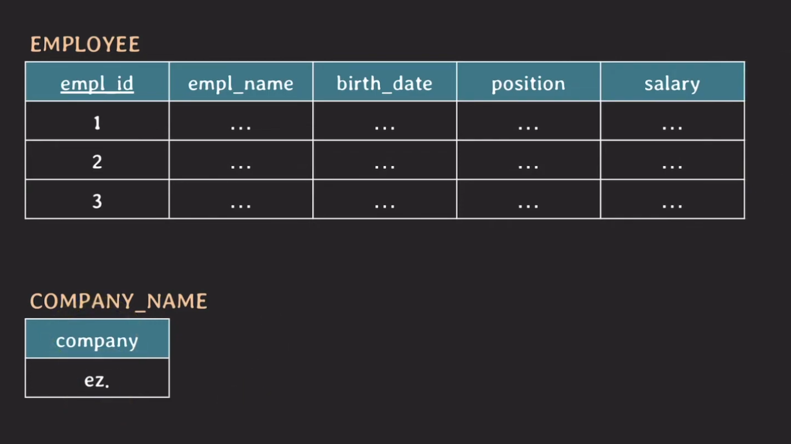

# 정규화 2부

## 개요
지난 시간엔 정규화의 과정 중 1NF, 2NF를 학습해 보았다. 중복된 컬럼은 나누고 어느 키가 키를 제외한 나머지 속성을 결정하지 않는다면 다른 테이블로 구분하여 관리하는 것을 공부했다. 오늘은 3NF, BCNF에 대해서 알아볼 예정이다.

## 3NF
### Transitive FD
이전에 봤던 테이블을 이대로 이어서 분석해보자. 현재 empl_name은 empl_id에 의해 결정되고 있다. empl_id에 의해 empl_name이 결졍되는 것이다. 마찬가지로 account_id가 empl_id를 결정하고 있기도 하다. 그래서 B가 C를 향하고 A가 B를 향할 때 A는 C로 연결 지을 수 있다. 다른 키인 {bank_name, account_id}도 마찬가지로 empl_name과 바로 연결 지을 수 있다. 이를 `transitive FD`라 말한다. 추가로 Y와 Z는 그 어느것도 키의 부분 집합에 속하지 않은 속성이어야한다는 조건이 존재한다.
 
  

이에 따라서 empl_name에 중복 데이터가 생기는 것이다. (사실 지금은 잘 이해가 안된다.) 3NF의 규칙은 `모든 non-prime attribute는 어떤 key에도 transitively dependent하면 안된다.`라는 규칙을 가지고 있다. 그러니까 위에서 살펴본 transitive FD가 발생하면 안된다는 뜻이다. 덧붙여 설명하면 non-prime attribute과 non-prime attribute 사이에는 FD가 존재하면 안된다고 한다. 이 뜻은 empl_id가 empl_name을 결정하고 있기 때문이다. 결론적으로 3NF를 해결하기 위해서는 해당 속성을 제거해주면 된다.  
 
  

이렇게 하면 본 테이블에 우리가 발견했던 transitive FD는 존재하지 않게 되고 중복데이터가 사라지게 된다. 당연히 empl_id는 join할 때 필요한 정보이므로 삭제 될 수 없다. 그리고 3NF까지 정규화가 진행됐다면 `정규화됐다` 라고 말할 수 있다고 한다.

## BCNF
 
  

해당 테이블에서 중복되는 데이터를 또 살펴보자. 이제 bank_name과 class가 있을 것이다. 만약 row가 엄청 많다고 생각하게 되면 정리가 필요할 것 같은 속성 1순위가 될 것이다. 해당 속성을 정리해줄 수 있는 것이 바로 `BCNF`이다. BCNF의 규칙은 `모든 유효한 non-trivial FD X -> Y는 super key여야 한다.`라는 규칙이다. 최종적으로 다음과 같이 수정할 수 있다.
 

## 참고 사항
2NF는 `key가 composite key가 아니라며 2NF는 자동적으로 만족한다`라고 쓰여있는 경우가 있다. 정리해보면 모든 non-prime attribute는 모든 key에 fully dependent해야하며 또 다른 정리로 모든 non-prime attribute는 어떤 key에도 partially dependent하면 안된다라고 정리할 수 있다. 그러나 예외적인 상황이 존재하게 되는데.

 

바로 이와 같은 상황이다. company는 empl_id와 사실은 관계가 없는 속성이 될 수 있는데 이는 키와 partially하기 때문에 2NF를 위반하게 되는 것이다. 2NF를 따른다면 최종적으로 다음과 같아야하는데 
 

이렇게 작업하게 되면 company가 더욱더 의미없는 데이터로 취급되개 된다. 극단적인 예외 케이스라고 한다. 그래서 위의 2NF를 설명한 교과적 정의는 이처럼 예외 케이스를 보여줄 수 있고 company 속성을 그냥 employee 테이블에 놓겠다고 결정하는 것을 `denormalization` 즉, 역정규화라고 한다. 테이블을 너무 많이 쪼개버리면 join할 때 부하가 많이 걸리기 때문에 역정규화를 하기도 한다고 한다. 이 부분은 DB설계 시 설계자가 적절하게 조절하면 된다고 한다.

## 마무리 
요즘 사이드 프로젝트 때문에 DB를 설계하고 있는데 오늘 배운 내용이 정말 많은 도움이 됐다. 이전에 설계를 할때는 두리뭉실하게 한 컬럼에는 하나의 값만 넣어야지 혹은 이 속성은 테이블과 분리시켜도 될 것 같은데? 작업했지만 이제는 FD를 확인해가면서 설계를 할 수 있게 됐다. 