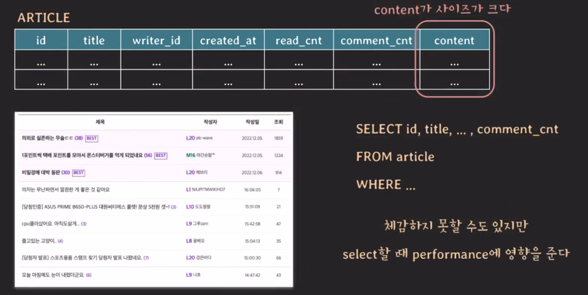
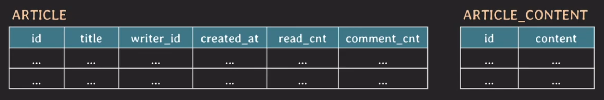
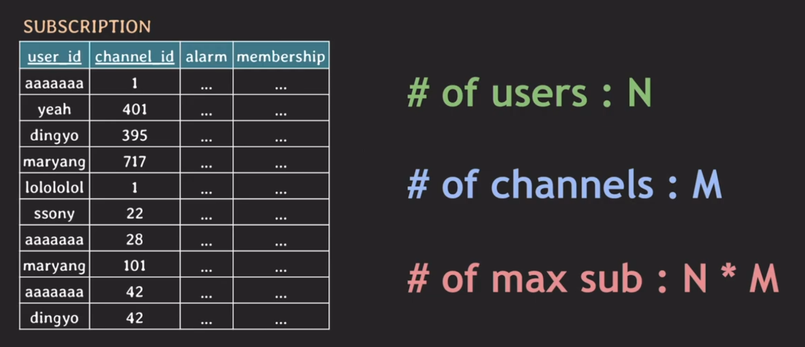
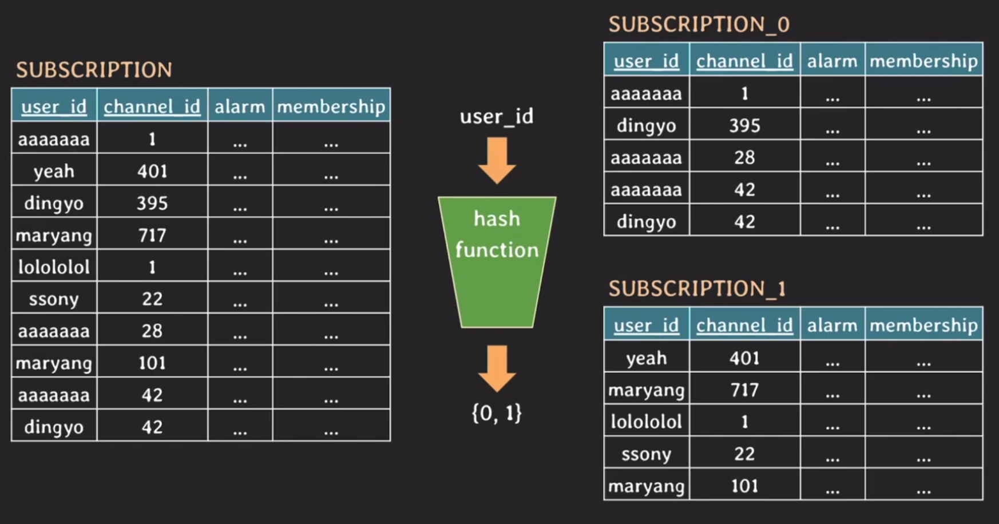
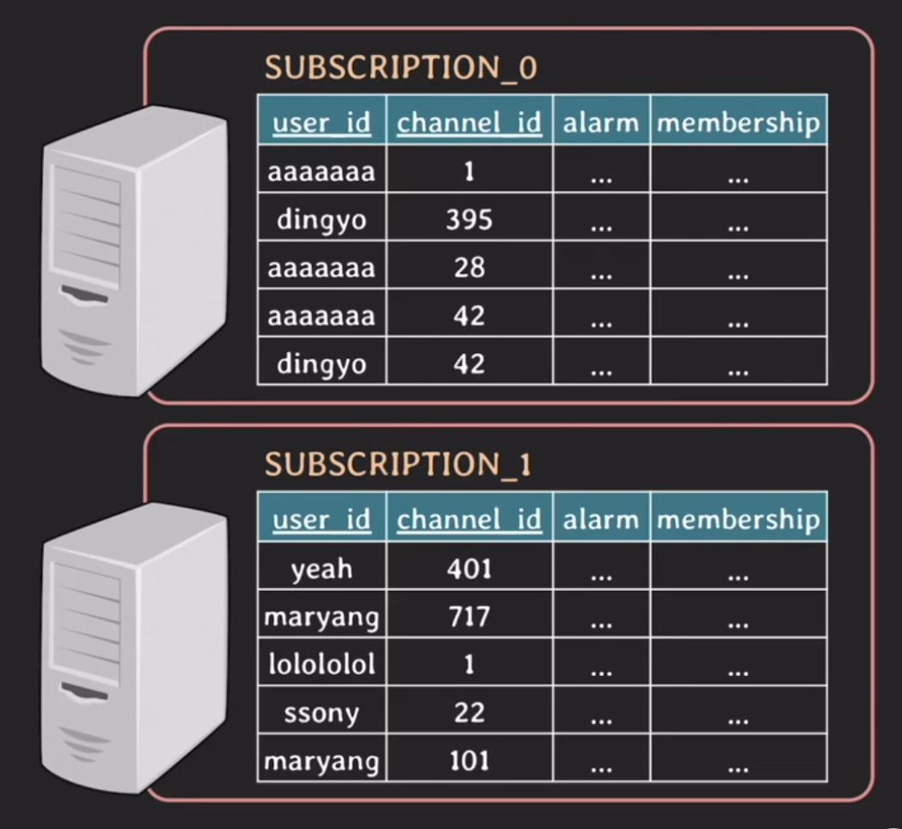
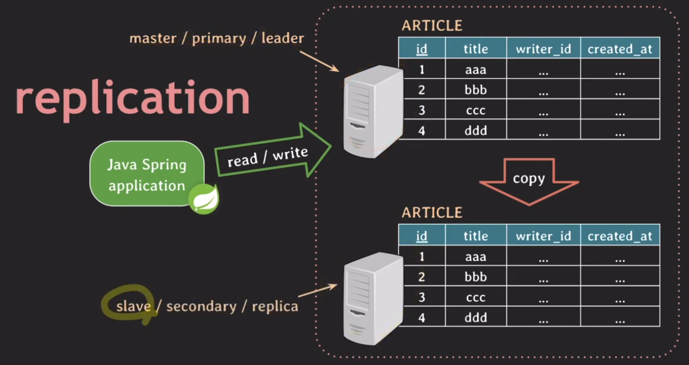

# Partioning & Sharding & Replication

## Partioning
Partioning은 table을 더 작은 table들로 나누는 것을 말한다. 크게 두가지 종류가 있는데 column을 기준으로 나누는`vertical partitioning`과 row를 기준으로 나누는 `horizontal partitioning`이 있다.

### Vertical partitioning
우리가 이전에 보았던 정규화도 vertical partitioning에 속하게 되는데 vertical partitioning은 이외에 다른 것도 존재한다.
 

위와 같은 경우는 아티클 목록에 대한 데이터를 가져왔을 때 content에 대한 정보는 필요가 없는데 우리가 select문에서 content를 쓰지 않는다고 해서 content를 실제로 secondary storage에서 읽지 않는 것은 아니다. (RDB는 row단위로 저장되기 때문) 모두 메인 메모리로 가져온 다음 그때 필터링을 하여 우리에게 제공되는 것이다. 이때 인덱스가 잘 걸려 있다면 체감하지 못하겠지만 만약 full-scan인 경우 퍼포먼스에 분명한 영향을 주게 되는데 이때 `vertical partitioning`을 사용하면 된다. content는 `article_content`라는 테이블로 분리하여 관리하면 된다.
 

vertical partitioning은 이외에 민감한 정보에는 제한을 걸때 사용하거나 자주 쓰는 정보와 아닌 데이터를 구분하여 사용하는 방법이 있다.

### Horizontal partitioning
 

위와 같은 상황일 경우 테이블의 크기가 커질수록 인덱스의 크기도 커진다. 테이블에 읽기/쓰기가 있을 때마다 인덱스에서 처리되는 시간도 조금씩 늘어난다는 이야기이다. 이때 사용되는 방법이 horizontal partitioning이다. 방법으로는 hash based, range based 등이 있다.

#### hash-based
 

이런 방법으로 hash function을 사용해 user_id를 0 혹은 1로 구분하여 원천테이블과 같은 모양 속성으로 테이블을 두개 생성하고 각 user_id에 맞게 데이터를 만들어준다. 이때 user_id와 같은 역할을 하는 키를 `partition key`라고 부른다. 그런데 만약 channel_id가 1인 사용자를 모두 조회하고 싶으면 어떻게 될까? 이때는 두 테이블을 모두 조회해야한다. 그러므로 partition key는 가장 많이 사용될 패턴에 따라 정하는 것이 중요하다. 또 데이터가 잘 분배 될 수 있도록 hash function을 장 정의하는 것 또한 중요하다. 한번 나누어져 버리고 나면 다시 파티셔닝하거나 파티션을 추가하는 것은 굉장히 까다롭다.

## Sharding
sharding은 horizontal partitioning처럼 동작한다. 그러니까 여러 테이블로 나누어지게 되는데 sharding은 그 파티션들이 독립된 DB 서버에 저장이 된다.
 

이로 인한 장점은 부하를 분산시켜서 DB 서버의 부담을 줄일 수 있다는 것이다. horizontal partitioning과는 다르게 partition key를 `shard key` 그리고 나눠진 테이블을 partition이 아니라 `shard`라고 부른다.

## Replication
 

개념은 간단하다 만약 자바 앱이 DB에 데이터를 쓰려고 하는데 DB가 죽어버리는 상황이 발생했다. 그런데 우리는 서비스를 계속 지속해야하지 않나? 그떄를 대비해서 primary DB와 동일한 DB서버를 만들어 놓는 것이다. 이 서버는 primary DB의 데이터와 항상 동일하게 만들어진다. 이 과정은 실시간이 될 수있고 혹은 비동기 방식으로 동기화 될 수 있다. 이러한 fail over를 극복할 수 있게 서비스를 구성하는 것을 High availability(고가용성, HA)이라고 한다. 또 read 트래픽을 secondary DB서버로 돌릴 수도 있어서 DB서버의 부담을 줄이는 역할도 수행할 수 있다. 또 만약 primary DB가 죽을때 secondary DB서버가 primary DB로 전환되어 동작한다.

## 마무리
아직 실제로 해당 개념들을 사용해 본적은 없지만 예전에 influx DB로 시계열 데이터를 다뤄본 적이 있는데 거기서는 샤딩이라는 개념을 필수로 알아야했었다. 데이터가 워낙 많다보니까 당연한 개념이었겠다. 요즘 새로운 사이드 프로젝트를 하고 있는데 replication 개념을 바로 사용해보려고 한다. 꽤 재밌는 작업이 될 것 같다.