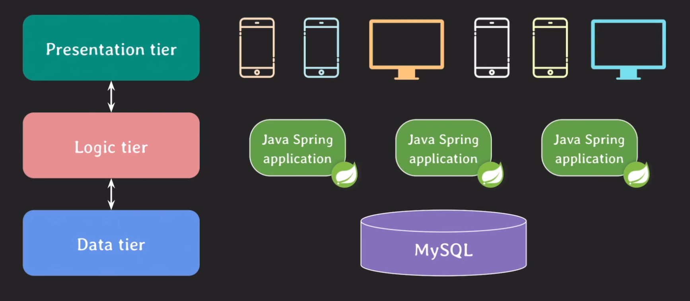
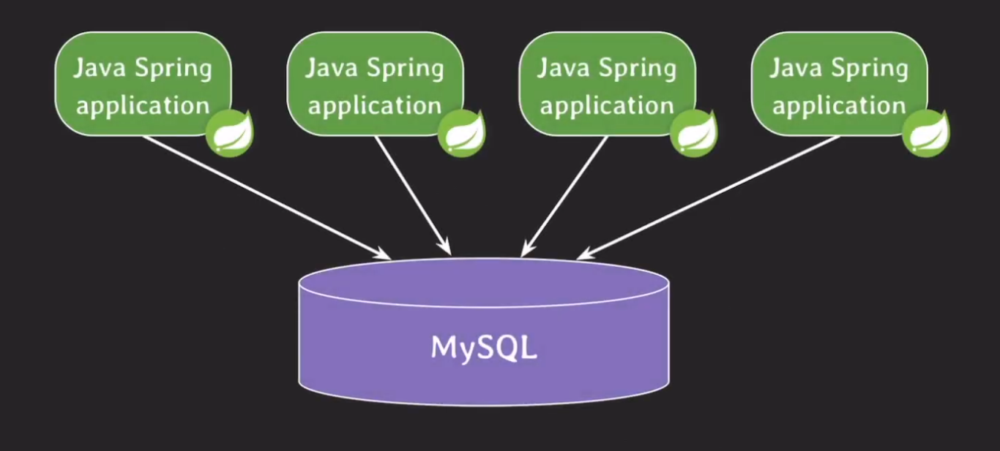
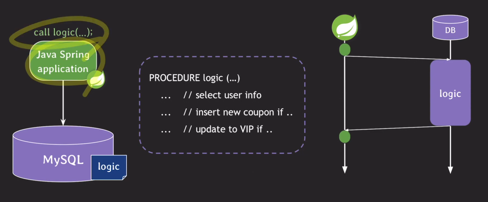
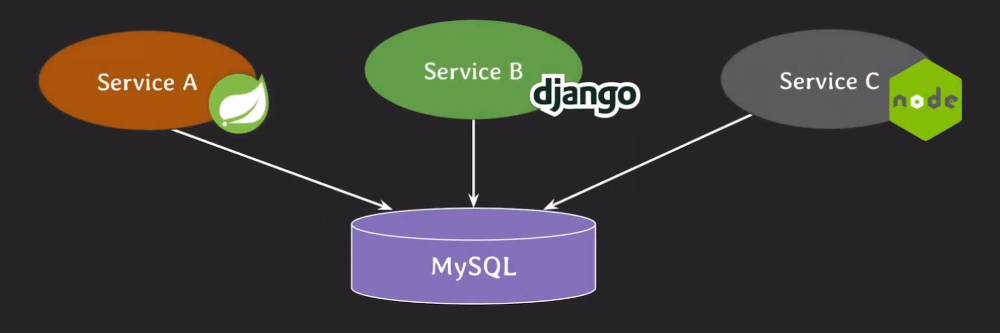
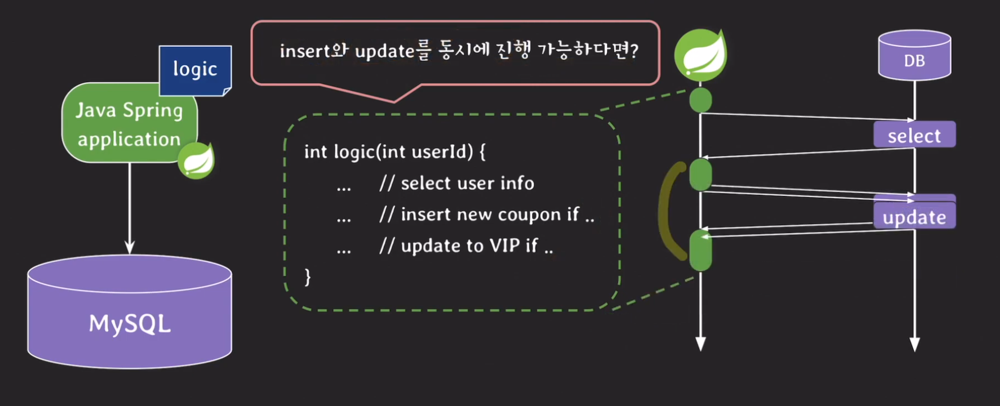

# Stored procedure 2부

## 3-tier architecture
  

여기서 비즈니스 로직이 담당하는 기능은 어떤것이 있을까?
- 회원가입/탈퇴
- 상품 리스트업 알고리즘
- 상품 정보 업로드 기능
- 상품 검색 기능
- 메시지 기능

그렇다면 데이터 티어에는 어떤 데이터들이 있을까.
- 회원 정보
- 상품 정보
- 판매/구매 내역 정보
- 지역 정보

저번 내용에서 봤듯이 Stored procedure의 주된 사용 목적은 비즈니스 로직 구현이었는데 위에 구현된 비즈니스 로직처럼 데이터 티어에서 비즈니스 로직이 구현된다는 말이다.

## Stored procedure 장-단점
### 장점
#### application에 transparent하다.
 
  

만약에 application에서 로직 변경이 있을 경우 각 애플리케이션에 따로 빌드 및 배포를 해야하지만 만약에 데이터 티어 단에서 프로시저만 변경을 해준다면 더욱더 편안하게 로직을 변경할 수 있는 장점이 있다.

#### Network traffic을 줄여서 응답 속도를 향상시킬 수 있다.
 
  

만약에 비즈니스 로직이 애플리케이션 단에 있었다면 select, insert, update를 순차적으로 각각 호출하여 네트워크 호출이 빈번하지만 로직을 데이터 단으로 내리면 네트워크는 한번만 호출해도 되기 때문에 시간 절약이 된다.

#### 여러 서비스에서 재사용이 가능하다
 
  

이 경우에는 로직이 애플리케이션에 있다면 같은 기능임에도 불구하고 사용 언어에 대해 구분을 해줘야하지만 데이터 단으로 로직을 내리면 단순하게 호출만 하면 된다.

#### 민감한 정보에 대한 접근을 제한할 수 있다
만약에 개발 시에 민감한 정보를 컨트롤해야하는 경우가 있을 때 데이터 단에 로직을 구현해 놓으면 개발자는 로직을 호출만 하면 되기에 프로시저를 통해 직접적인 접근을 막을 수 있다.

### 단점
#### 유지보수 비용이 커진다
일단 모든 비즈니스 로직을 데이터 단에 놓을 수 없기 때문에 개발자는 소스코드를 봤다가 프로시저를 봤다가 하면서 불편하게 관리를 해야하고 소스코드 버전 관리에 비해 데이터 단의 버전 관리는 빈약하기 때문에 이같은 면에서도 비용이 증가하게 된다. 더불어 개발자들이 프로시저에 관련된 언어를 알아야하고 새로운 프로시저를 만들게 되면 모든 관련 애플리케이션 단의 소스코드에도 반영을 해줘야한다.(재빌드, 재배포)

#### DB서버를 추가하는 것은 간단한 작업이 아니다
애플리케이션은 유연하게 서버를 관리할 수 없지만 그에 비해 DB 서버는 절대 그렇지가 않다. 만약 트래픽이 몰릴 경우 많은 애플리케이션에서 DB서버로 트래픽을 보내면 CPU 사용량을 감당할 수 없게 되는 경우가 생기게 된다. 이때 애플리케이션에 비해 DB서버를 추가하는 것은 기민하지 않기 때문에 대응이 많이 느리다.

#### Stored procedure가 언제나 transparent인건 아니다
만약 프로시저 이름을 바꿔야 할 상황이 왔을 때 애플리케이션과 소통하지 않고 바꿔버리면 호출을 할 수 없게 되는 상황이 발생하게 된다. 그래서 바꾸려고 하는 프로시저를 중복하여 생성한다음(이름만 변경해도) 그 후 애플리케이션이 호출명을 바꾸고 적용하고 나면 그제서야 데이터 티어에서 기존 프로시저를 삭제할 수 있다.

#### transparent하다고 무조건 좋은 것이 아니다
프로시저를 구현 부분만 수정하고 반영을 했더니 버그가 있는 바람에 다시 롤백을 하는 상황이 발생했다. 만약 이 상황을 3~4시간이나 지나서야 알아챘다면 그 시간동안 사용자들은 피해를 봤을 것이고 큰 손해가 될 수도 있었을 것이다. 모니터링을 해볼 수가 없다는 말이다. 반면에 애플리케이션 단은 서버를 한대씩 패치하면서 모니터링을 해볼 수 있기 떄문에 이런 경우에는 운영에는 꽤 치명적인 단점이 된다.

#### 재사용 가능하다는 것은 양날의 검이 될 수있다.
만약 3개의 다른 애플리케이션이 있는데 A에서 무자비하게 트래픽을 DB로 쏘게되면 CPU 사용량이 올라가게 되고 심한 경우 B, C 서비스에도 영향을 미치게 되는 경우가 있다. 그래서 이런 경우에는 애플리케이션과 DB 사이에 하나의 통로를 더 만들어서 트래픽을 관리할 수 있게 만들면 트래픽을 무리하게 요구하는 애플리케이션에 패널티를 줄 수 있게 된다. 사실 이렇게 까지 구조를 짜게 되면 사실상 각 A, B, C의 서비스가 직접 프로시저를 호출하는 것이 아니게 되기 때문에 재사용의 측면하고는 거리가 생길 수 있다.

#### 비즈니스 로직을 소스 코드에 두고도 응답 속도를 향상 시킬 수 있다.
 
  

이렇게 순차적으로 진행할 필요가 없을 때는 이렇게 호출을 구성하여 응답 속도를 향상 시킬 수 있다. 그리고 또 다른 방법으로 바로 `캐시`를 사용하는 것이다. 기존의 정보를 사용해도 무방한 호출인 경우 레디스나 다른 캐시 저장소에 데이터를 저장해오고 이 후에는 정해놓은 시간안에는 캐시 저장소의 데이터를 사용하면 된다. 

#### 민감한 정보에 대한 접근을 제한할 수 없다.
만약 개발자가 민감한 정보를 반환하는 프로시저를 심어두고 사용한다면 이미 위의 장점은 없어지게 된다. 그리고 이렇게 프로시저만을 호출하게 만들어 놓는다면 운영 시 CS업무가 신속하게 처리될 수가 없다. 그래서 보안이 목적이라면 담당자나 개발자에게만 DB 혹은 테이블 권한을 부여하고 민감한 정보는 암호화해서 저장하며 보악 서약서 등을 통해 정책적으로 보안을 강화하는 방법을 따르는 편이 나을수도 있다.

#### 이외의 단점
- 프로시저로는 복잡하고 유연한 코드를 작성하기 어렵다
- 오늘 날의 프로그래밍 언어는 훨씬 다양하고 강력한 기능들을 제공한다
- 프로시저는 가독성이 떨어진다
- 프로시저는 디버깅이 어렵다

## 마무리
3년동안 프로시저를 못 본 이유를 오늘 꽤 많이 알 수 있게 된 것 같다. 예상엔 정말 특별한 경우가 아니면 Stored function을 유틸 함수로만 작성해서 사용 할 것 같다.