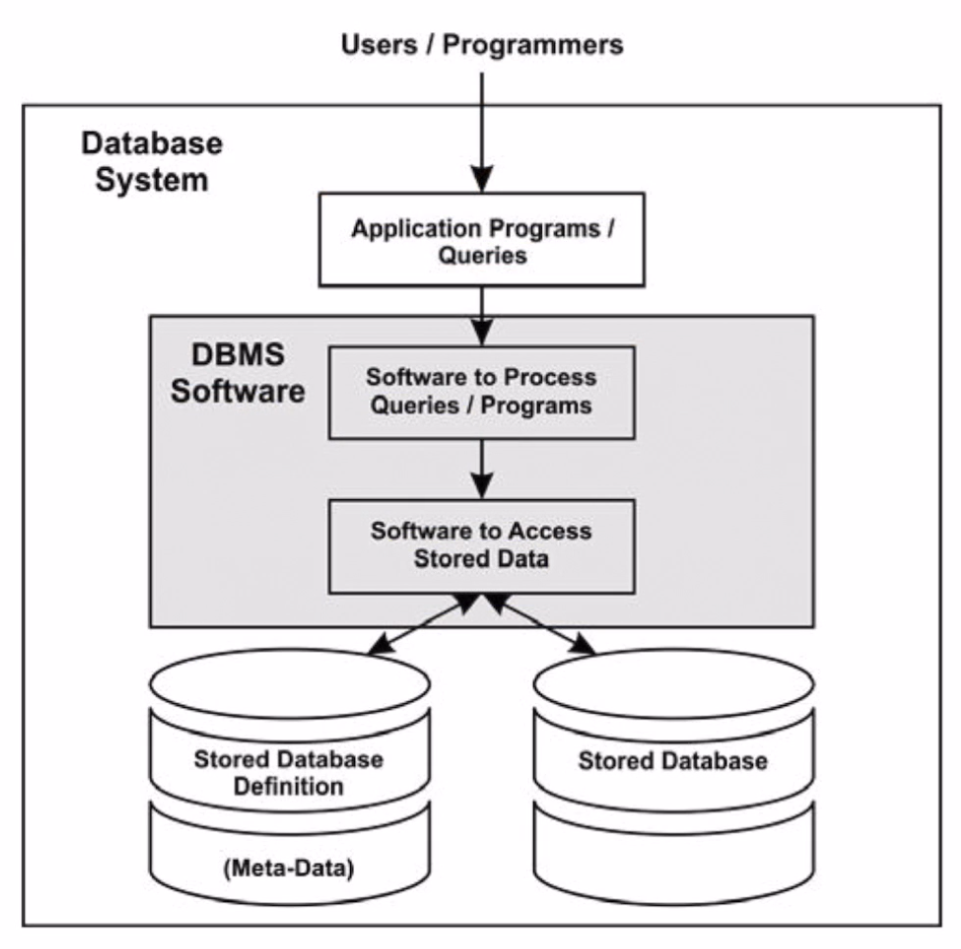
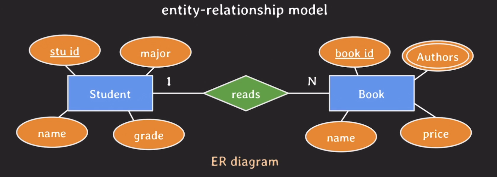
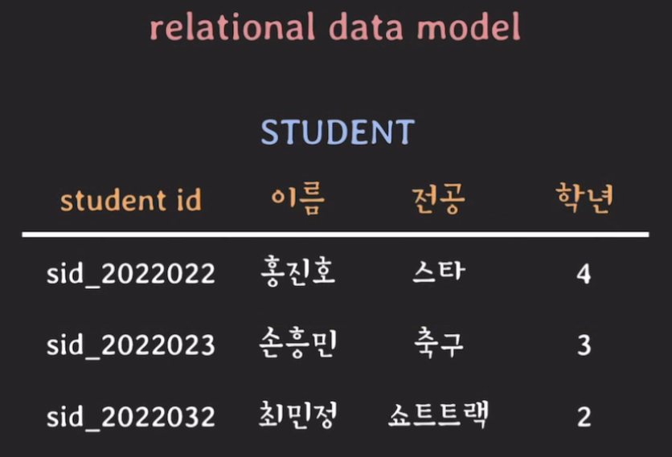
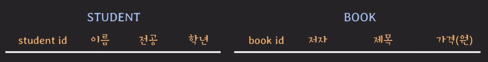
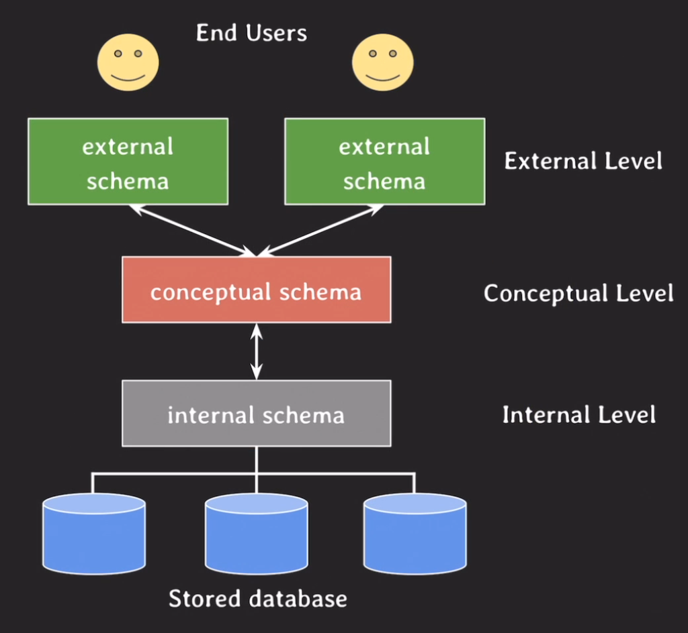

# Database 시작

## DB & DBMS & DB system
### database(DB)
<b>전자적으로 저장</b>  
<b>관련있는 데이터</b>  
<b>조직화된 집합</b>  

database의 개념을 설명하기 위해서 필요한 개념들이다. 전자적으로 저장되고 사용되는 관련있는 데이터들의 조직화된 집합을 db라고 한다. 관련있는 데이터는 같은 목적이거나 같은 서비스에 위치해 있는 데이터를 말한다. 조직화된 집합은 소위 말해서 데이터가 관리되고 있음을 말한다. 이는 중복 데이터가 없으며 데이터의 불일치를 막고 있는 그런 상태이며 예를들어 도서관의 책 관리 시스템을 생각하면 된다. 그리고 이런 데이터를 전자적으로 사용하고 싶을 때 바로 db가 사용된다.

### DBMS
DBMS는 database management systems의 줄임말로 사용자에게 DB를 정의하고 만들고 관리하는 기능을 제공하는 소프트웨어 시스템이다. 일종의 툴이라고 생각하면 편할 것 같다. DB를 정의하다 보면 부가적인 데이터가 발생하게 되는데 여기서 부가적인 데이터를 `metadata`라고 부른다.  

> MySQL, Postgresql, MariaDB, Oracle이 대표적인 DBMS이다.  

> Metadata  
>Metadata는 databese를 정의하거나 기술하는 data이며 catalog(databese의 metadata가 저장되는 곳)라고도 부른다. 예를 들면 데이터 유형, 구조, 제약 조건, 보안, 저장, 인덱스, 사용자 그룹 등이 여기에 속하며 metadata 또한 DBMS를 통해 저장/관리된다.

### DB system
database + DBMS + 연관된 application을 DB system이라고 부르며 줄여서 database라고 부른다. 처음 일할 때 db라고 할때마다 "무슨 db를 말하는 거지?"라고 갸우뚱 거렸던 적이 몇 번있었는데 이후에는 이러한 시스템을 뭉쳐서 부른 다는 것을 알게되었다. 그리고 각각 따로 사용했던 적도 할 일도 없는 부분 같다.

### Databese flow

1. 유저나 개발자는 만들어진 프로그램을 쿼리를 통해 원하는 데이터를 가져오려고 요청한다.
2. DBMS에서는 쿼리를 분석하고 요청을 처리하기 위해 관련된 정보를 catalog에서 확인하고 
3. 그 정보를 바탕으로 실제 데이터를 database에서 찾고 데이터를 반환한다.

## Data models
DB의 구조를 기술하는데 사용될 수 있는 개념들이 모인 집합을 data models라고 하며 DB 구조를 추상화해서 표현할 수 있는 수단을 제공한다. model에는 여러 종류가 있으며 추상화 수준과 DB 구조화 방식이 조금씩 다르다. 그리고 DB에서 읽고 쓰기 위한 기본적인 동작들도 포함된다.  

> DB 구조 : 데이터 유형, 데이터 관계, 제약 사항 등등

### conceptual data models
- 일반 사용자들이 쉽게 이해할 수 있는 개념들로 이뤄진 모델  
- 추상화 수준이 가장 높음  
- 비즈니스 요구 사항을 추상화하여 기술할 때 사용  
- 대표적으로 entity-relationship model이 있다.

### logical data models
- 이해하기 어렵지 않으면서 디테일하게 DB를 구조화 할 수 잇는 개념들을 제공
- 데이터가 컴퓨터에 저장될 때 구조와 크게 다르지 않게 DB 구조화를 가능하게 함
- 특정 DBMS나 storage에 종속되지 않는 수준에서 DB를 구조화할 수 있는 모델
- 대표적으로 relation data model이 있다.
- 그리고 object data model과 둘을 합친 object-relational data model이 있다.

### physical data models
- 컴퓨터에 데아터가 어떻게 파일 형태로 저장되는지를 기술할 수 있는 수단을 제공
- data format, data orderings, access path 등등  
> access path : 데이터 검색을 빠르게 하기 위한 구조체 (ex. index)

## Schema & State
### schema
- data model을 바탕으로 database의 구조를 기술한 것
- schema는 database를 설계할 때 정해지며 한번 정해진 후에는 자주 바뀌지 않는다

### state
- database에 있는 실제 데이터는 꽤 자주 바뀔 수 있다
- 특정 시점에 database에 있는 데이터를 database state 혹은 snapshot이라고 한다
- 혹은 database에 있는 현재 instance의 집합이라고도 한다.

## Three-schema architecture
- database system을 구축하는 구조 중 하나 (대부분이 구조를 사용함.)
- user application으로 부터 물리적인 database를 분리시키는 목적
- 세가지 level이 존재하며 각각의 level마다 schema가 정의되어 있다

### internal shemas at internal level
- 물리적으로 데이터가 어떻게 저장되는지 physical data model을 통해 표현
- data storage, data structure, access path 등등 실체가 있는 내용 기술

### conceptual schemas at conceptual level
- 전체 database에 대한 구조를 기술 (external schema의 요약본이라고 생각하면 됨.)
- 물리적인 저장 구조에 관한 내용은 숨김
- entities, data types, relationships, user operations, constraints에 집중
- logical data model을 통해 기술

### external schema(or user views) at external(or view) level
- external views, user views라고도 불림
- 특정 유저들이 필요로 하는 데이터만 표현
- 그 외 알려줄 필요가 없는 데이터는 숨김
- logical data model을 통해 표현

### three-schema architecture 정리
- 각 레벨을 독립시켜서 어느 레벨에서의 변화가 상위 레벨에 영향을 주지 않기 위함
- 대부분의 DBMS가 three level을 완벽하게 명시적으로 나누지는 않음
- 데이터가 존재하는 곳은 internal level

## Database language
### DDL
- data definition language
- conceptual schema를 정의하기 위해 사용되는 언어
- internal schema까지 정의할 수 있는 경우도 있음

### SDL
- storage definition language
- internal schema를 정의하는 용도로 사용되는 언어
- 요즘은 특히 relational DBMS에서는 SDL이 거의 없고 파라미터 등의 설정으로 대체됨

### VDL
- view definition language
- external schema를 정의하기 위해 사용되는 언어
- 대부분의 DBMS에서는 DDL이 VDL 역할까지 수행

### DML
- data manipulation language
- database에 있는 data를 활용하기 위한 언어
- data 추가, 삭제, 수정, 검색 등등의 기능을 제공하는 언어

### SQL
- 오늘날의 DBMS는 위의 언어가 따로 존재하기 보다는 통합된 언어로 존재한다.
- 대표적인 예로 relational database language인 SQL이 있다.

---
> 강의 출처  
> 해당 폴더에 있는 글은 모두 쉬운코딩님의 강좌를 보고 공부한 내용들입니다.  
> [유튜브 - 쉬운코딩](https://www.youtube.com/@ezcd)