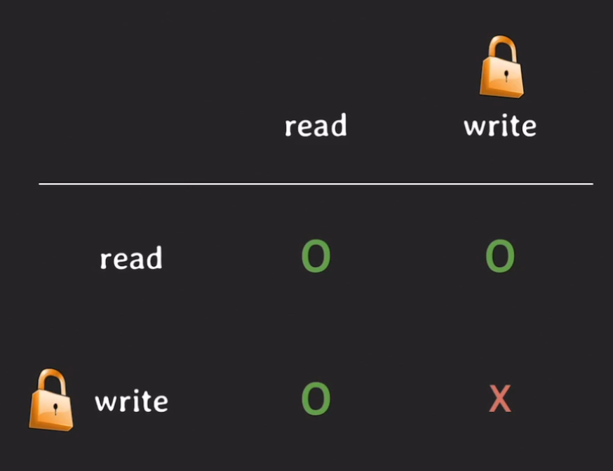
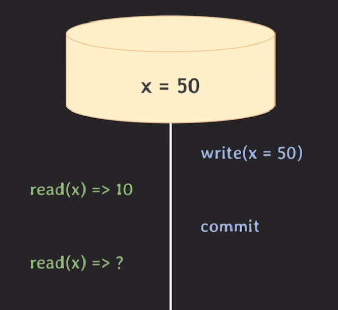
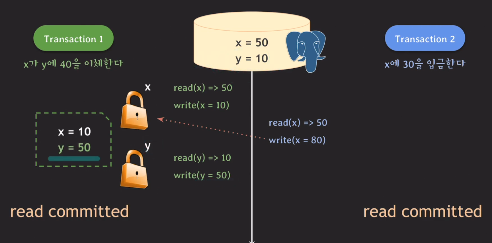
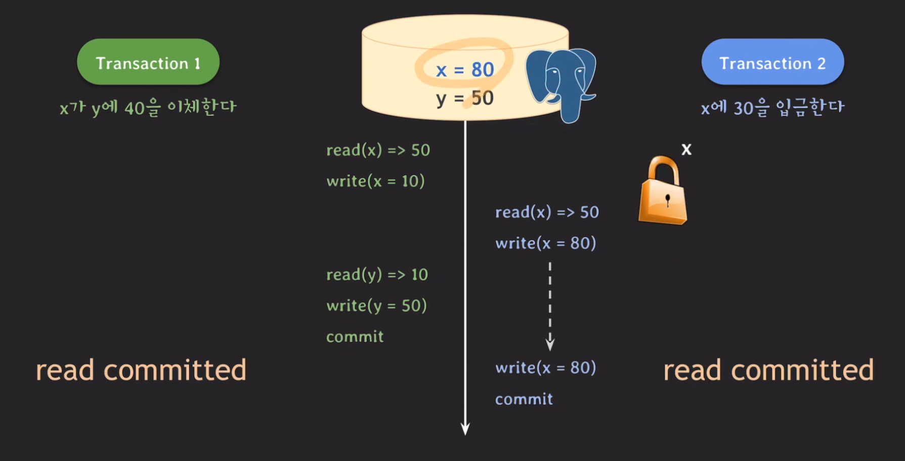
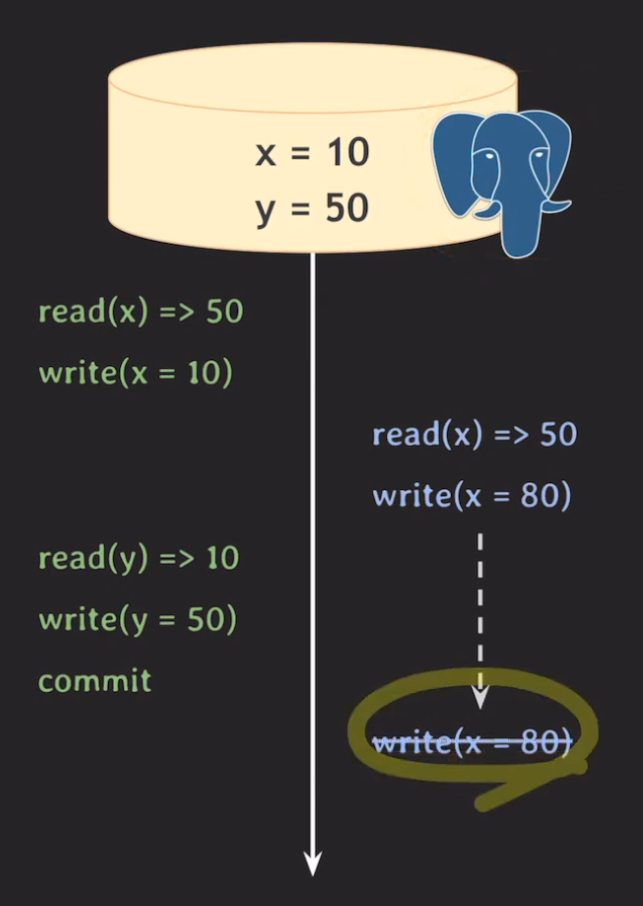
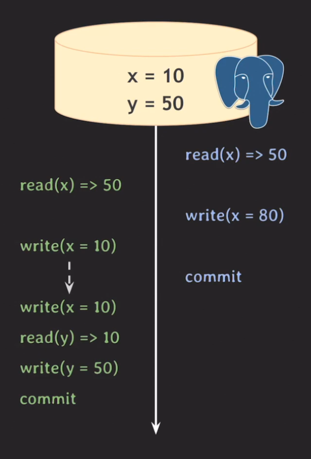
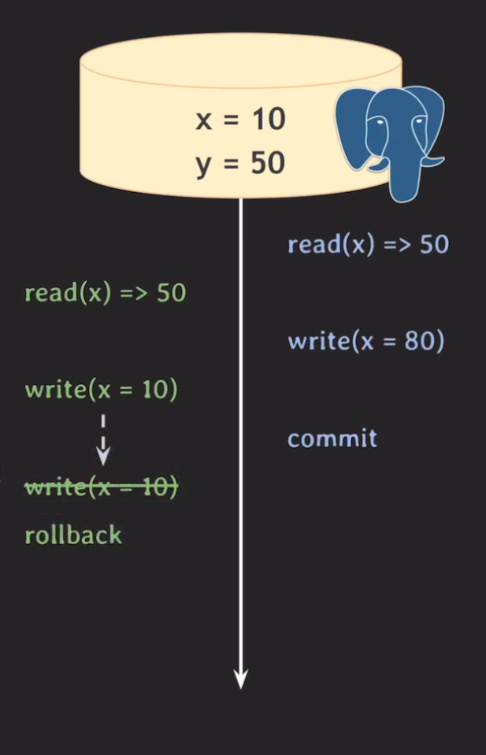

# MVCC 1부

## 개요
MVCC란 multiversion concurrency control로 DB의 동시성을 위해 생겨난 개념 중 하나이다. 이전 시간에 배운 isolation level과 함께 MVCC case를 공부해볼 예정이다.

## MVCC
지난 영상에서 Lock을 기반으로 DB의 concurrency control이 어떻게 동작하는지 확인했다. lock은 read-read이 외의 상태는 서로의 tx가 같은 데이터에 접근할 수 없는 규칙을 가지고 있었다. 그러나 MVCC는 다음의 그림처럼 동시에 처리가 가능한 방식이 늘어나고 그에 따라 처리량이 Lock보다 월등하다.

 

### 예시
 
 

> 해당 이미지를 설명하기전에 추가사항이 있다. 각 operation을 실행할 때 관련된 lock 권한을 얻어야하는데 예시에서는 그 부분을 생략한 형태로 이해하면 된다. write를 한다면 write lock을 얻은 상태인 것이고 read또한 그렇다. 그리고 모든 lock은 commit된 순간에 반납을 하는 것으로 하는 것을 이 예시의 전제라고 보면 된다.

마지막 tx1의 read한 x값은 isolaion level에 따라서 달라지게 되는데 만약 tx1이 `read committed`라면 read하는 시간을 기준으로 그전에 commit된 데이터를 읽게되어 50을 읽게될 것이고 `reapeatable read`라면 10을 읽을 것이다. `reapeatable read`은 tx의 시작 시간을 기준으로 그 전에 commit된 값을 읽기 때문에 초기값이었던 10을 읽게되는 것이다. 이는 RDBMS마다 조금씩 기준이 달라지는데 어떤 RDBMS는 최초의 read operation을 기준 시간으로 삼는 RDBMS도 있으니 참고하면 좋을 것 같다.  
> MySQL은 `특정 시점 기준으로 commit된 데이터`를 읽는 방식을 `consistent read`라고 부른다.

그렇다면 또 다른 isolation level인 serializable에서는 어떻게 동작할까? 이때 MySQL과 postgreSQL의 방식이 서로 조금 다르다. 

#### MySQL
MVCC로 동작하기 보다는 lock으로 동작하는데 이는 MVCC의 방법이 아니라 이전 시간에 배웠던 Lock의 방식 그러니까 read-read만 허용된 상태로 동작하는 것을 말한다.

#### PostgreSQL
SSI(Serializable Snapshot Isolation)기법이 적용된 MVCC로 동작한다. 

추가로 또 다른 isolation level로 read uncommitted가 있는데 MVCC의 기본 개념은 commit된 데이터를 읽는 것이기 때문에 이 level에서는 보통 MVCC가 적용되지 않는다고 한다. PostgreSQL에서는 read uncommitted가 존재하지만 read committed처럼 동작한다고 한다.

<b>MVCC 정리</b>  
데이터를 읽을 때 특정 시점 기준으로 가장 최근에 commit된 데이터를 읽는다. 이는 isolation level에 따라 달라질 수 있으며 특정 시점을 관리해야하기 때문에 RDBMS가 데이터 변화(write) 이력을 관리하고 있다. 그에 따라서 write를 하는 도중에도 read를 할 수 있고 이 예시에는 없지만 read할 때도 write를 할 수 있다. read-write가 서로 block하지 않는다는 것이다. 

## PostgreSQL과 MySQL 비교
### PostgreSQL
tx1과 2 모두 read committed level로 동작한다고 가정해보자.
 
 

1. tx1이 x의 값을 읽는다.
2. tx1이 x에 10을 write하기 위해 lock을 얻는다.
3. tx1이 x에 10을 입력한다. (해당 내역은 변경내역은 다른 공간에 저장 됨)
4. tx2가 x의 값을 읽는다.
5. tx2가 x에 50을 write하기 위해 lock을 요청하지만 tx1이 해당 lock을 소유중이기 때문에 tx2는 block이 된다.
6. tx1이 y에 대해서 값을 읽고(read) lock을 얻은 뒤 y에 50을 작성하고 변경내역을 저장한다.
7. 그리고 tx1이 커밋을 완료하고 모든 lock을 반환한다.

 
 

1. tx2가 x에 대해 lock을 획득한다.
2. tx2가 x에 80을 입력하고 변경내역을 저장한다.
3. tx2가 커밋을 완료하고 lock을 반환한다.

최종적으로 x=80 y=50이 나왔지만 사실 정상적인 값은 x=40 y=50이 나와야 우리가 기대하는 값이 된다. 그리고 이 현상을 지난 시간에 배운 `Lost update`라고 한다. 이 문제를 isolation level을 변경함으로써 해결할 수 있다. 이번에는 tx2가 repeatable read level로 바뀐 상태로 살펴보자.

 
 

이렇게 마지막 operation이 실패하게 되는데 그 이유는 postgreSQL에사 같은 데이터에 먼저 update한 tx가 commit되면 나중 tx는 rollback이 되는 규칙을 가지고 있기 때문이다. tx1번과 tx2번 모두 x에 대해서 write를 하기 때문에 이 규칙에 걸린 것이다. 그래서 tx2는 결국에 rollback을 하고 transaction을 마친다. postgreSQL은 repeatable read level일 때 이와 같은 특징을 가지고 있고 이러한 행동을 `first-updater-win`이라고 부른다. 또 이 예시에서 알 수 있는 것은 각각의 tx은 서로 다른 isolation을 가질 수 있다는 것이다.

#### 만약 같은 예시이지만 tx2가 먼저 시작하게 된다면?
 
 

이런 조건으로 실행 된 schedule은 문제를 일으키게 된다. 둘다 commit이 되었지만 예상한 x=40 y=50을 받을 수 없었기 때문이다. 이 또한 `Lost update`가 일어난 것이다. 그러면 이제 우리는 read committed level은 안전하지 않다는 것을 느끼기 시작하게 되는데 이때 위의 예처럼 tx1에도 repeatable read level를 적용해보면 결과가 어떻게 달라질까?

 

이전의 예시와 같이 `first-updater-win`에 따라 tx1이 지게되어 rollback을 하게 된다. 이로써 한쪽만 repeatable read level을 설정해준다고 해결될 수 없다는 것을 생각해 볼 수 있다. 그러나 MySQL은 PostgreSQL처럼 `first-updater-win`같은 개념이 존재하지 않는데 그럼 이 문제를 어떻게 해결할까?

## 마무리
배우면 배울 수록 속편하게 던졌던 트랜잭션 속에 이렇게 복잡한 커뮤니케이션이 존재한다는 것을 알게되고 놀라는 중이다.   

<b>그렇지만 재밌다!</b>