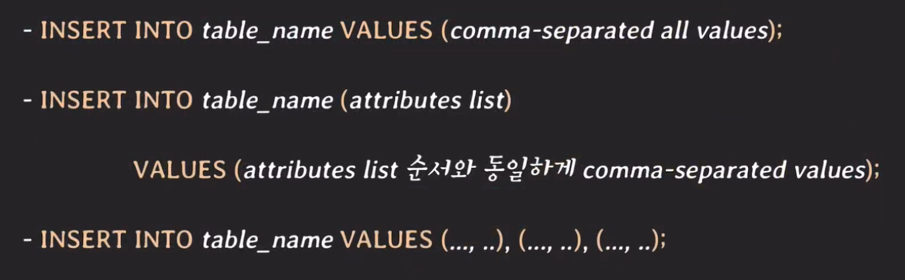
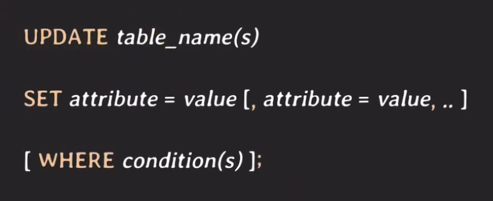
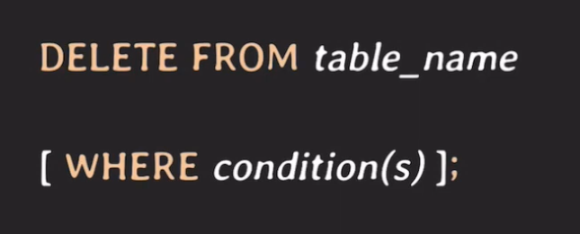

# Insert & Update

## Insert
### INSERT Statement
 

각각 구분을 해보자면 
- 첫번째 쿼리는 모든 속성에 값을 추가 하겠다는 말이고 values에 작성할 때도 모든 속성을 작성해주어야한다. 만약 외래키가 있는데 외래키의 테이블에 데이터가 없는 경우 NULL로 작성해주면 된다.
- 두번째 쿼리는 내가 추가하고 싶은 속성을 선택하여 insert할 수 있는 쿼리다. 이때 NULL이면 안되는 속성값이거나 NULL이면 안되는 속성값인데 default 값이 없거나 하는 이런 경우에는 에러가 난다.
- 세번째 쿼리는 여러 데이터를 넣고 싶을 때 사용하는 쿼리이다.

## Update
### UPDATE Statement
 

업데이트를 여러 속성에 걸쳐서 하고 싶다면 해당 속성을 SET 구절에 콤마로 구분하여 적어주면 되고 WHERE절에 필요한 조건을 작성하면 된다.

## Delete
### DELETE Statement
 

where절이 누락되는 경우는 초기 개발을 제외하고는 거의 없을 것이다.  
<b>꼭 유념하자.</b>