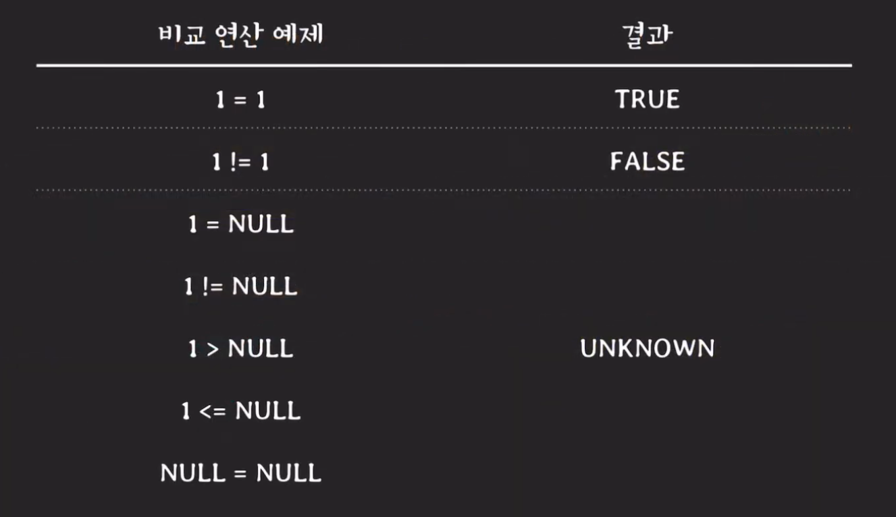
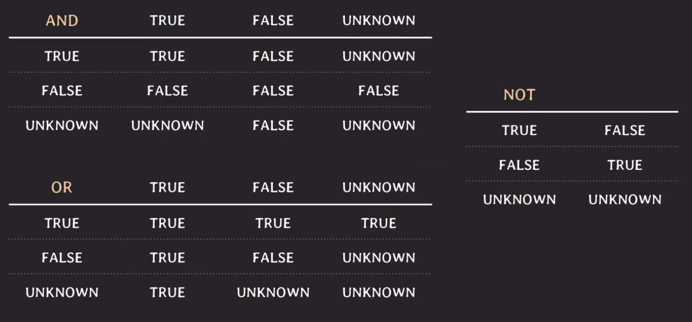
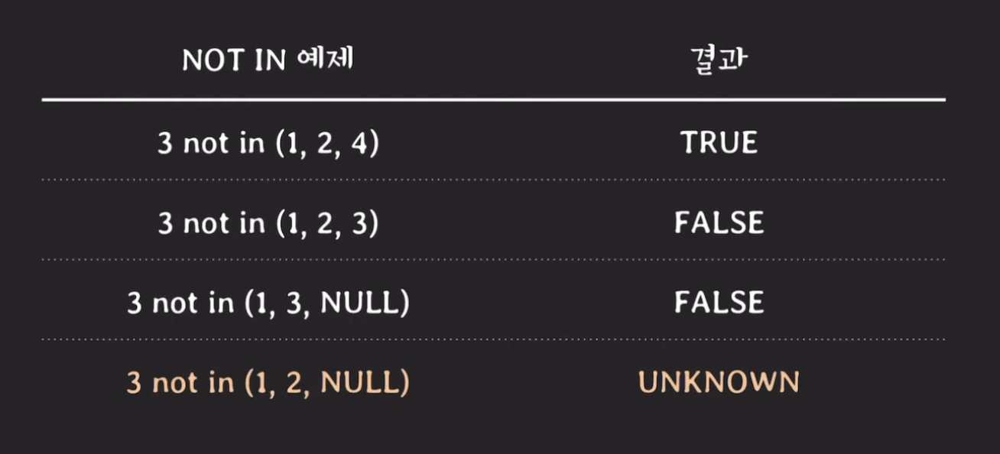

# SQL에서의 NULL

## 개요
SQL에서의 NULL의 의미는 다양한 의미를 가질 수 있는데 예를 들면 다음과 같다.  
<b>unknown</b>  
해당 값이 아직 알려지지 않았을 때  

<b>unavailable or withheld</b>  
정보를 공개하지 않아 정보를 이용할 수 없을 때  

<b>not applicable</b>  
해당 사항이 없을 때  

## IS
만약 테이블에서 어떠한 속성 값이 NULL인 데이터를 가져오고 싶을 때는 `=`와 같은 연산자를 사용하면 안되고 `IS`를 사용해야한다. 이때 `=`을 사용하게 되면 아무런 값이 조회되지 않는다. 

```SQL
SELECT id 
FROM employee
WHERE birth_date IS NULL;
```

## NULL과 Three-Valued Logic
SQL에서 NULL과 비교 연산을 하게 되면 그 결과는 UNKNOWN이다. `UNKNOWN은 'TRUE일수도 있고 FALSE수도 있다'` 라는 의미이며 Three-Valued Logic은 비교/논리 연산의 결과로 `TRUE, FALSE, UNKNOWN`을 가진다. 아래는 비교 연산의 결과와 논리 연산을 NULL과 하게 될 경우에 대한 정리표이다.






### 그런데 이게 왜 중요한가?
바로 조건절 때문인데. where절에 있는 condition(s)의 결과는 TRUE인 tuple(s)만 선택된다. 즉, 결과가 FALSE거나 UNKNOWN이면 tuple은 선택되지 않는다는 말이다. 만약 v NOT IN (v1, v2, v3)라는 쿼리가 있을 때 해당 쿼리를 풀어쓰면 다음과 같은데 v != v1, v != v2, v != v3 이때 하나라도 값이 NULL이라면 어떻게 될까?



위의 이미지에서 제일 마지막 예시는 NULL을 잘 모르고 사용한다면 1번과 같은 결과가 나올것이라 예상하지만 4번의 예시를 풀어 쓴다면 
3 != 1, 3 != 2, 3 != NULL이게 된다. 이때 값은 UNKNOWN이 나온다고 위에서 확인했다. 그러면 결과적으로 우리는 예상한 데이터를 받을 수 없게되고 해당 데이터는 정확하지 않다는 말이다. 쿼리를 통해서 다시 확인해보자.

```SQL
SELECT D.id, D.namd
FROM dapartment AS D
WHERE D.in NOT IN (
    SELECT E.dept_id
    FROM employee AS E
    WHERE E.birth_date >= '2000-01-01'
)
```
이런 쿼리가 있다고 했을 떄 만약 birth_date은 NULL을 가질 수 있다는 정책을 가지고 있을 경우 이 값이 하나라도 널이라면 반환되는 서브쿼리 값은 FALSE 또는 UNKNOWN이 될 것이다. 그러므로 outer query의 NOT IN과 비교하게 되면 where 절은 TRUE의 값을 반환하기 때문에 결국 아무런 값도 받을 수 없다는 뜻이다, 2000대 생이 있음에도 불구하고 말이다. 그러면 어떻게 해결해야하나? 두가지 쿼리가 있다. 하나는 가장 많이 쓰는 IS NOT NULL과 EXISTS를 사용하는 방법이다.

```SQL
SELECT D.id, D.namd
FROM dapartment AS D
WHERE D.in NOT IN (
    SELECT E.dept_id
    FROM employee AS E
    WHERE E.birth_date >= '2000-01-01'
        AND E.dept_id IS NOT NULL
)
```
```SQL
SELECT D.id, D.namd
FROM dapartment AS D
WHERE D.in NOT EXISTS (
    SELECT *
    FROM employee AS E
    WHERE E.dept_id = D.id 
        AND E.birth_date >= '2000-01-01'
)
```

## 마무리
오늘 배운 내용은 정말 중요하다고 생각한다. RDBMS마다 조금 다를 수 있을 거라고 생각지만 정신없이 일하고 있을 때 해당 로직을 알지 못하고 작업을 한다면 내가 많든 로직에서 정말 이상한 값을 반환해줄 수 있기 때문이다. 어쩌면 3년 동안 일하면서 나도 실수를 했을지도 모르겠다. IS NOT NULL이라는 친구를 더 가까이 생각해둬야 할 것 같다.