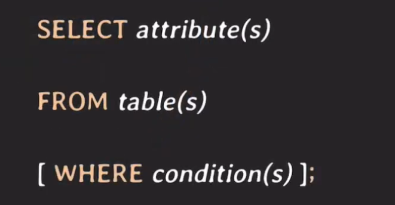

# Select

## Select statement


가장 기본적인 select 구문으로 조회하고자 하는 데이터에 따라서 조건과 테이블 그리고 나열된 속성 값이 달라지며
where 절에는 조건 타입에 따라서 selection condition과 join condition으로 나눠진다.

## AS
- AS는 테이블이나 attribute에 별칭을 붙일 때 사용한다. 
- AS는 생략 가능하다.

```SQL
SELECT E.id AS leader_id, E.name AS leader_name, position
FROM project AS P, employee AS E
WHERE P.id = 2002 and P.leader_id = E.id;
```

## DISTINCT
- 중복되는 tuple을 제외하고 싶을 때 사용한다. 

```SQL
SELECT DISTINCT P.id, P.name
FROM employee AS E, works_on AS W, project AS P
WHERE E.position = 'DSGN' AND
      E.id = W.empl_id AND W.proj_id = P.id;
```

## LIKE
- 조건문에 사용되며 조회되는 데이터 중 원하는 데이터를 필터링하기 위해 사용하며 특정 문자열로 된 데이터를 찾기 위해 많이 사용한다.

```SQL
SELECT name
FROM employee
WHERE name LIKE 'N%' or name LIKE '%N';
```
> 이름이 n으로 시작하거나 n으로 끝나는 사람을 찾기 위한 쿼리

```SQL
SELECT name
FROM employee
WHERE name LIKE '%NG%';
```
> 이름에 NG가 들어간 사람을 찾기 위한 쿼리

```SQL
SELECT name
FROM employee
WHERE name LIKE 'J____';
```
> 이름이 J로 시작하고 총 4글자인 사람을 찾기 위한 쿼리

## *(asterisk)
- 조회되는 모든 데이터의 속성을 알고 싶을 때 사용
- 만약 속성이 100개가 되고 그것을 모두 조회하고 싶을 때 100개를 나열하는게 아니라 *만 써주면 된다.

## 주의사항
- SELECT로 조회할 때 조건들을 포함해서 조회를 한다면 이때 조건들과 관련된 속성에 인덱스가 걸려있어야 한다.
- 그렇지 않다면 데이터가 많아질 시 조회 속도가 느려진다.
