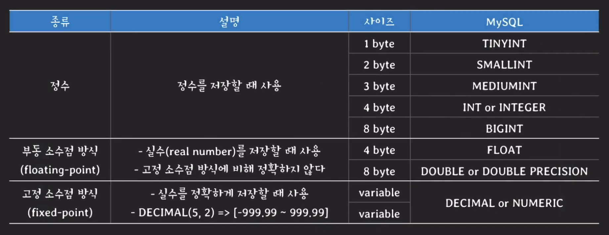
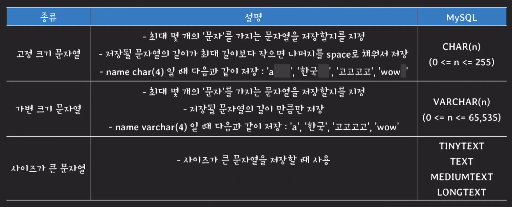
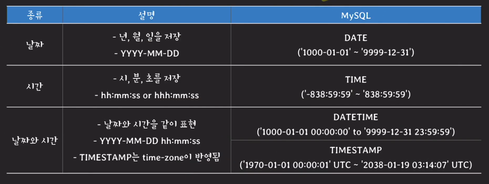
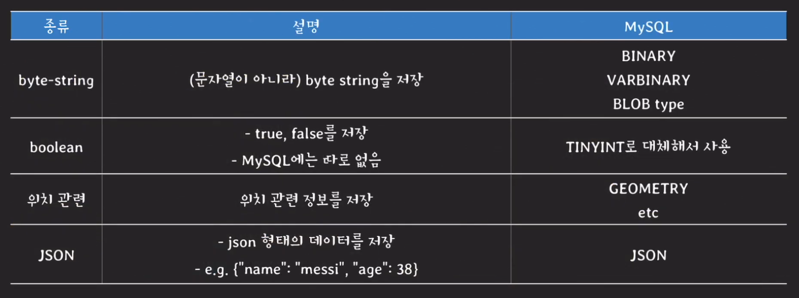
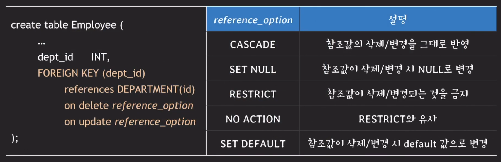
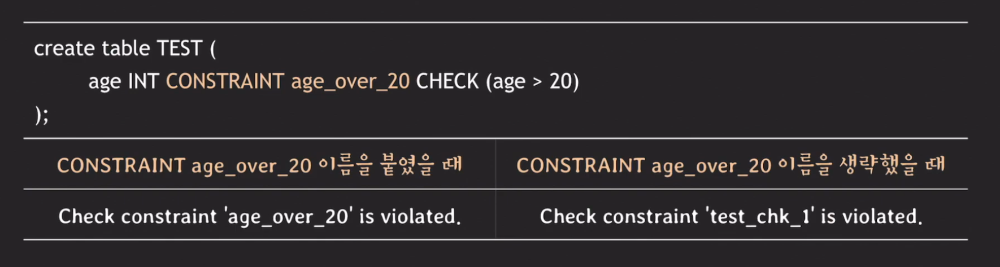
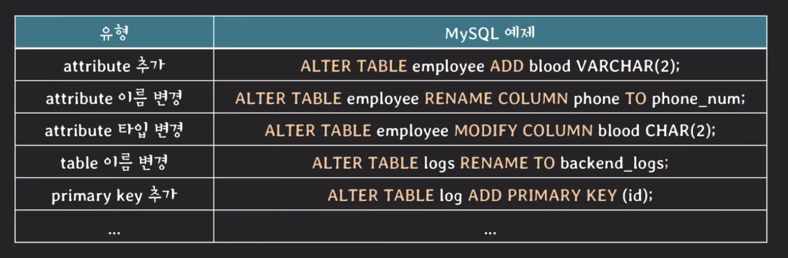

# SQL 시작

## SQL의 기본 개념
SQL은 Structured Query Language의 줄이말이며 현업에서 쓰이는 relation DBMS의 표준 언어이다.

### 주요용어
|relation data model|SQL|
|---|---|
|relation|table|
|attribute|column|
|tuple|row|
|domain|domain|

### SQL에서 relation이란?
- multiset(= bag) of tuples @ SQL
- 중복된 tuple을 허용한다

### SQL & RDBMS
SQL은 RDBMS의 표준 언어지만 실제 구현에 강제가 없기 때문에 각 RDBMS마다 제공하는 SQL의 스펙이 조금씩 다르다. 예를 들면 프로시저나 함수를 선언하는 방식이나. 조인의 기준 혹은 내장 함수명이 다른 것이 그 특징이다.

## MYSQL로 배워보기
### Database vs schema
- MySQL에서는 database와 schema가 같은 뜻을 의미
- create database company = create schema company
- 다른 RDBMS에서는 의미가 다르게 쓰임
- ex. PostgreSQL에서는 schema가 database의 namespace를 의미
    - [참고 블로그 링크](https://postgresql.kr/docs/12/sql-createschema.html) 

### 데이터 타입
#### 숫자  
 

표준 SQL은 DECIMAL에서는 자리수가 넘어가도 조금 유연하게 저장하는 반면에 NUMERIC은 저장조차 안되는데 MySQL에서는 어떤 타입을 쓰던 엄격하게 스펙을 제한하여 조건을 넘으면 저장하지 않는다.

#### 문자열  
 

그러면 편하게 VARCHAR를 쓰면 되는 거 아니냐라고 말할 수 있는데 이는 RDBMS마다 권장하는 것이 다르다. PostgreSQL은 VARCHAR를 권장하고 MySQL은 공간적인 측면에서는 VARCHAR가 좋지만 시간적인 측면에서는 CHAR를 사용할 것을 권장한다. 그리고 TINYTEXT와 TEXT는 MySQL에서 VARCHAR와 동일하거나 더 작은 길이를 가지고 있다.

#### 날짜와 시간
 

#### 그 외
 

### 제약사항
대부분의 것들은 알고 있어서 처음 알게된 것만 기술하겠다.

#### Check
check 제약사항은 속성값을 제한하고 싶을 때 사용하는데 예를 들면 점프 높이를 측정하고 그 값을 기록해야하는 테이블이 있고 속성값 중에 height라는 속성이 있는데 해당 값이 무조건 300보다 작아야한다면 `CHECK(height < 300)`이라고 DDL문에 작성하면 된다. 선언은 속성이 두 개 이상으로 구성될 때는 `CHECK(start_date < end_date)`처럼 사용해야한다.

#### Foreign key  
 

#### contraint 이름 명시하기
- 이름을 붙이면 어떤 constraint를 위반했는지 쉽게 파악할 수 있다.
- contraint를 삭제하고 싶을 때 해당 이름으로 삭제 가능

### Alter table
 

- table의 schema를 변경하고 싶을 때 사용
- 서비스 중인 table의 schema를 변경하는 것이라면 변경 작업때문에 서비스의 백엔드에 영향이 없을 시 검토한 후에 변경하는 것이 중요

## 마무리
### database 구조를 정의할 때 중요한 점
만들려는 서비스의 스펙과 데이터 일관성, 편의성, 확장성 등등을 종합적으로 고려하여 DB 스키마를 적절하게 정의하는 것이 중요하다.
