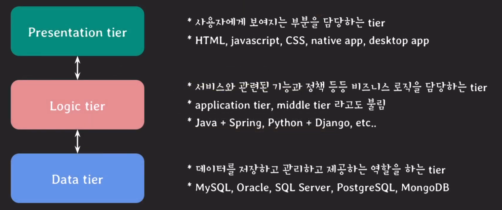

# Stored fuction

## Stored fuction이란?
- 사용자가 정의한 함수
- DBMS에 저장되고 사용되는 함수
- SQL의 select, insert, update, delete statement에서 사용할 수 있다.

### 예제
#### 1. 임직원의 ID를 열자리 정수로 핸덤하게 발급하고 싶다. ID의 맨 앞자리는 1로 고정이다.

##### 함수 선언
```SQL
delimiter && -- 쿼리 구문 문자 수정
CREATE FUNCTION id_generator()
RETURNS int
NO SQL -- MySQL 전용
BEGIN -- 함수 구현 시작
    RETURN (1000000000 + floor(rand() * 1000000000));
END -- 함수 구현 종료
$$ -- 쿼리 종료
delimiter ; -- 쿼리 구문 문자 복구
```
> delimiter란?  
> 구분 문자를 칭하는 말로 기본값은 ;인데 쿼리에서 ;은 쿼리가 끝났다는 것을 의미하기 때문에 함수 선언 단계에서 세미콜론을 사용할 일이 생긴다면 위와 같이 delimiter를 $$로 바꿔주고 다시 세미콜론으로 바꿔주면 된다. $$와 같은 문자는 임의로 정할 수 있다.

##### 함수 사용
```SQL
INSERT INTO employee 
VALUES(id_generator(), 'JEHN', '1991-08-04', 'F', 'PO', 1000000000, 1005);
```

#### 2. 부서의 ID를 파라미터로 받으면 해당 부서의 평균 연봉을 알려주는 함수를 작성하자.
##### 함수 선언
```SQL
delimiter &&
CREATE FUNCTION dept_avg_salary(d_id int)
RETURNS int
READS SQL DATA -- MySQL 전용
BEGIN
    DECLARE avg_sal int; -- int타입 변수 선언
    SELECT avg(salary) INTO avg_sal -- 조회된 데이터를 avg_sal에 대입
                        FROM employee
                        WHERE dept_id = d_id;
    RETURN avg_sal; -- 값 리턴
END
$$

-- 또는 변수를 선언하지 않고 바로 쓰고 싶다면
CREATE FUNCTION dept_avg_salary(d_id int)
RETURNS int
READS SQL DATA -- MySQL 전용
BEGIN
    SELECT avg(salary) INTO @avg_sal
                        FROM employee
                        WHERE dept_id = d_id;
    RETURN @avg_sal;
END
$$
delimiter ;
```

##### 함수 사용
```SQL
SELECT *, dept_avg_salary(id) AS avg_salary
FROM department;
```

#### 3. 졸업 요건 중 하나인 토익 800 이상을 충족했는지를 알려주는 함수를 작성하자.
##### 함수 선언
```SQL
delimiter &&
CREATE FUNCTION toeic_pass_fail(toeic_score int)
RETURNS char(4)
NO SQL
BEGIN
    DECLARE pass_fail char(4);
    IF toeic_score is null   THEN SET pass_fail = 'fail';
    ELSEIF toeic_score < 800 THEN SET pass_fail = 'fail';
    ELSE                     THEN SET pass_fail = 'pass';
    END IF;
    RETURN pass_fail
END
$$
-- 또는
CREATE FUNCTION toeic_pass_fail(toeic_score int)
RETURNS char(4)
NO SQL
BEGIN
    IF toeic_score is null   THEN SET @pass_fail = 'fail';
    ELSEIF toeic_score < 800 THEN SET @pass_fail = 'fail';
    ELSE                     THEN SET @pass_fail = 'pass';
    END IF;
    RETURN @pass_fail
END
$$
delimiter ;
```

##### 함수 사용
```SQL
SELECT *, toeic_pass_fail(toeic)
FROM student;
```

### Stored fuction 정리
- 이외에도 loop를 돌면서 반복적인 작업을 수행하거나
- case 키워드를 사용해서 값에 따라 분기 처리하거나
- 에러를 핸들링하거나 에러를 일으키는 등의 다양한 동작을 정의할 수 있다

#### Stored fuction 삭제하기
```SQL
DROP FUNCTION stored_function_name;
```

#### 등록된 Stored fuction 파악하기
```Shell
# DBMS shell에서...

# DB 조회
SHOW DATABASES;

# DB의 함수 조회
SHOW FUNCTION STATUS where DB = 'company';

# 함수의 코드 조회
SHOW CREATE FUNCTION id_generator;
```

## 마무리 & Stored fuction은 언제 써야할까?
### Three-tier architecture
<br>
  

이번 부분을 공부하면서 개발자를 하고 있는 다른 형에게 질문을 했다. 왜냐하면 예전에 그 형이 "내가 지금하고 있는 프로젝트는 웬만한걸 다 DB에서 처리를 해."라고 했던 기억이 났기 때문이다. 물어본 질문은 "형 프로젝트 할 때 함수나 프로시져를 많이 써?"라는 질문이었다. 돌아온 질문은 엄청 많이 썼다고 했고 PL/SQL만 알면 크게 어렵지 않다라고 했다. 하지만 문득 이번 내용을 공부하면서 계속 관리하기가 힘들텐데...라는 생각이 멈추지 않았다. 새로 들어온 직원분이나 선임에게 전달받을 때를 생각하니 벌써부터 지쳐가는 모습이 보였기 때문이다. 물론 DB tool을 쓰고 그러면 전달은 어렵지 않겠지만 수많은 사람들이 작업하는 코드인 만큼 버려지는 함수들도 많을 것 같았고 혹시라도 연산에 부하가 걸리는 작업이라면 DB 메모리에 영향을 미치지는 않을까? 하는 걱정도 들었기 떄문이다. 마지막에 쉬운코딩님이 정리한 "Stored fuction은 언제 써야할까?"에 대한 내용은 다음과 같다. 우리 대부분의 IT 회사는 위에 보여지는 그림처럼 three-tier architecture를 따르고 있기 때문에 비즈니스 로직이거나 비슷한 로직은 비즈니스 로직에 위치해 있어야 관리도 쉽고 파악도 쉽다고 생각하기 때문에 util용도로 쓰는 함수는 괜찮지만 그 외의 함수는 비즈니스 단에서 처리하는게 맞는 것 같다라고 이야기를 해주셨다. 내가 걱정했던 부분과 상통하는 부분이 있어서 괜시리 기분이 좋아졌다. 이 다음 글은 프로시져에 관한 글인데 이것 또한 기대가 되는 부분이다.