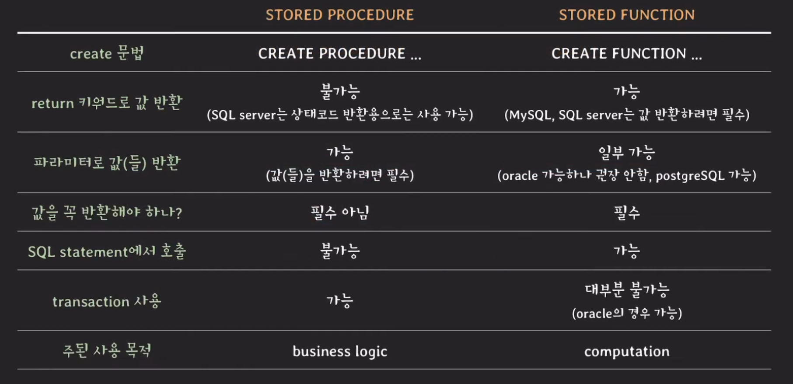

# Stored procedure 1부

## Stored procedure이란?
- 사용자가 정의한 프로시저
- RDBMS에 저장되고 사용되는 프로시저
- `구체적인 하나의 작업을 수행한다.`

### 예제
#### 두 정수의 곱셈 결과를 가져오는 프로시저를 작성하자.
##### 프로시저 정의
```SQL
delimiter &&
CREATE PROCEDURE product(IN a int, IN b int, OUT result int) 
-- INPUT 파라미터는 IN, OUTPUT 파라미터는 OUT 
-- INPUT은 생략 가능하지만 OUT은 명시적으로 작성해줘야한다.
BEGIN
    SET result = a * b;
END
$$
delimiter ;
```

##### 프로시저 사용
```SQL
CALL product(5, 7, @result);
SELECT @result;
```

#### 두 정수를 맞바꾸는 프로시저를 작성하자.
##### 프로시저 정의
```SQL
delimiter &&
CREATE PROCEDURE swqp(INOUT a int, INOUT b int) 
BEGIN
    SET @temp = a;
    SET a = b;
    SET b = @temp;
END
$$
delimiter ;
```

##### 프로시저 사용
```SQL
SET @a = 5, @b = 7;
CALL swap(@a, @b);
```

#### 각 부서별 평균 연봉을 가져오는 프로시저를 작성하자.
##### 프로시저 정의
```SQL
delimiter &&
CREATE PROCEDURE get_dept_avg_salary() 
BEGIN
    SELECT dept_id, avg(salary)
    FROM employee
    GROUP BY dept_id;
END
$$
delimiter ;
```

##### 프로시저 사용
```SQL
CALL get_dept_avg_salary();
```

#### 사용자가 프로필 닉네임을 바꾸면 이전 닉네임을 로그에 저장하고 새 닉네임으로 업데이트하는 프로시저를 작성해보자.
##### 프로시저 정의
```SQL
delimiter &&
CREATE PROCEDURE change_nickname(user_id INT, new_nick varchar(30)) 
BEGIN
    INSERT INTO nickname_logs (
        SELECT id, nickname, now() FROM users WHERE id = user_id
    );
    UPDATE users SET nickname = new_nick WHERE id = user_id;
END
$$
delimiter ;
```

##### 프로시저 사용
```SQL
CALL change_nickname(1, 'TAZO');
```

### Stored procedure 정리
- 이외에도 조건문을 통해 분기처리를 하거나
- 반복문을 수행하거나
- 에러를 핸들링하거나 에러를 일으키는 등의 다양한 로직을 정의할 수 있다

## Stored function vs Stored procedure

  

- 큰 특징으로 SQL statement에서 호출이 가능하냐 불가능 하냐가 하나 있고
- 반환값 필수 여부
- transaction이 가능한가에 대한 여부를 중점적으로 기억하면 좋을 것 같다.
- 마지막으로 주된 사용 목적에 대해서도 기억하면 좋겠다.

### 이외에도 확인해봐야 할 점
- 다른 function/procedure를 호출할 수 있는지
- resultset(=table)을 반환할 수 있는지
- precompiled execution plan을 만드는지
    - 프로시저나 함수나 미리 RDBMS가 컴파일 시켜서 실행계획을 만들어 놓는지.
- try-catch를 사용할 수 있는지

## 마무리
이번 영상을 보면서 예전에 어렴풋이 들었던 프로시저와 함수의 차이점에 대해서 배울 수 있었다. 이전에도 안써봤고 이후에도 쓸지 안쓸지 모르겠지만 써야할 때 기억이 났으면 좋겠다. (물론 검색하면 금방이지만)