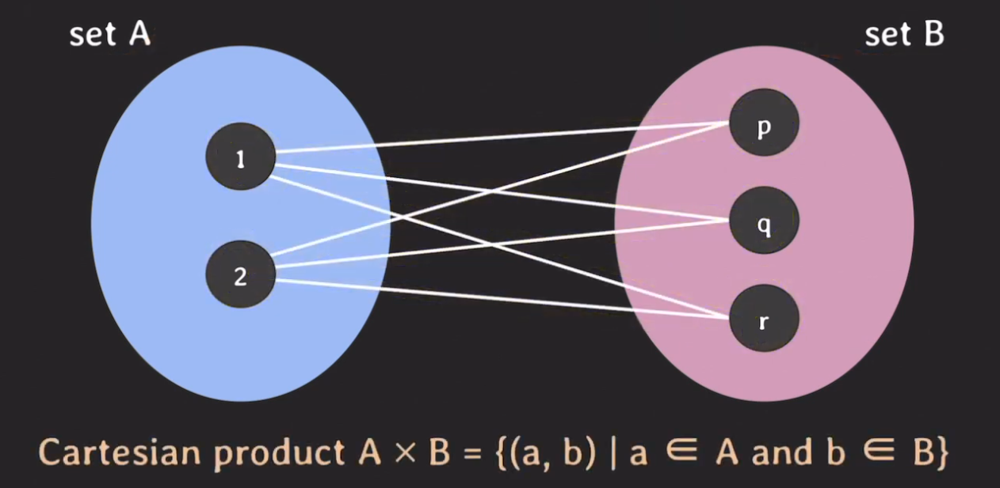
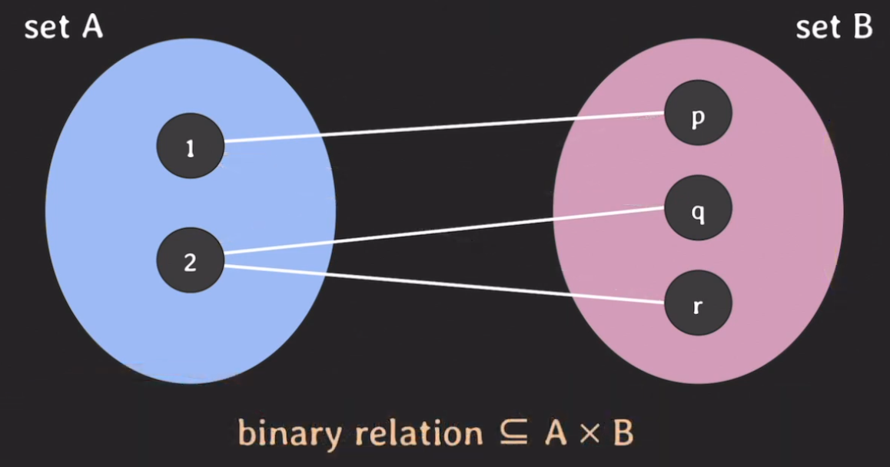
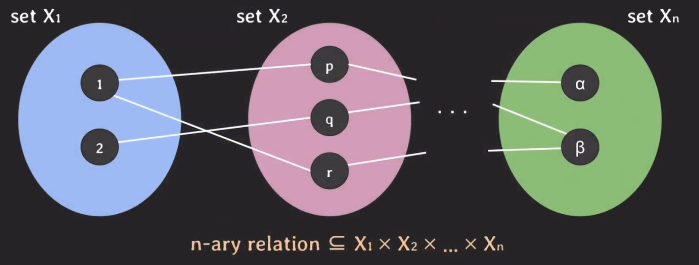
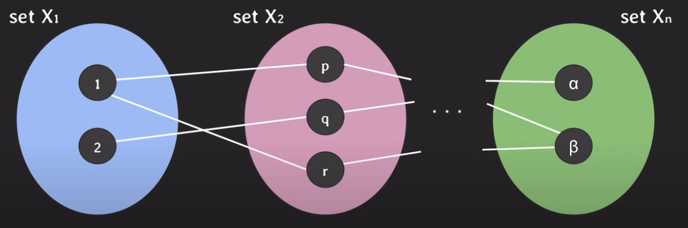
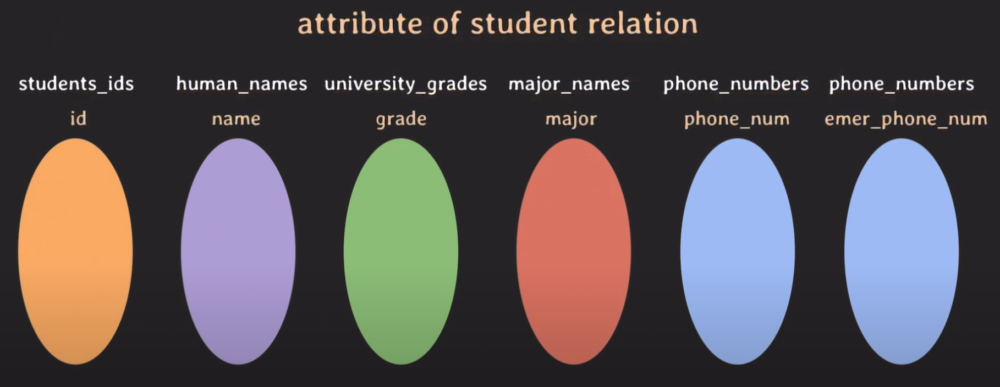
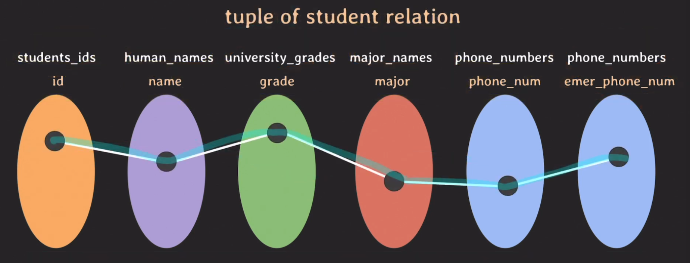
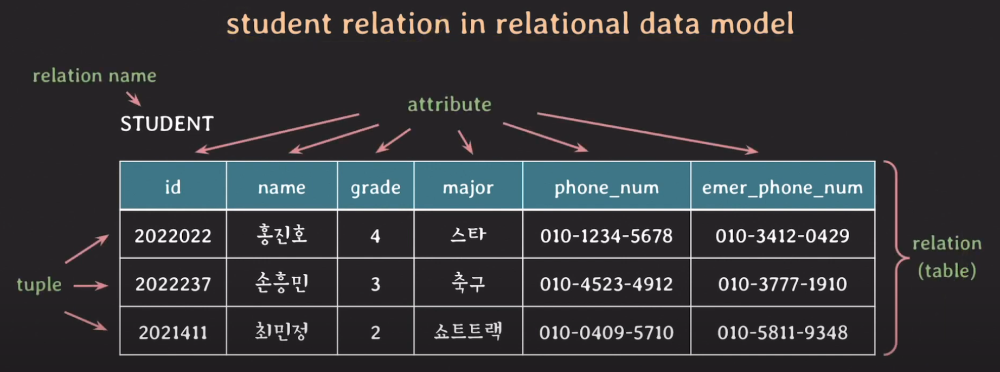
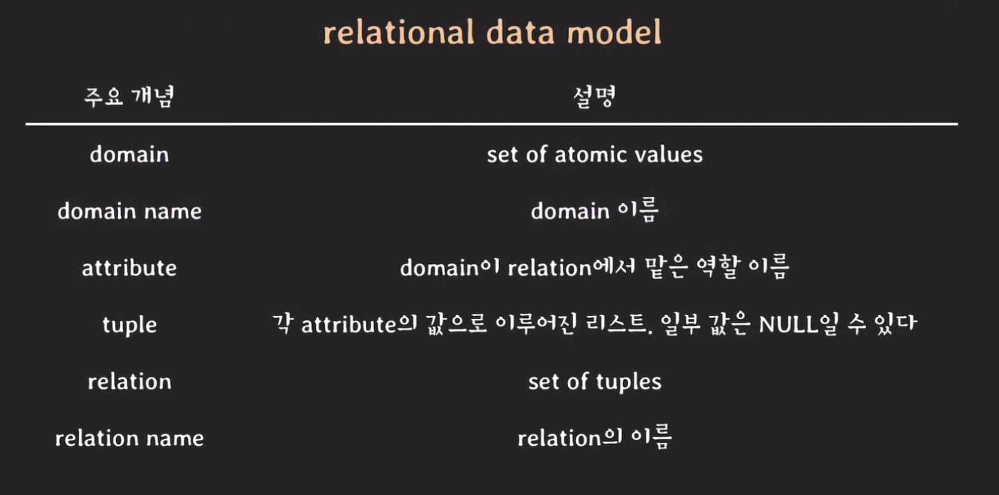

# Ralationnal Database

## 개요
relational이 무엇인지 알기 위해서는 먼저 set이라는 자료구조를 알 필요가 있다.  

> set이란?  
> 서로 다른 elements를 가지는 collection이며 하나의 set에서 elements의 순서는 중요하지 않다.

## 수학에서 relation이란?

- 수학에서 말하는 릴레이션은 cartesian product와 관련이 있다. cartesian product은 집합 a과 b에서 각각 하나씩 골랐을 때 만들 수 있는 모든 조합을 의미한다. 

- 이런 경우의 릴레이션을 binary relation이라하고 A와 B의 cartesian product의 부분 집합이라 말할 수 있다.
- 그리고 이것이 수학에서 말하는 관계이다.

  

- 위의 set이 확장되었다고 생각해보자.
- 이 전에는 집합이 두개라 바이너리였지만 지금은 집합이 n개이기 때문에 n-ary 릴레이션이라고 한다. 
- n-ary 릴레이션은 n개의 cartesian product의 부분 집합이라고 할 수 있는 것이다.
- 그리고 각각의 연결된 데이터를 tuple이라고 한다. 

#### 정리해보자면
- 수학에서 말하는 관계란 cartesian product의 부분집합이다.
- 혹은 tuple들의 set(집합)이다.

## Relation in methemetics & Relational data model
  

- relational data model에서 elements 혹은 값들의 Set(집합)을 도메인이라고 부르며
- relational data model에서도 tuple을 가질수 있고 집합마다 이름을 붙일 수 있다.
- 위와 같은 이미지 전체를 relational data model에서 relation이라고 부른다.

### Student relation
#### domain definition
student_ids : 학번 집합, 7자리 integer 정수  
human_names : 사람 이름 집합, 문자열  
university_grades : 대학교 학년 집합, {1, 2, 3, 4}  
major_names : 대학교에서 배우는 전공 이름 집합  
phone_numbers : 휴대폰 번호 집합  

#### Domain of student relation
그런데 만약 어느 한 학생이 출석을 하지 않아 가족이나 주변 사람에게 연락을 하기 위한 도메인 필요하게 되었다. 그래서 동일하게 휴대폰 번호로 된 도메인을 만들었는데 이렇게 되면 동일한 도메인이 2개가 생기는 것이다. 이때 relation data model에서는 attribute라는 개념을 사용하게 된다. 수행하는 역할에 따라 이름을 붙여주는 것이다.  
  

#### Table  
이 이미지는 한 학생의 튜플을 가시적으로 표현한 것이다. 
  

이러한 튜플을 보기좋게 표현한 것이 바로 테이블 구조이다. 테이블 구조로 바뀐 relation은 다음과 같다.
  

## 주요 개념 정리
### Relation data model
  

### Relation schema
- relation의 구조를 나타낸다.
- relation 이름과 attributes 리스트로 표기된다.
- attributes와 관련된 constraints도 포함한다.
- ex.STUDENT(id, name, grade, major, phone_num, emer_phone_num)

### degree of a relation
- relation schema에서 attributes의 수
- ex.STUDENT(id, name, grade, major, phone_num, emer_phone_num) 이 경우 degree 6

### Relation (of relation state)
이전 글에서 state를 언급한 적이 있는데 state는 변할 수 있는 값 혹은 실제 데이터를 의미하는 단어이다. 그러나 우리가 실제로 사용할 때는 state라는 말도 쓰지만 relation이라고 하는 경우가 있으니 사용할 때 유의해야한다.

### Relational database
relational database는 위에서 정리한 relational data model에 기반하여 구조화된 database이며 relational database는 여러 개의 relations로 구성된다.

### Relational database schema
여기서 스키마는 relation schemas set과 relation이 여러개가 있기 때문에 integrity constraints set와 함께 구성된다.

## relation의 특징들
|특징|
|:---|
|relation은 중복된 tuple을 가질 수 없다. 그 이유는 relation은 set의 tuple이기 때문|
|relation의 tuple을 식별하기 위해 attribute의 부분 집합을 key로 설정한다 (id 집합)|
|relation에서 tuple의 순서는 중요하지 않다|
|하나의 relation에서 attribute의 이름은 중복되면 안된다|
|하나의 tuple에서 attribute의 순서는 중요하지 않다|
|attribute는 atomic해야한다 (더이상 나눠질 수 없는 값이어야 한다.)|

### NULL의 의미
- 값이 존재하지 않는다
- 값이 존재하나 아직 그 값이 무엇인지 알지 못한다
- 해당 사항과 관련이 없다

### keys
#### superkey
- `relation에서 tuple을 unique하게 식별할 수 있는 attributes set`을 의미한다
- ex. PLAYER(id, name, team_id, back_number, birth_date)의 수퍼키는 {id, name, team_id, back_number, birth_date}, {id, name}, {name, team_id, back_number}...이 될 수 있다.

#### candidate key
- `어느 한 attribute라도 제거하면 unique하게 tuples를 식별할 수 없는 super key`를 말한다
- key or minimal superkey
- ex. PLAYER(id, name, team_id, back_number, birth_date)의 candidate key는 {id}, {team_id, back_number}가 있겠다

#### primary key
- `relation에서 tuples를 unique하게 식별하기 위해 선택된 candidate key`
- 보통은 attribute 수가 적은 candidate key로 primary key를 사용한다
- ex. PLAYER(id, name, team_id, back_number, birth_date)의 primary key는 {id}, {team_id, back_number}가 된다

#### unique key
- `primary key가 아닌 candidate keys`
- alternate key
- ex. PLAYER(id, name, team_id, back_number, birth_date)의 unique key는 {team_id, back_number}가 된다

#### foreign key
- `다른 relation의 PK(primary key)를 참조하는 attibutes set`을 말한다.
- ex. 도메인이 PLAYER(id, name, team_id, back_number, birth_date)와 TEAM(id, name, manager)라고 했을 때 foreign key는 PLAYER의 {team_id}가 된다

### constraints 뜻
relational database의 relations들이 언제나 항상 지켜줘야 하는 제약사항을 말한다. database가 항상 일치된 형태로 그리고 데이터의 일관성을 보장하기 위해 사용되는 개념이다

#### implicit constraints
- relational data model 자체가 가지는 contraints
- relation은 중복되는 tuple을 가질 수 없다
- relation 내에서는 같은 이름의 attibute를 가질 수 없다

#### schema-based constraints
- 주로 DDL을 통해 schema에 직접 명시할 수 있는 constraints
- explicit constraints
- 이 제약 사항에는 여러 종류가 존재한다.

|제약사항|내용|
|:---|:---|
|domain constraints|attribute의 value는 해당 attribute의 domain에 속한 value여야한다.|
|key constraints|서로 다른 tuples는 같은 value의 key를 가질 수 없다.|
|NULL value constraint|attibute가 NOT NULL로 명시됐다면 NULL을 값으로 가질 수 없다.|
|entity integrity contraint|primary key는 value에 NULL을 가질 수 없다.|
|referential integrity constraint|FK와 PK와 도메인이 같아야 하고 PK에 없는 values를 FK가 값으로 가질 수 없다.|