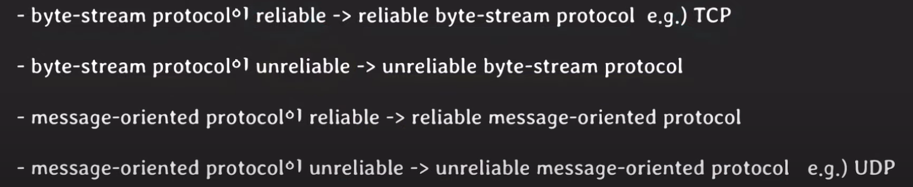
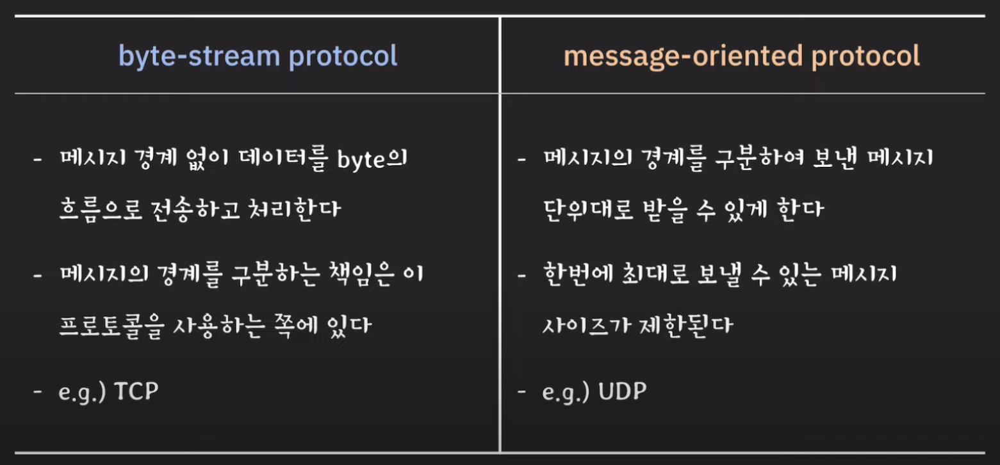

# byte-stream protocol과 message-oriented protocol의 차이

## 개요
TCP와 UDP를 각각 byte-stream protocol과 message-oriented protocol이라고 부른다. 그 이유와 동작 방식에 대해서 알아보려고 한다.

## UDP - message-oriented protocol
UDP는 internet protocol과 거의 유사하게 동작하기 때문에 전송 중 데이터가 유실되거나 순서가 바뀌는 경우가 발생하나, 그런 문제없이 잘 전달된다고 가정을 해보겠다. 

한 호스트에서 다른 호스트로 각각 4byte, 8byte, 3byte의 데이터를 보내면 도착지 호스트의 transport layer에서 메시지를 잘 구분하여 application layer로 데이터를 잘 보내주게 된다. 이때 출발지 호스트에서 전송 함수를 통해 각 3개의 `메시지`를 보내면 받는 쪽에서도 받는 함수를 3번 호출하여 메시지를 읽게 되게되는데 이게 message-oriented protocol의 큰 특징이다. 

- 보낸 메시지 단위 그대로 받을 수 있게 해주는 프로토콜
- 메시지 간의 경계를 구분할 수 있음
- 한번에 전송 가능한 메시지의 최대 크기가 존재함

## TCP - byte-stream protocol
TCP는 UDP처럼 4byte, 8byte, 3byte와 같은 데이터를 보낼 때 메시지의 경계나 구분에 관심이 없고 보내려는 데이터를 byte들의 흐름이라고 인식하고 전송합니다. 그러면 TCP는 이 byte들을 어떤 단위로 전송할까. 바로 이전에 배웠던 TCP segment이다. 정리해보자면

- TCP는 신뢰할 수 있는 데이터 전송을 실현하는 것이 목적이다. 
- 애플리케이션에서 보낸 메시지와는 독립적으로 특정 크기로 구분되는 별도의 전송단위를 통해 데이터를 전송한다. 
- 이 단위를 `TCP segment`라고 부른다.
- 특정크기에 대한 개념은 다음과 같다.
    - `MSS(Maximum Segment Size)`
    - 정의한 MSS값보다 크면 segment를 분리한다.

그런데 만약 MSS의 크기가 널널해서 15byte를 한번에 보낼 수 있게 되었고 해당 데이터를 도착지 애플리케이션에서 사용하면 된다. 아까는 클라이언트에서 3번에 나누어 데이터를 보내고 받았는데 TCP로 보낼 때 또한 출발지 호스트는 3번에 나누어 보냈다. 그런데 MSS의 값이 널널해서 한번에 보냈는데 그럼 받는 쪽에서는 메시지를 어떻게 구분해야할까? 이때 이 책임은 byte-stream protocol에 있지 않다. 이 프로토콜을 사용하는 쪽에서 담당한다고 한다. 예를들어 MSS가 1kb라면 최대 1kb만큼의 byte를 한번에 읽을 수 있다는 것이다. 동작을 좀 더 정리해보면

- 사용하는 쪽에서 전송한 메시지를 구분하지 않음
- 데이터 전송을 `byte들의 흐름 관점`으로만 접근
- `메시지를 구분하는 책임은 해당 프로토콜을 사용하는 쪽에 있음`

## 질문
<b>1. Byte-stream protocol은 reliable한가?</b>  
reliable한지 여부와 독립적인 개념이다.

<b>2. UDP를 통해 max UDP datagram size보다 큰 메시지를 전송하려면 어떻게 되는가?</b>   

이때는 실패하고 에러를 받는다. 에러에 대해서 어떻게 처리할지는 개발자나 application-layer protocol이 구현해야한다.

<b>3. TCP를 통해 MSS보다 큰 메시지를 전송하려면 어떻게 되는가?</b>   
TCP가 알아서 MSS에 맞는 TCP segment로 나누어서 전송한다. 

<b>4. byte-stream protocol을 사용하는 쪽에서 메시지를 구분하는 방법은 어떤 것들이 있나요?</b>   
방법은 여러가지가 있다. 
- 메시지 사이즈를 고정한다. 
- 메시지 사이즈를 먼저 보낸 후 메시지를 보낸다.
- 메시지 사이에 구분자를 넣어서 전송한다. (ex. CRLF)
    - Carriage Return / Line Feed

<b>5. TCP가 byte-stream protocol이라면 TCP 위에서 동작하는 HTTP는 자체적으로 HTTP message의 경계를 구분하는 방법을 가지고 있다는 말인가?</b>   
정답은 그렇다. 그러나 HTTP버전에 따라 달라지는 부분이 있기 때문에 사용하는 버전에 따라 확인해봐야한다.

## 마무리

---
> 강의 출처  
> 해당 폴더에 있는 글은 모두 쉬운코딩님의 강좌를 보고 공부한 내용들입니다.  
> [유튜브 - 쉬운코딩](https://www.youtube.com/@ezcd)