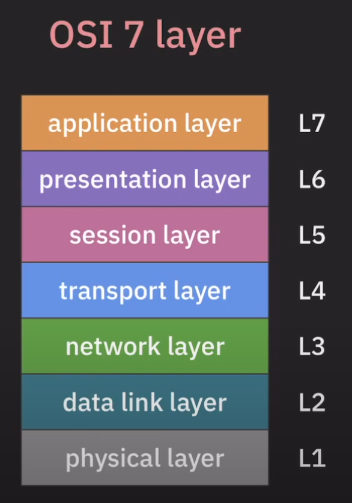

# Protocol

## 복습
이전에 우리는 네트워크에 대해서 배웠다. 네트워크란 각 역할과 쓰임새에 맞는 노드가 목적에 맞는 장비를 사용해서 연결되어있는 것을 네트워크라고 하였고 각 연결된 점들을 노드라고 부르기로 했다. 그리고 이 모든 일종의 생태계를 인터넷이라고 부르기로 했다.

## 개요
네트워크란 어떠한 점. 즉, 노드들이 연결되어있는 것인데 네트워크의 역할을 좀 더 자세하게 써보자면 다음과 같다.  

```text
- 애플리케이션 목적에 맞는 통신 방법 제공
- 신뢰할 수 있는 데이터 전송 방법 제공
- 네트워크 간의 최적의 통신 경로 결정
- 목적지로 데이터 전송
- 노드 사이의 데이터 전송
```

이에 따라 통신이 주 목적인 네트워크에는 일종의 약속이 필요하게 된다. 마치 우리가 한국어와 한국어로 대화하듯이 말이다. 네트워크 통신을 하기 위해서 통신에 참여하는 주체 즉, 노드들이 따라야하는 형식 혹은 절차 혹은 규약이 그 약속들인데 우리는 이것을 `네트워크 프로토콜`이라고 부른다.

## 프로토콜 (Protocol)
네트워크는 위에 작성한 것처럼 여러가지 일을 수행하는데 단 하나의 프로토콜로 통신하기에는 문제가 있다. 어느 순간에는 다른 나라 말을 쓰는 것이 더 효율적이고 기능을 확장하기에도 유연할 수 있기 때문이다. 그래서 네트워크에는 여러가지 약속들이 존재한다. 기본적으로 위에 나열한 네트워크의 역할에 맞춰 `모듈화`를 하여 각 기능별로 분리를 하게 된다. 예를 들면 애플리케이션은 애플리케이션끼리 알아먹을 수 있는 말들로 통신하고 어떻게 데이터를 전송해야 신뢰할 수 있는지에 대한 말을 사용하고 목적지로 보낼때는 어떤 말이 빠른지 노드 사이에서는 또 어떤 말이 빠른지에 대해서 분리를 한다는 말이다. 이것은 곧 계층구조로 표현할 수 있게 되며 OSI model(7 layer)과 TCP/IP stack(4 layer)가 탄생하게 된다. 아직은 각 레이어가 어떻게 통신하는지는 이제 자세하게 알아보자.

## OSI 7 layer


이 7개의 레이어들은 각 레이어에 맞게 프로토콜이 세분화돼서 구현이 되어있으며 각 레이어의 프로토콜은 하위 레이어의 프로토콜이 제공하는 기능을 사용하여 동작한다. 

#### <b><span style="color:orange">L7</span> - application layer</b>
애플리케이션 목적에 맞는 통신 방법 제공  
HTTP, DNS, SMTP, FTP 등

#### <b><span style="color:purple">L6</span> - presentaion layer</b>
애플리케이션 간의 통신에서 메시지 포맷 관리  
인코딩 <-> 디코딩  
암호화 <-> 복호화  
압축 <-> 압축 풀기  

#### <b><span style="color:pink">L5</span> - session layer</b>
애플리케이션 간의 통신에서 세션을 관리  
`RPC(remote procedure call)`  

#### <b><span style="color:skyblue">L4</span> - transport layer</b>
애플리케이션 간의 통신 담당  
목적지 애플리케이션으로 데이터 전송  
안정적이고 신뢰할 수 있는 데이터 전송 보장(TCP)    
필수 기능만 제공(UDP)  

#### <b><span style="color:green">L3</span> - network layer</b>
호스트 간의 통신 담당(IP 프로토콜)  
목적지 호스트로 데이터 전송  
네트워크 간의 최적의 경로 설정  
라우터에 위치함  
라우터, IP  

#### <b><span style="color:cyan">L2</span> - data link layer</b>
직접 연결된 노드 간의 통신 담당  
MAC 주소 기반 통신 (ARP : IP주소를 MAC 주소로 변환하는 역할)  
스위치, 브릿지  

#### <b><span style="color:grey">L1</span> - physical layer</b>
bits단위로 데이터 전송  
리피터, 케이블, 허브  

### 그러면 어떻게 통신하는 걸까?


이 이미지는 흐름만 먼저 간단하게 파악하기 위함이다. 보내는 쪽이 L7부터 아래로 쭉 압축을 하여 physical layer에서 라우터로 전송하게 되고 
1. L7부터 아래로 쭉 압축을 하여 L1에서 라우터로 전송
2. 라우터는 목적지 IP가 무엇인지 다음 라우터가 필요한지 아닌지 등 정보 파악을 위해 L3까지 압축을 풀고 확인 후 다시 L1까지 압축한 뒤 전송
3. 많은 라우터를 거쳐 목적지에 도착한 데이터를 physical layer부터 압축을 쭉 풀어서 L7에서 최종적으로 데이터를 받아볼 수 있게 된다.

이 과정을 `encapsulation & decapsulation`이라고 부른다.

[조금 더 자세한 참고자료 1](https://www.cloudflare.com/ko-kr/learning/ddos/glossary/open-systems-interconnection-model-osi/)  
[조금 더 자세한 참고자료 2](https://ko.wikipedia.org/wiki/OSI_%EB%AA%A8%ED%98%95)

#### 전송과정
전송과정을 단순하게 표현하면 다음과 같다.
> M - 메시지, 보내고자 하는 데이터  
> L(n) - 각 계층  
> T - 트레일러, 전송 후에 에러 확인 용도  

M  
L7(M)  
L6(L7(M))  
L5(L6(L7(M)))  
L4(L5(L6(L7(M))))  
L3(L4(L5(L6(L7(M)))))  
L2(L3(L4(L5(L6(L7(M))))),T)  
L1(L2(L3(L4(L5(L6(L7(M))))),T))

이런 식으로 받게되고 라우터에서는 L3까지 압축을 풀고 데이터를 확인 그리고 다음 라우터의 위치 수정 등의 작업을 한 뒤 다시 L1까지 압축하여 목적지까지 보내게 된다. 목적지에서는 최종적으로 메시지를 받아보게 된다. 각 계층당 사용하는 정보가 각각 다르고 사용하는 비트수가 다르지만 추후에 필요할때 참고하여 찾아보면 될 것 같다. 

## TCP/IP stack layer


이전에 또 다른 전송 계층 모델이 있다고 했는데 바로 그 계층이 TCP/IP stack이다. 해당 계층 구조는 인터넷에 특화된 계층 구조라고 생각하면 된다. OSI 7 계층 모델과 대칭되는 부분이 있고 TCP/IP에서는 4개의 계층으로 묶어서 구분하고 있다.

## 마무리
이렇게 보니 우리가 사용하는 네트워크가 어마무시하게 빠르다는 것을 알게되었다. 유튜브를 생각해보아도 요즘엔 기본으로 1080p로 영상을 대부분 시청하는데 이때 소모하는 데이터량이 엄청 큰데도 우리는 무리없이 영상을 시청할 수 있다. 너무 흥미로운 구조이고 속도이다. 

### 정리
네트워크가 통신하는 방법에는 수많은 프로토콜이 존재하며 정해진 행동 양식이 있어 모듈화를 시킬 수 있었다. 그래서 탄생한 것이 OSI 7 layer 모델이다. 해당 모델은 7개의 레이어로 이루어져 각 레이어가 하는 작업이 정해져있고 하위 레이어의 프로토콜이 제공하는 데이터를 사용하게 되어있다. 추가로 웹에 특화된 TCP/IP stack이라는 모델도 있다. 해당 레이어는 4 계층으로 application, transport, internet, link로 OSI 모델의 계층을 비슷한 영역만큼 묶어서 만들어졌다. 나는 웹 개발자이기 때문에 TCP/IP 모델을 더 주목해서 살펴봐야한다.  

---
> 강의 출처  
> 해당 폴더에 있는 글은 모두 쉬운코딩님의 강좌를 보고 공부한 내용들입니다.  
> [유튜브 - 쉬운코딩](https://www.youtube.com/@ezcd)