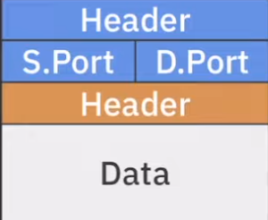
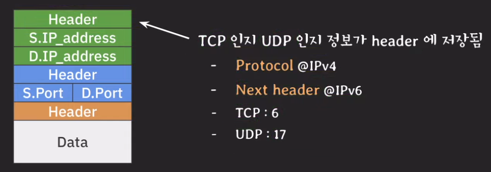
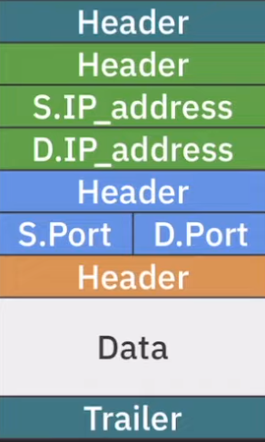

# Segment / Datagram / Packet / Frame

## 개요
이전까지 각 레이어에서 주고받는 정보를 추상적으로만 생각했다면 이번에는 레이어끼리 어떤 데이터를 압축하고 사용하는지에 대해서 자세하게 배워볼 예정이다. 더불어 trasport 레이어에서 어떻게 프로토콜을 구분하는지 아직 안배웠기때문에 이번 글에서도 같이 공부해보려고 한다.

## 출발지
### Application layer
해당 레이어에서 송/수신되는 데이터를 data 혹은 message라고 부르며 header와 data로 구분 되어있다. 여기서 data에 해당하는 부분을 `payload`라고 부르며 이 부분이 프로토콜을 통해 송/수신 되는 실제 데이터이다. 그래서 payload는 다른 레이어에서도 동일하게 사용된다.

### Transport layer
transport layer는 프로세스 간에 어떻게 통신할지를 담당하는 레이어이며 해당 레이어에서 사용할 헤더가 application layer에서 넘어온 데이터에 추가된다. 이를 프로토콜의 차이에 따라 부르는 명칭이 있는데 프로토콜이 TCP라면 `TCP segment`, UDP라면 `UDP datagram`이라고 부르게 된다. 그리고 여기서도 payload가 존재하게 되는데 transport layer에서 사용하는 헤더를 제외한 나머지 부분 즉, application layer의 데이터 전체가 payload에 해당하게 된다. 그리고 각 프로토콜 간에 공통적으로 헤더에 전송지 port와 목적지 port를 추가한다.

### Internet layer
internet layer는 호스트와 호스트 간에 통신을 담당하는 레이어이고 어떠한 경로를 따라 목적지까지 데이터를 전달하는 역할을 갖고 있는데 이때 수많은 라우터를 거치게 된다. 해당 레이어의 프로토콜은 IP를 사용하며 internet layer에서 송/수신되는 데이터를 `IP datagram` 또는 `IP packet`이라고 부른다. 그리고 동일하게 payload는 internet layer에서 추가된 헤더를 제외한 나머지 데이터가 payload이다. 그리고 해당 헤더에는 보내는 쪽과 받는 쪽의 IP 주소가 담기며 추가로 transport layer에서 결정되는 TCP인지 UDP인지에 대한 정보가 담긴다.

### Link layer
이 레이어의 역할은 노드와 노드끼리의 통신을 담당하는데 예를들면 우리집에서 출발한 데이터가 처음으로 당도하는 라우터까지가 link layer의 역할인 것이다. 여기서도 구분에 필요한 헤더와 트레일러가 데이터에 추가되게되고 해당 레이어의 데이터를 `Frame`이라고 부르게 된다. payload 또한 동일하게 해당 레이어의 헤더와 트레일러를 제외한 데이터가 payload가 된다.

## 라우터
### 라우팅되는 과정
link layer가 보낸 데이터가 라우터에 도착하게 되면 라우터의 link layer에서 필요한 정보들을 확인 후 제거하고 internet layer로 데이터를 올려보냅니다. internet layer에서는 이제 다음 전송지가 어딘지 찾는 과정이 일어나게 되는데 internet layer의 헤더에 담긴 목적지 IP주소를 보고 그 경로를 결정하게 됩니다. 바로 여기서 `라우팅 테이블`이 사용되게 됩니다. 데이터를 어디로 보내야할지 확인 한 수 다시 link layer로 데이터를 내린다음 헤더와 트레일러를 추가하고 Frame을 만들게 됩니다. 

## 목적지
### Link layer
위의 과정을 거쳐서 목적지에 도착하게 된다면 link layer에서 헤더와 트레일러를 확인 후 떼어내고 internet layer로 데이터를 올립니다. 

### Internet layer
해당 레이어에 도착하면 먼저 헤더의 목적지 IP주소와 호스트의 IP주소가 같은지 확인합니다. 그리고 이제 transport layer로 올려야하는데 이때 중요한 것이 TCP인지 UDP인지 어떤 프로토콜을 쓰고있느냐를 알아야합니다. 그래서 프로토콜 정보를 transport layer가 아닌 internet layer에 담았던 것이고 프로토콜을 구분하여 transport layer로 올려줘야 데이터를 올바르게 읽을 수 있기 때문에 아주 중요한 부분이다. 그리고 여기서 `프로토콜 정보와 출발지, 도착지 IP 주소를 따로 저장`한 뒤에 internet layer의 헤더를 제거하고 아까 저장한 Protocol, S.IP_address, D.IP_address와 같이 transport layer로 데이터를 올려보내게 된다.

### Transport layer
transport layer는 받은 데이터를 어떤 애플리케이션으로 데이터를 보낼 지 담당하고 있는데 이 말은 transport layer는 특정 소켓을 통해 데이터를 전송해야한다는 말이다.

#### UDP 일 때
upd일 때는 굉장히 간단하다. transport layer가 가지고 있는 도착지 IP 주소와 포트 번호를 가지고 소켓을 찾고 헤더를 떼어낸 뒤 payload를 보내주면 된다.

#### TCP 일 때
앞서 tcp의 특징 중 하나로 리스닝 소켓의 유무가 있었다. 클라이언트가 보낸 데이터의 도착지가 리스닝인지 아닌지를 구분하는 방법은 transport layer의 헤더에 정보가 담겨있는데 `syn플래그 값이 1`이면 리스닝 소켓으로 데이터를 보내주면 된다. 그러나 이미 연결된 connection이라면 internet layer에서 같이 보내준 값을 조합하여 출발지의 IP,port 도착지의 IP, port와 동일하게 매칭되는 소켓으로 transport layer의 payload를 보내주면 된다.

#### Multiflexing & Demultiplexing
> <b>Demultiplexing</b>  
> 위처럼 internet layer로 부터 받은 segment나 datagram에 있는 payload를 적절한 socket으로 전달하는 것을 Demultiplexing이라고 부른다.

> <b>Multiflexing</b>  
> 여러 socket들로 부터 데이터를 수집해서 각각 segment 혹은 datagram으로 만든 후 internet layer로 내려보내는 것을 Multiflexing이라고 한다.

#### Transport layer 마무리
이제 헤더를 정리하고 application layer로 보내줘야하는데 이때 기존의 데이터 중 protocol을 제외한 출발지의 IP,port 도착지의 IP, port의 정보를 저장하고 transport layer의 헤더를 제거한 뒤에 소켓을 통해 프로세스로 보내주게 됩니다.

### Application layer
그러면 이제 소켓을 통해 프로세스로 넘어온 데이터를 application layer의 헤더를 분석해서 어떠한 프로토콜인지 구분을 해야합니다. (ex. HTTP, HTTPS, DNS...) 그리고 최종적으로 헤더를 떼어내고 payload를 애플리케이션의 비즈니스 로직에 전달하게 됩니다.

## 주의사항
#### Packet
Internet layer에서 사용되는 packet과 인터넷을 통해 송/수신되는 데이터의 단위가 혼동되는 경우가 있다. 보통 모델을 기반해서 이야기하는 것이 아니라면 후자로 쓰이는 경우가 많다. 

#### Datagram
UDP datagram인지 IP datagram인지 잘 구분해야한다.

#### Segment
일부 문서나 책에서는 TCP segment나 UDP datagram을 편의상 일괄적으로 segment라고 부르기도 한다.